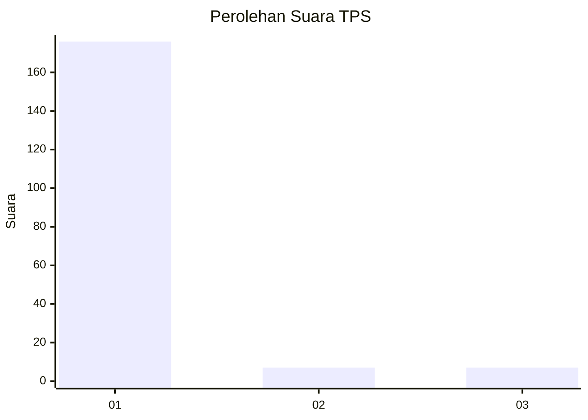
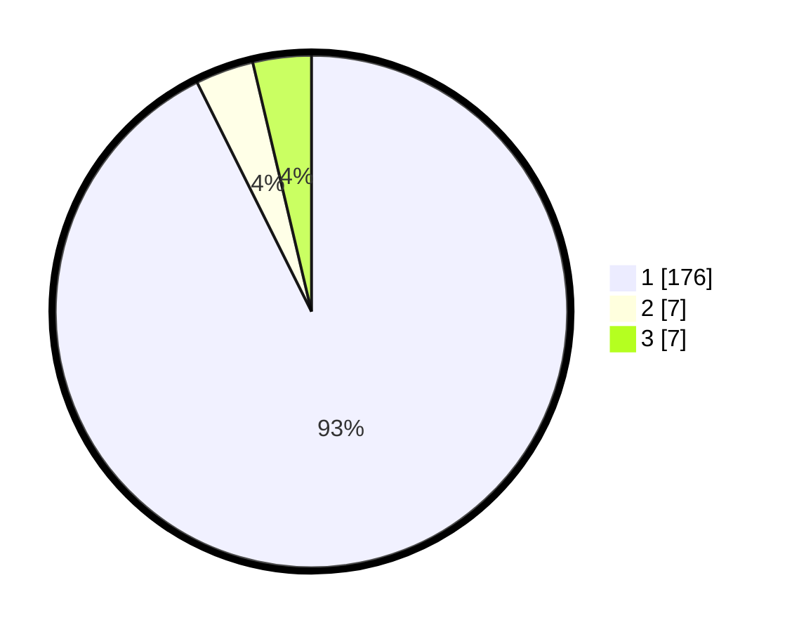

# Hasil

## Grafik

## Tabel

| No. | Nama Paslon    | Suara | Suara (raw) | Persentase |
|:--- |:-------------- | -----:| -----------:| ----------:|
| 1   | ANIES MUHAIMIN | 176   | [176][p-1]  | 92,63      |
| 2   | PRABOWO GIBRAN | 7     | [7][p-2]    | 3,68       |
| 3   | GANJAR MAHFUD  | 7     | [7][p-3]    | 3,68       |

[p-1]: https://github.com/gigit-pemilu/pemilu-2024-11-aceh/blob/main/pilpres/hitung-suara/sub/11-aceh/sub/07-pidie/sub/04-delima/sub/2043-keutapang-bambong/sub/001-tps/sub/paslon-1.txt
[p-2]: https://github.com/gigit-pemilu/pemilu-2024-11-aceh/blob/main/pilpres/hitung-suara/sub/11-aceh/sub/07-pidie/sub/04-delima/sub/2043-keutapang-bambong/sub/001-tps/sub/paslon-2.txt
[p-3]: https://github.com/gigit-pemilu/pemilu-2024-11-aceh/blob/main/pilpres/hitung-suara/sub/11-aceh/sub/07-pidie/sub/04-delima/sub/2043-keutapang-bambong/sub/001-tps/sub/paslon-3.txt

## Foto C Plano

https://sirekap-obj-formc.kpu.go.id/e107/pemilu/ppwp/11/07/04/20/43/1107042043001-20240215-144737--f49be3ee-6e28-41b9-810e-7adce0f9d220.jpg

https://sirekap-obj-formc.kpu.go.id/e107/pemilu/ppwp/11/07/04/20/43/1107042043001-20240215-144850--38cb62d5-c769-4da8-9985-a15509ba88f3.jpg

https://sirekap-obj-formc.kpu.go.id/e107/pemilu/ppwp/11/07/04/20/43/1107042043001-20240215-145031--f797c2ee-dac9-4146-b2e1-0effa3a20344.jpg

## Metadata

| Key        | Value               |
| ---------- | ------------------- |
| Time Stamp | 2024-02-19 06:16:00 |

