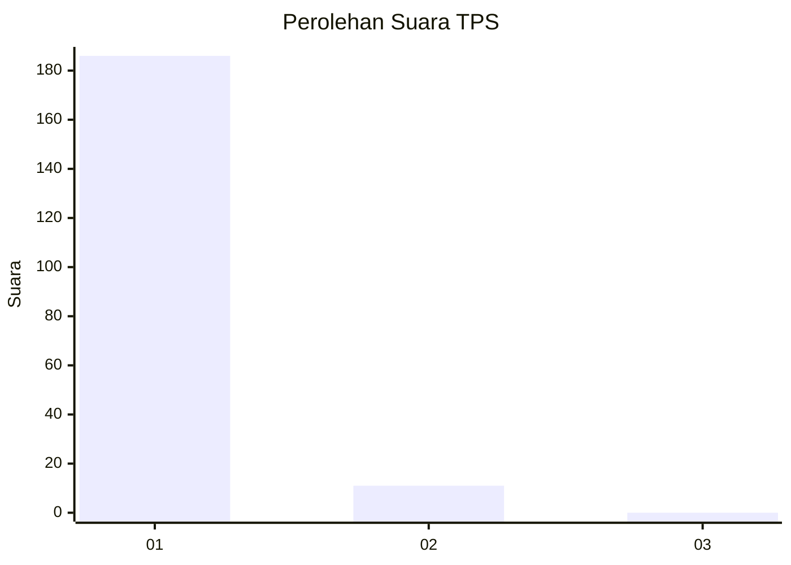
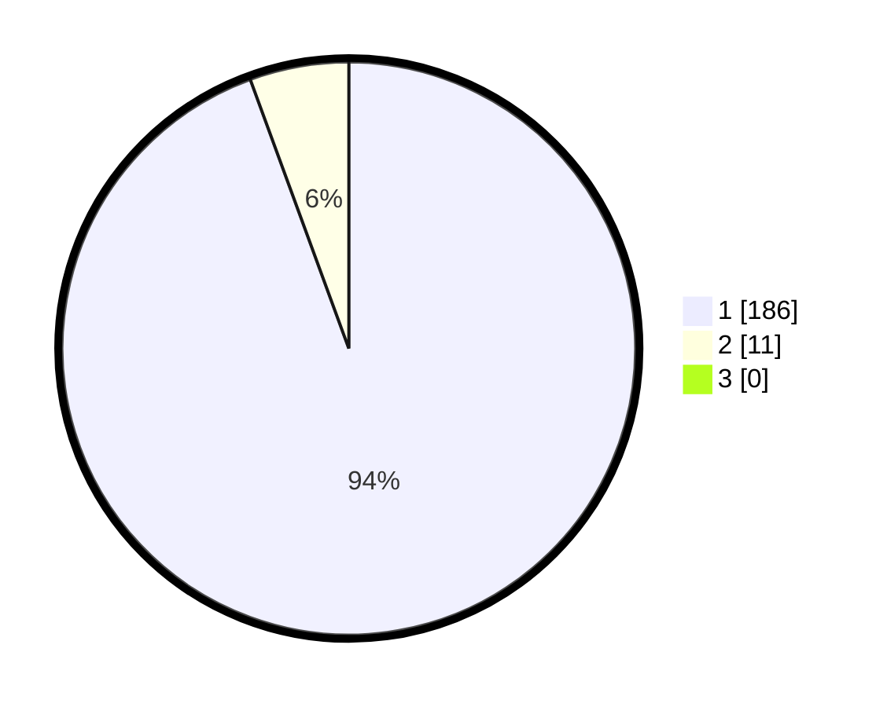

# Hasil

## Grafik

## Tabel

| No. | Nama Paslon    | Suara | Suara (raw) | Persentase |
|:--- |:-------------- | -----:| -----------:| ----------:|
| 1   | ANIES MUHAIMIN | 186   | [186][p-1]  | 94,42      |
| 2   | PRABOWO GIBRAN | 11    | [11][p-2]   | 5,58       |
| 3   | GANJAR MAHFUD  | 0     | [0][p-3]    | 0,00       |

[p-1]: https://github.com/gigit-pemilu/pemilu-2024-11-aceh/blob/main/pilpres/hitung-suara/sub/11-aceh/sub/07-pidie/sub/04-delima/sub/2043-keutapang-bambong/sub/002-tps/sub/paslon-1.txt
[p-2]: https://github.com/gigit-pemilu/pemilu-2024-11-aceh/blob/main/pilpres/hitung-suara/sub/11-aceh/sub/07-pidie/sub/04-delima/sub/2043-keutapang-bambong/sub/002-tps/sub/paslon-2.txt
[p-3]: https://github.com/gigit-pemilu/pemilu-2024-11-aceh/blob/main/pilpres/hitung-suara/sub/11-aceh/sub/07-pidie/sub/04-delima/sub/2043-keutapang-bambong/sub/002-tps/sub/paslon-3.txt

## Foto C Plano

https://sirekap-obj-formc.kpu.go.id/5057/pemilu/ppwp/11/07/04/20/43/1107042043002-20240215-125458--b8ca972d-278c-4033-a1cc-2df21dfd3de3.jpg

https://sirekap-obj-formc.kpu.go.id/5057/pemilu/ppwp/11/07/04/20/43/1107042043002-20240215-125709--83e66064-f8dd-4b7d-8b45-ef19057314f1.jpg

https://sirekap-obj-formc.kpu.go.id/5057/pemilu/ppwp/11/07/04/20/43/1107042043002-20240215-125820--c3b53a9a-d6d1-4f46-b26f-2f1f8715db4b.jpg

## Metadata

| Key        | Value               |
| ---------- | ------------------- |
| Time Stamp | 2024-02-19 06:16:00 |

