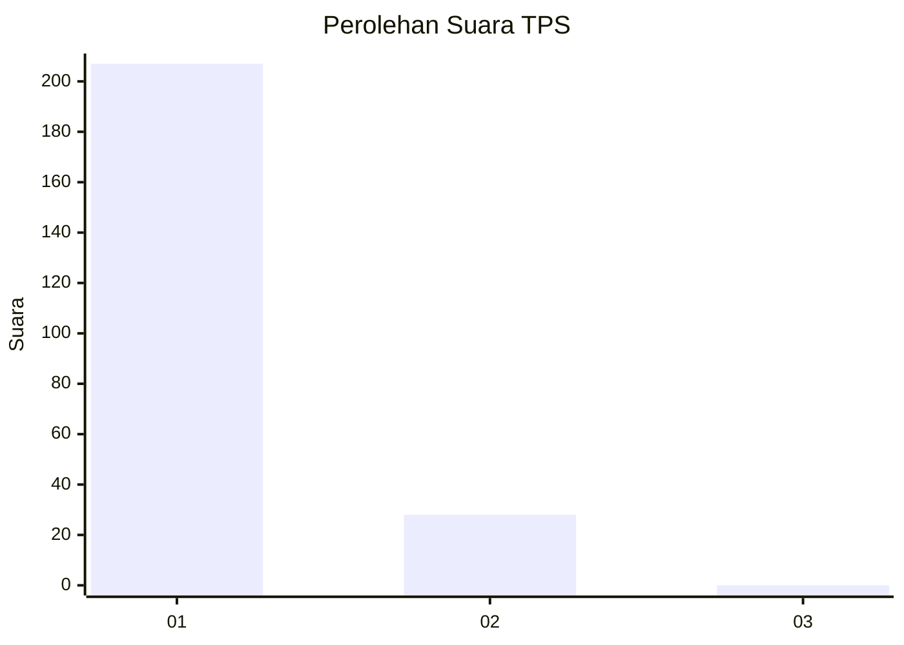
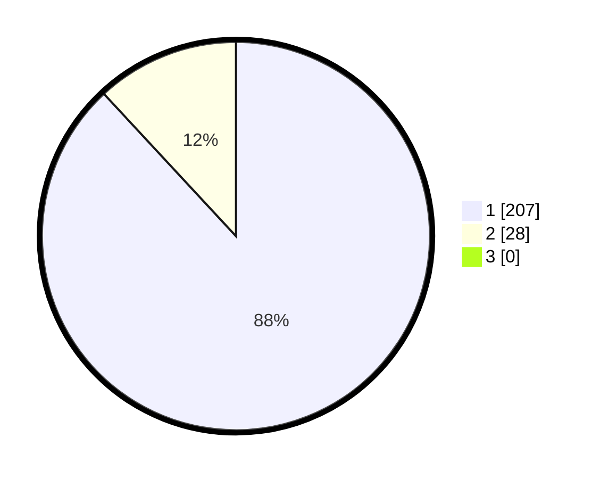

# Hasil

## Grafik

## Tabel

| No. | Nama Paslon    | Suara | Suara (raw) | Persentase |
|:--- |:-------------- | -----:| -----------:| ----------:|
| 1   | ANIES MUHAIMIN | 207   | [207][p-1]  | 88,09      |
| 2   | PRABOWO GIBRAN | 28    | [28][p-2]   | 11,91      |
| 3   | GANJAR MAHFUD  | 0     | [0][p-3]    | 0,00       |

[p-1]: https://github.com/gigit-pemilu/pemilu-2024-11-aceh/blob/main/pilpres/hitung-suara/sub/11-aceh/sub/07-pidie/sub/04-delima/sub/2044-metareum/sub/001-tps/sub/paslon-1.txt
[p-2]: https://github.com/gigit-pemilu/pemilu-2024-11-aceh/blob/main/pilpres/hitung-suara/sub/11-aceh/sub/07-pidie/sub/04-delima/sub/2044-metareum/sub/001-tps/sub/paslon-2.txt
[p-3]: https://github.com/gigit-pemilu/pemilu-2024-11-aceh/blob/main/pilpres/hitung-suara/sub/11-aceh/sub/07-pidie/sub/04-delima/sub/2044-metareum/sub/001-tps/sub/paslon-3.txt

## Foto C Plano

https://sirekap-obj-formc.kpu.go.id/8d84/pemilu/ppwp/11/07/04/20/44/1107042044001-20240215-080820--dd7c0d16-23d8-4ff0-a323-8348278d1e66.jpg

https://sirekap-obj-formc.kpu.go.id/8d84/pemilu/ppwp/11/07/04/20/44/1107042044001-20240215-080041--3d801d9a-ecf3-4dcd-bbb8-de4fe3db827a.jpg

https://sirekap-obj-formc.kpu.go.id/8d84/pemilu/ppwp/11/07/04/20/44/1107042044001-20240215-080222--7357d8e6-4b12-48b8-ac81-d03d4d130dc7.jpg

## Metadata

| Key        | Value               |
| ---------- | ------------------- |
| Time Stamp | 2024-02-19 06:16:00 |

