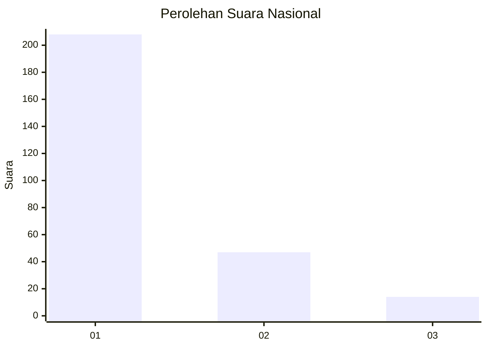
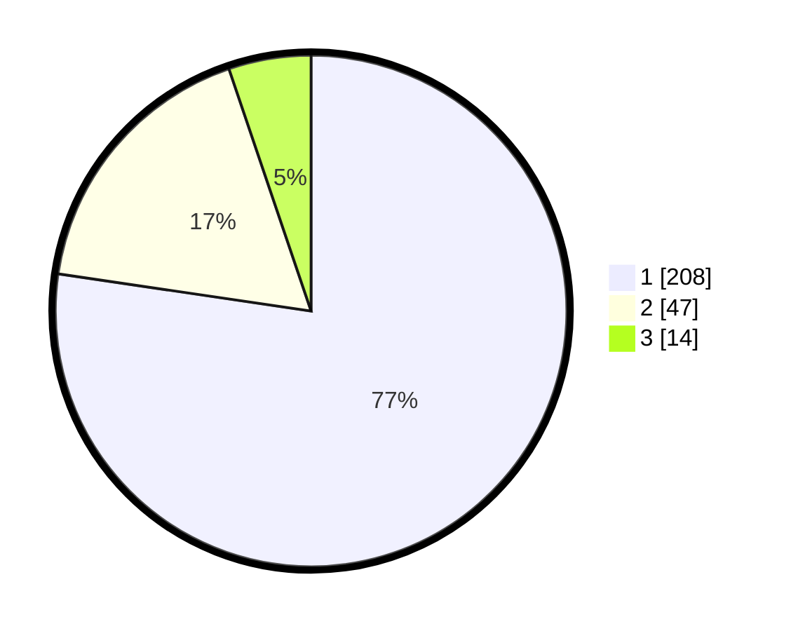

# Hasil

## Grafik

## Tabel

| No. | Nama Paslon    | Suara | Suara (raw) | Persentase |
|:--- |:-------------- | -----:| -----------:| ----------:|
| 1   | ANIES MUHAIMIN | 208   | [208][p-1]  | 77,32      |
| 2   | PRABOWO GIBRAN | 47    | [47][p-2]   | 17,47      |
| 3   | GANJAR MAHFUD  | 14    | [14][p-3]   | 5,20       |

[p-1]: https://github.com/gigit-pemilu/pemilu-2024/blob/main/pilpres/hitung-suara/sub/11-aceh/sub/07-pidie/sub/05-geumpang/sub/2001-bangkeh/sub/001-tps/sub/paslon-1.txt
[p-2]: https://github.com/gigit-pemilu/pemilu-2024/blob/main/pilpres/hitung-suara/sub/11-aceh/sub/07-pidie/sub/05-geumpang/sub/2001-bangkeh/sub/001-tps/sub/paslon-2.txt
[p-3]: https://github.com/gigit-pemilu/pemilu-2024/blob/main/pilpres/hitung-suara/sub/11-aceh/sub/07-pidie/sub/05-geumpang/sub/2001-bangkeh/sub/001-tps/sub/paslon-3.txt

## Foto C Plano

https://sirekap-obj-formc.kpu.go.id/cc82/pemilu/ppwp/11/07/05/20/01/1107052001001-20240214-220501--d4bef48b-b49a-4313-bbad-e506168d6fed.jpg

https://sirekap-obj-formc.kpu.go.id/cc82/pemilu/ppwp/11/07/05/20/01/1107052001001-20240214-220655--416a4940-f79e-4e9c-b5d0-f2749ceb6cc8.jpg

## Metadata

| Key        | Value               |
| ---------- | ------------------- |
| Time Stamp | 2024-02-25 10:00:00 |

