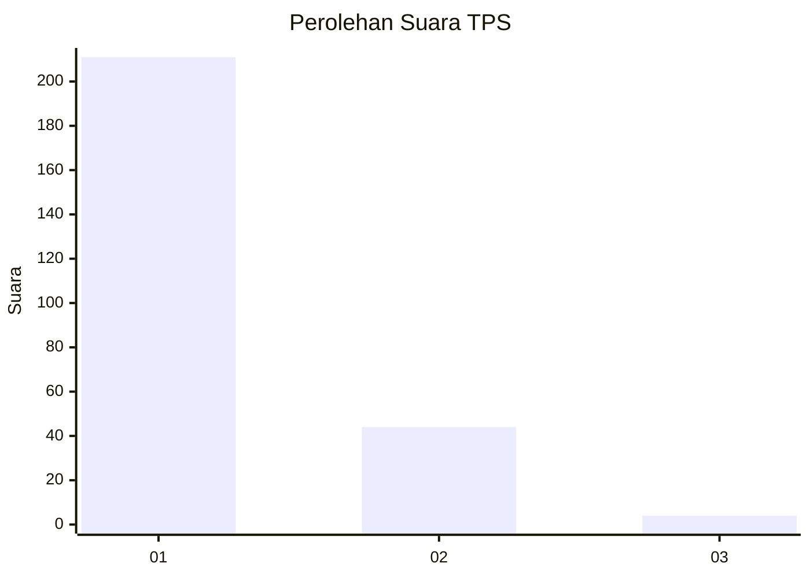
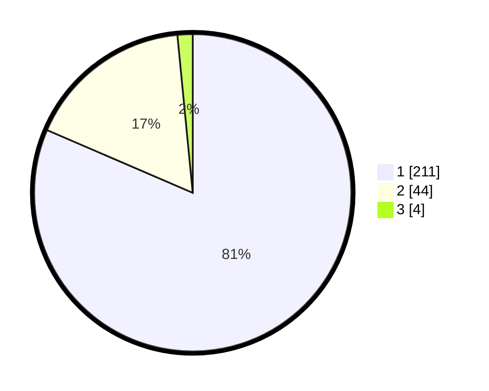

# Hasil

## Grafik

## Tabel

| No. | Nama Paslon    | Suara | Suara (raw) | Persentase |
|:--- |:-------------- | -----:| -----------:| ----------:|
| 1   | ANIES MUHAIMIN | 211   | [211][p-1]  | 81,47      |
| 2   | PRABOWO GIBRAN | 44    | [44][p-2]   | 16,99      |
| 3   | GANJAR MAHFUD  | 4     | [4][p-3]    | 1,54       |

[p-1]: https://github.com/gigit-pemilu/pemilu-2024-11-aceh/blob/main/pilpres/hitung-suara/sub/11-aceh/sub/07-pidie/sub/05-geumpang/sub/2004-leupu/sub/003-tps/sub/paslon-1.txt
[p-2]: https://github.com/gigit-pemilu/pemilu-2024-11-aceh/blob/main/pilpres/hitung-suara/sub/11-aceh/sub/07-pidie/sub/05-geumpang/sub/2004-leupu/sub/003-tps/sub/paslon-2.txt
[p-3]: https://github.com/gigit-pemilu/pemilu-2024-11-aceh/blob/main/pilpres/hitung-suara/sub/11-aceh/sub/07-pidie/sub/05-geumpang/sub/2004-leupu/sub/003-tps/sub/paslon-3.txt

## Foto C Plano

https://sirekap-obj-formc.kpu.go.id/82c9/pemilu/ppwp/11/07/05/20/04/1107052004003-20240214-203713--2b0e61c6-3b98-4000-b9ef-1b54b1524d80.jpg

https://sirekap-obj-formc.kpu.go.id/82c9/pemilu/ppwp/11/07/05/20/04/1107052004003-20240214-203848--c8929027-5922-400e-9dec-5cae5a854627.jpg

## Metadata

| Key        | Value               |
| ---------- | ------------------- |
| Time Stamp | 2024-02-17 03:30:02 |

