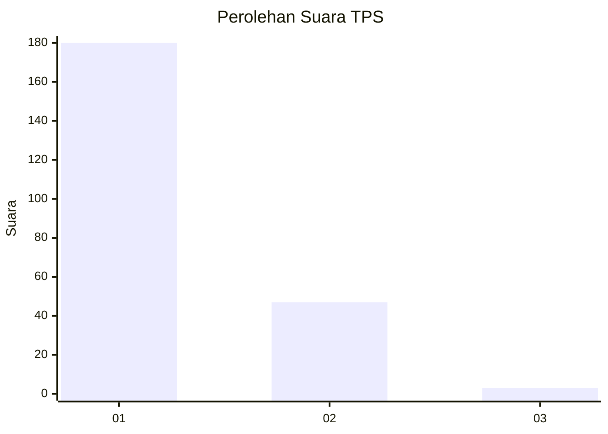
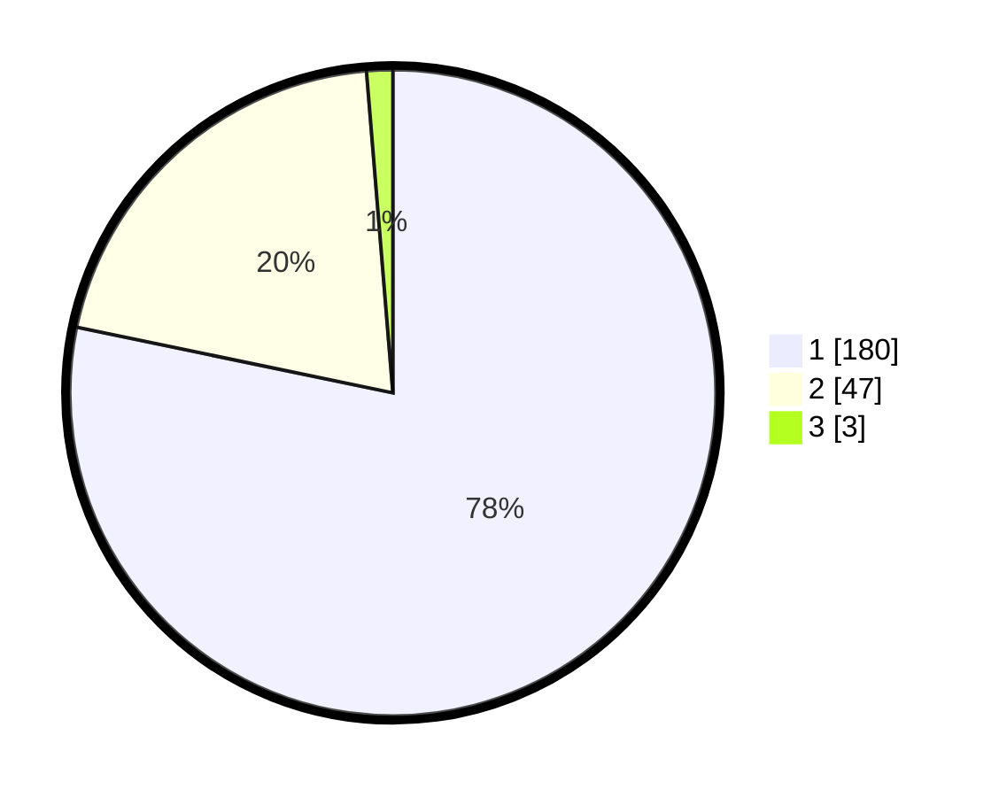

# Hasil

## Grafik

## Tabel

| No. | Nama Paslon    | Suara | Suara (raw) | Persentase |
|:--- |:-------------- | -----:| -----------:| ----------:|
| 1   | ANIES MUHAIMIN | 180   | [180][p-1]  | 78,26      |
| 2   | PRABOWO GIBRAN | 47    | [47][p-2]   | 20,43      |
| 3   | GANJAR MAHFUD  | 3     | [3][p-3]    | 1,30       |

[p-1]: https://github.com/gigit-pemilu/pemilu-2024-11-aceh/blob/main/pilpres/hitung-suara/sub/11-aceh/sub/07-pidie/sub/05-geumpang/sub/2004-leupu/sub/004-tps/sub/paslon-1.txt
[p-2]: https://github.com/gigit-pemilu/pemilu-2024-11-aceh/blob/main/pilpres/hitung-suara/sub/11-aceh/sub/07-pidie/sub/05-geumpang/sub/2004-leupu/sub/004-tps/sub/paslon-2.txt
[p-3]: https://github.com/gigit-pemilu/pemilu-2024-11-aceh/blob/main/pilpres/hitung-suara/sub/11-aceh/sub/07-pidie/sub/05-geumpang/sub/2004-leupu/sub/004-tps/sub/paslon-3.txt

## Foto C Plano

https://sirekap-obj-formc.kpu.go.id/c411/pemilu/ppwp/11/07/05/20/04/1107052004004-20240214-203152--9b85ed12-5132-4105-b544-e3f202881438.jpg

https://sirekap-obj-formc.kpu.go.id/c411/pemilu/ppwp/11/07/05/20/04/1107052004004-20240214-204651--33c70f14-fa5e-4ae9-be9b-ab263ee9293f.jpg

https://sirekap-obj-formc.kpu.go.id/c411/pemilu/ppwp/11/07/05/20/04/1107052004004-20240214-204812--abcf0051-6362-4326-8511-2e78d3505ea8.jpg

## Metadata

| Key        | Value               |
| ---------- | ------------------- |
| Time Stamp | 2024-02-15 00:41:44 |

