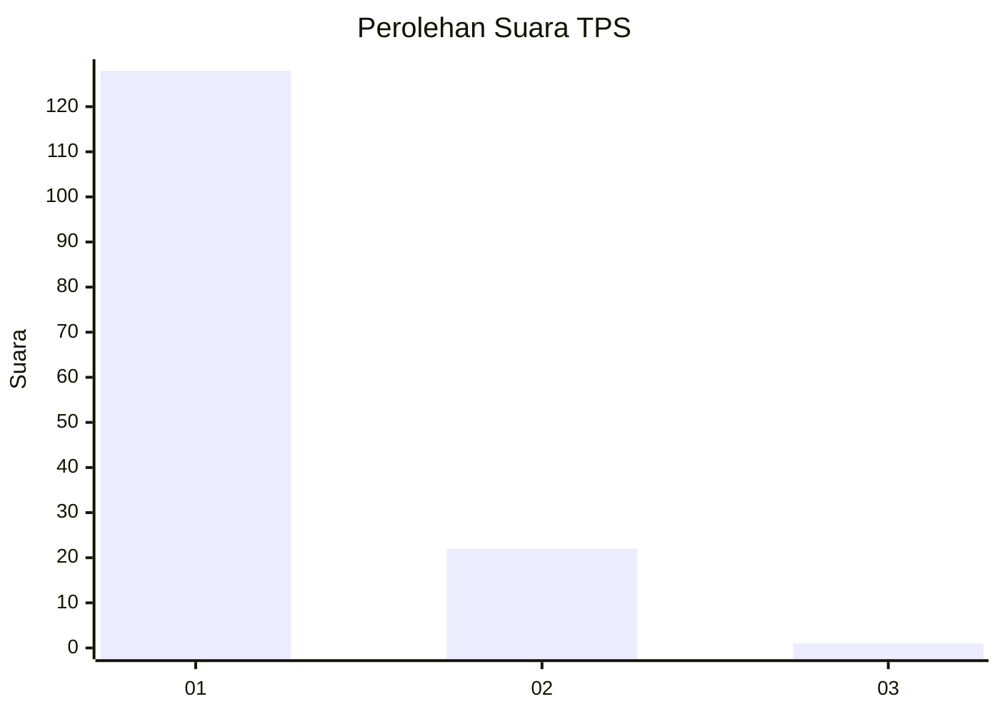
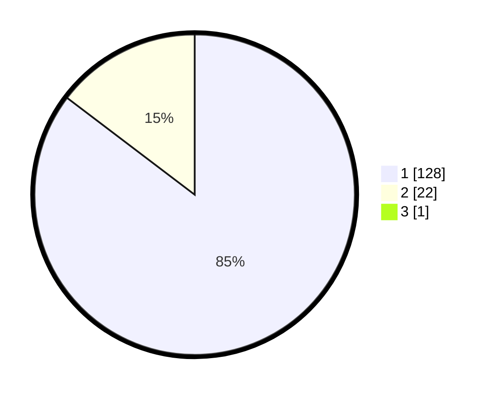

# Hasil

## Grafik

## Tabel

| No. | Nama Paslon    | Suara | Suara (raw) | Persentase |
|:--- |:-------------- | -----:| -----------:| ----------:|
| 1   | ANIES MUHAIMIN | 128   | [128][p-1]  | 84,77      |
| 2   | PRABOWO GIBRAN | 22    | [22][p-2]   | 14,57      |
| 3   | GANJAR MAHFUD  | 1     | [1][p-3]    | 0,66       |

[p-1]: https://github.com/gigit-pemilu/pemilu-2024-11-aceh/blob/main/pilpres/hitung-suara/sub/11-aceh/sub/07-pidie/sub/06-glumpang-tiga/sub/2001-simpang/sub/001-tps/sub/paslon-1.txt
[p-2]: https://github.com/gigit-pemilu/pemilu-2024-11-aceh/blob/main/pilpres/hitung-suara/sub/11-aceh/sub/07-pidie/sub/06-glumpang-tiga/sub/2001-simpang/sub/001-tps/sub/paslon-2.txt
[p-3]: https://github.com/gigit-pemilu/pemilu-2024-11-aceh/blob/main/pilpres/hitung-suara/sub/11-aceh/sub/07-pidie/sub/06-glumpang-tiga/sub/2001-simpang/sub/001-tps/sub/paslon-3.txt

## Foto C Plano

https://sirekap-obj-formc.kpu.go.id/34fc/pemilu/ppwp/11/07/06/20/01/1107062001001-20240215-020045--98146b7b-3be6-4deb-8ed4-3cad612fdbcb.jpg

https://sirekap-obj-formc.kpu.go.id/34fc/pemilu/ppwp/11/07/06/20/01/1107062001001-20240215-020210--cab99d43-33d2-48bf-b381-24cb5f523c4b.jpg

https://sirekap-obj-formc.kpu.go.id/34fc/pemilu/ppwp/11/07/06/20/01/1107062001001-20240215-020423--1d7ccec7-0a64-4360-bdb1-e141084596a9.jpg

## Metadata

| Key        | Value               |
| ---------- | ------------------- |
| Time Stamp | 2024-02-17 03:30:02 |

## DATA PEMILIH TETAP

Jumlah pemilih dalam DPT: **181**.
 * L: **80**.
 * P: **101**.

## DATA PENGGUNA HAK PILIH

Jumlah pengguna hak pilih dalam DPT: **154**.
 * L: **59**.
 * P: **95**.

Jumlah pengguna hak pilih dalam DPTb: **0**.
 * L: **0**.
 * P: **0**.

Jumlah pengguna hak pilih dalam DPK: **0**.
 * L: **0**.
 * P: **0**.

Jumlah pengguna hak pilih: **154**.
 * L: **59**.
 * P: **95**.

## JUMLAH SUARA SAH DAN TIDAK SAH

JUMLAH SELURUH SUARA SAH: **151**.

JUMLAH SUARA TIDAK SAH: **3**.

JUMLAH SELURUH SUARA SAH DAN SUARA TIDAK SAH: **154**.

