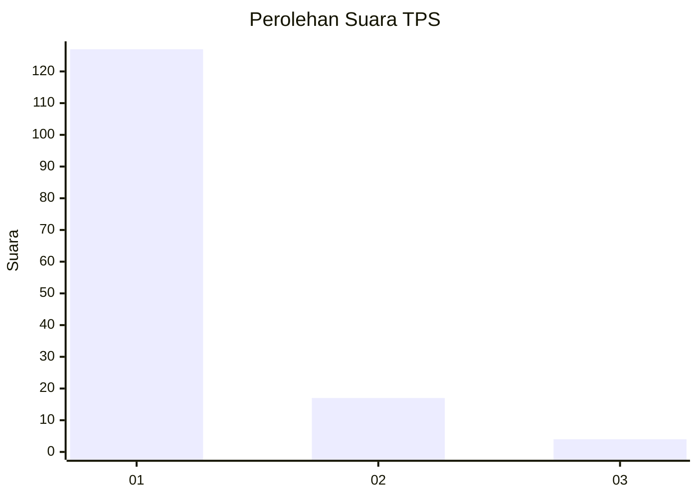
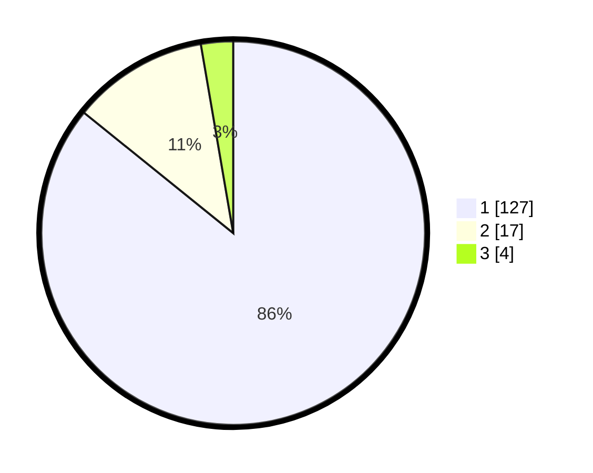

# Hasil

## Grafik

## Tabel

| No. | Nama Paslon    | Suara | Suara (raw) | Persentase |
|:--- |:-------------- | -----:| -----------:| ----------:|
| 1   | ANIES MUHAIMIN | 127   | [127][p-1]  | 85,81      |
| 2   | PRABOWO GIBRAN | 17    | [17][p-2]   | 11,49      |
| 3   | GANJAR MAHFUD  | 4     | [4][p-3]    | 2,70       |

[p-1]: https://github.com/gigit-pemilu/pemilu-2024-11-aceh/blob/main/pilpres/hitung-suara/sub/11-aceh/sub/07-pidie/sub/06-glumpang-tiga/sub/2001-simpang/sub/002-tps/sub/paslon-1.txt
[p-2]: https://github.com/gigit-pemilu/pemilu-2024-11-aceh/blob/main/pilpres/hitung-suara/sub/11-aceh/sub/07-pidie/sub/06-glumpang-tiga/sub/2001-simpang/sub/002-tps/sub/paslon-2.txt
[p-3]: https://github.com/gigit-pemilu/pemilu-2024-11-aceh/blob/main/pilpres/hitung-suara/sub/11-aceh/sub/07-pidie/sub/06-glumpang-tiga/sub/2001-simpang/sub/002-tps/sub/paslon-3.txt

## Foto C Plano

https://sirekap-obj-formc.kpu.go.id/e89b/pemilu/ppwp/11/07/06/20/01/1107062001002-20240215-035431--87216bec-a431-458e-a233-4460054c3e1e.jpg

https://sirekap-obj-formc.kpu.go.id/e89b/pemilu/ppwp/11/07/06/20/01/1107062001002-20240215-022814--1668b5bb-4c14-419f-b948-16befd5fff92.jpg

https://sirekap-obj-formc.kpu.go.id/e89b/pemilu/ppwp/11/07/06/20/01/1107062001002-20240215-023042--3e79b54f-5141-451e-b890-3a113cfb407a.jpg

## Metadata

| Key        | Value               |
| ---------- | ------------------- |
| Time Stamp | 2024-02-17 03:30:02 |

