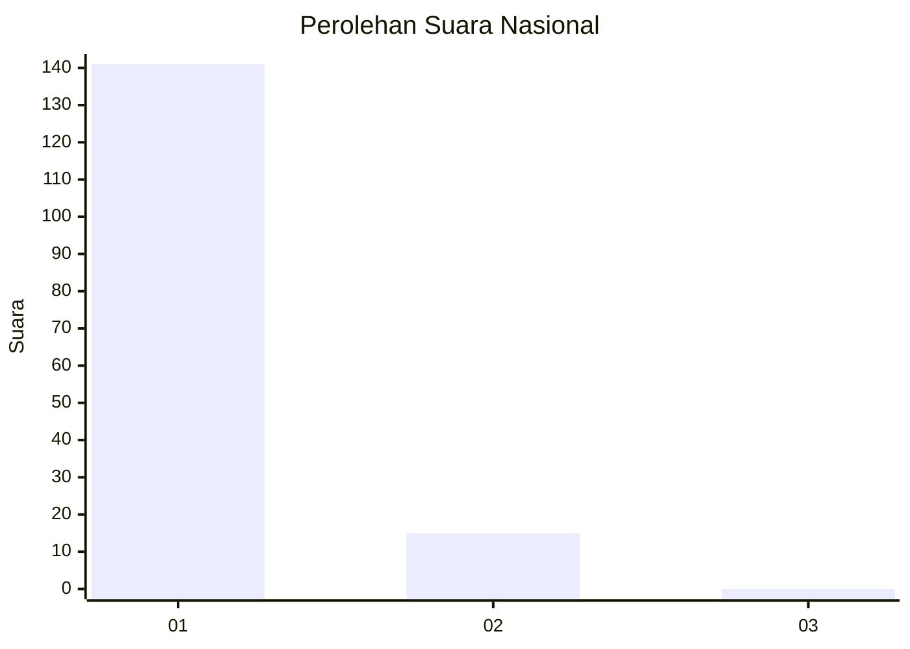
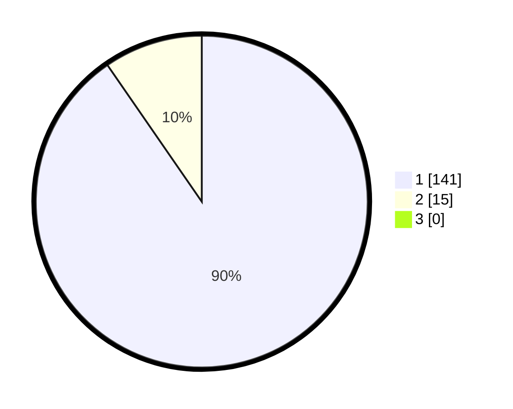

# Hasil

## Grafik

## Tabel

| No. | Nama Paslon    | Suara | Suara (raw) | Persentase |
|:--- |:-------------- | -----:| -----------:| ----------:|
| 1   | ANIES MUHAIMIN | 141   | [141][p-1]  | 90,38      |
| 2   | PRABOWO GIBRAN | 15    | [15][p-2]   | 9,62       |
| 3   | GANJAR MAHFUD  | 0     | [0][p-3]    | 0,00       |

[p-1]: https://github.com/gigit-pemilu/pemilu-2024/blob/main/pilpres/hitung-suara/sub/11-aceh/sub/07-pidie/sub/06-glumpang-tiga/sub/2003-krueng-nyong/sub/001-tps/sub/paslon-1.txt
[p-2]: https://github.com/gigit-pemilu/pemilu-2024/blob/main/pilpres/hitung-suara/sub/11-aceh/sub/07-pidie/sub/06-glumpang-tiga/sub/2003-krueng-nyong/sub/001-tps/sub/paslon-2.txt
[p-3]: https://github.com/gigit-pemilu/pemilu-2024/blob/main/pilpres/hitung-suara/sub/11-aceh/sub/07-pidie/sub/06-glumpang-tiga/sub/2003-krueng-nyong/sub/001-tps/sub/paslon-3.txt

## Foto C Plano

https://sirekap-obj-formc.kpu.go.id/4904/pemilu/ppwp/11/07/06/20/03/1107062003001-20240215-024924--a2b612c9-bb8b-40c2-be46-33eba1c6e431.jpg

https://sirekap-obj-formc.kpu.go.id/4904/pemilu/ppwp/11/07/06/20/03/1107062003001-20240215-025054--659c18a7-f6cf-450d-9629-8a775f34e734.jpg

https://sirekap-obj-formc.kpu.go.id/4904/pemilu/ppwp/11/07/06/20/03/1107062003001-20240215-025233--1c320e3a-a263-48db-85a4-8015d4153f73.jpg

## Metadata

| Key        | Value               |
| ---------- | ------------------- |
| Time Stamp | 2024-02-17 03:30:02 |

