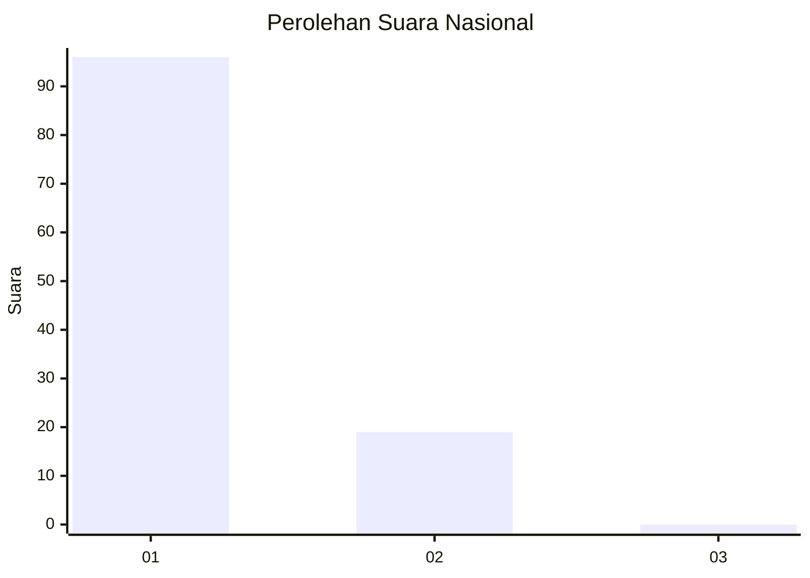
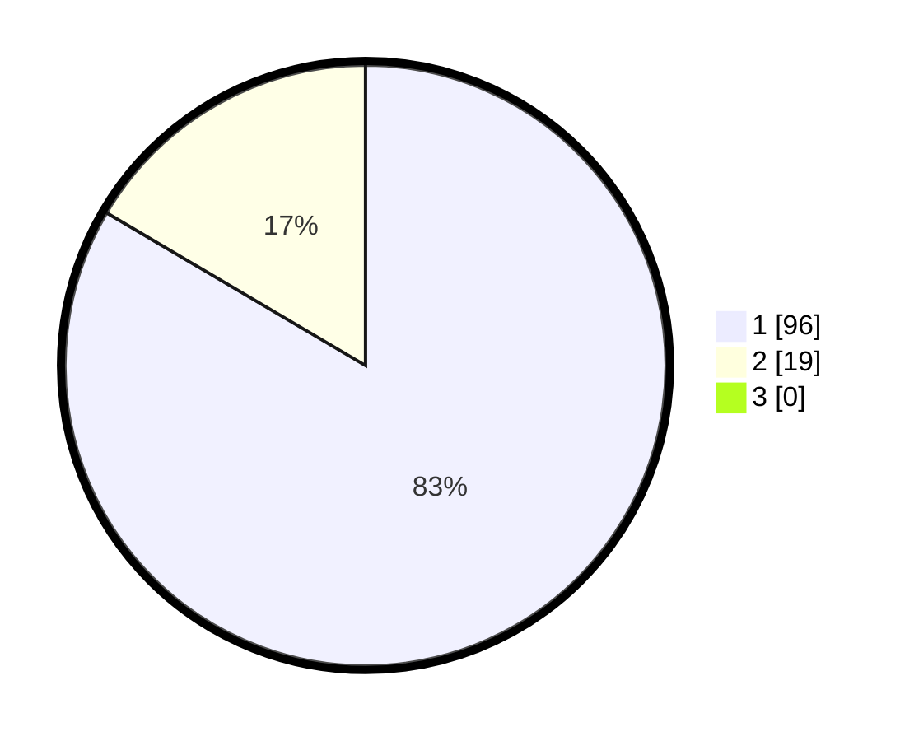

# Hasil

## Grafik

## Tabel

| No. | Nama Paslon    | Suara | Suara (raw) | Persentase |
|:--- |:-------------- | -----:| -----------:| ----------:|
| 1   | ANIES MUHAIMIN | 96    | [96][p-1]   | 83,48      |
| 2   | PRABOWO GIBRAN | 19    | [19][p-2]   | 16,52      |
| 3   | GANJAR MAHFUD  | 0     | [0][p-3]    | 0,00       |

[p-1]: https://github.com/gigit-pemilu/pemilu-2024/blob/main/pilpres/hitung-suara/sub/11-aceh/sub/07-pidie/sub/06-glumpang-tiga/sub/2009-reudeup-meulayu/sub/002-tps/sub/paslon-1.txt
[p-2]: https://github.com/gigit-pemilu/pemilu-2024/blob/main/pilpres/hitung-suara/sub/11-aceh/sub/07-pidie/sub/06-glumpang-tiga/sub/2009-reudeup-meulayu/sub/002-tps/sub/paslon-2.txt
[p-3]: https://github.com/gigit-pemilu/pemilu-2024/blob/main/pilpres/hitung-suara/sub/11-aceh/sub/07-pidie/sub/06-glumpang-tiga/sub/2009-reudeup-meulayu/sub/002-tps/sub/paslon-3.txt

## Foto C Plano

https://sirekap-obj-formc.kpu.go.id/7bff/pemilu/ppwp/11/07/06/20/09/1107062009002-20240214-214710--8b6422d3-4acc-49f3-b9e2-bedb93ba383d.jpg

https://sirekap-obj-formc.kpu.go.id/7bff/pemilu/ppwp/11/07/06/20/09/1107062009002-20240214-214948--0de1dac1-594b-4eaa-bbb9-2236755e9128.jpg

https://sirekap-obj-formc.kpu.go.id/7bff/pemilu/ppwp/11/07/06/20/09/1107062009002-20240214-215152--b0ff1633-cbc1-40d0-8047-1a46a5d25d07.jpg

## Metadata

| Key        | Value               |
| ---------- | ------------------- |
| Time Stamp | 2024-02-24 22:31:28 |

