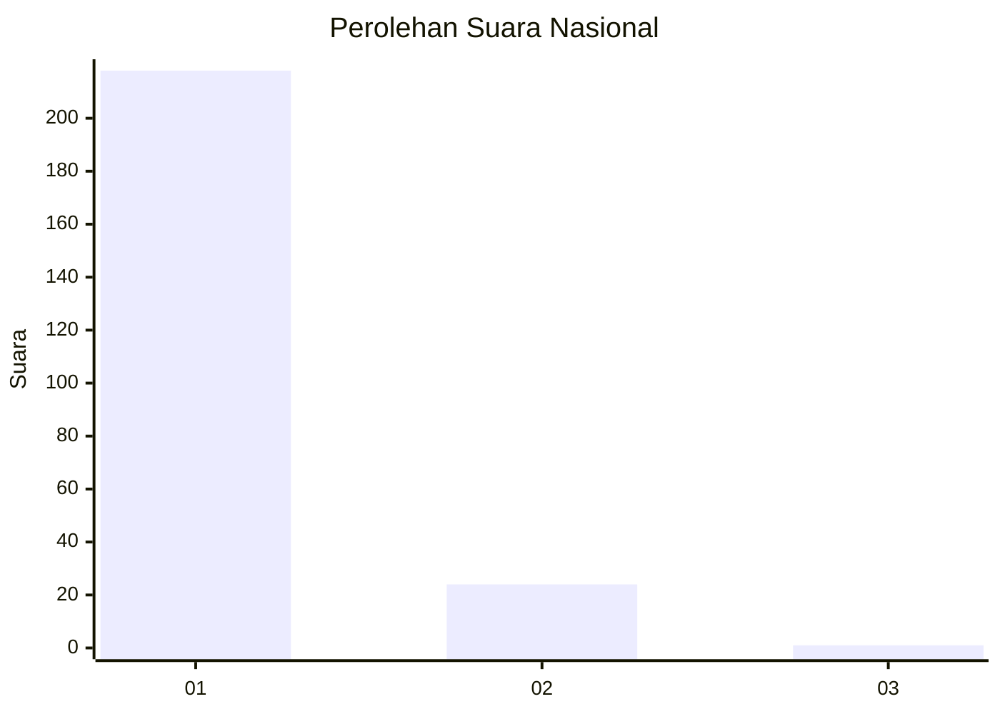
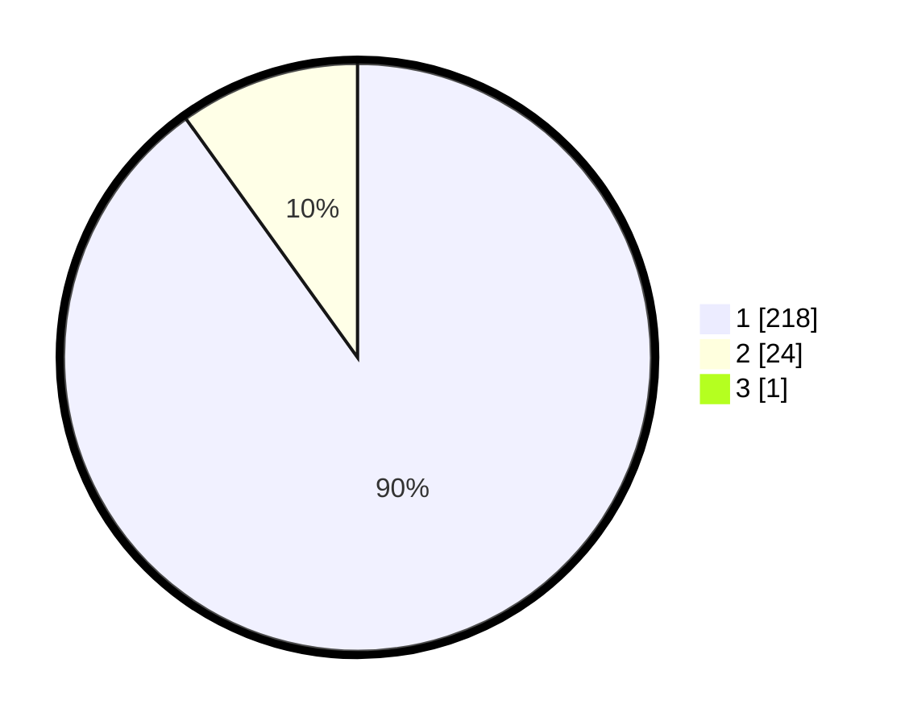

# Hasil

## Grafik

## Tabel

| No. | Nama Paslon    | Suara | Suara (raw) | Persentase |
|:--- |:-------------- | -----:| -----------:| ----------:|
| 1   | ANIES MUHAIMIN | 218   | [218][p-1]  | 89,71      |
| 2   | PRABOWO GIBRAN | 24    | [24][p-2]   | 9,88       |
| 3   | GANJAR MAHFUD  | 1     | [1][p-3]    | 0,41       |

[p-1]: https://github.com/gigit-pemilu/pemilu-2024/blob/main/pilpres/hitung-suara/sub/11-aceh/sub/07-pidie/sub/06-glumpang-tiga/sub/2010-dayah-tanoh/sub/001-tps/sub/paslon-1.txt
[p-2]: https://github.com/gigit-pemilu/pemilu-2024/blob/main/pilpres/hitung-suara/sub/11-aceh/sub/07-pidie/sub/06-glumpang-tiga/sub/2010-dayah-tanoh/sub/001-tps/sub/paslon-2.txt
[p-3]: https://github.com/gigit-pemilu/pemilu-2024/blob/main/pilpres/hitung-suara/sub/11-aceh/sub/07-pidie/sub/06-glumpang-tiga/sub/2010-dayah-tanoh/sub/001-tps/sub/paslon-3.txt

## Foto C Plano

https://sirekap-obj-formc.kpu.go.id/9bcf/pemilu/ppwp/11/07/06/20/10/1107062010001-20240214-195129--63d3c012-e802-493f-9846-5c775463b5e9.jpg

https://sirekap-obj-formc.kpu.go.id/9bcf/pemilu/ppwp/11/07/06/20/10/1107062010001-20240214-195203--9ba5a183-de15-4f71-b073-d6cae3cd252e.jpg

https://sirekap-obj-formc.kpu.go.id/9bcf/pemilu/ppwp/11/07/06/20/10/1107062010001-20240215-012218--7beb9f24-3d85-4cb7-b0b2-38e12636dcf7.jpg

## Metadata

| Key        | Value               |
| ---------- | ------------------- |
| Time Stamp | 2024-02-24 22:31:28 |

