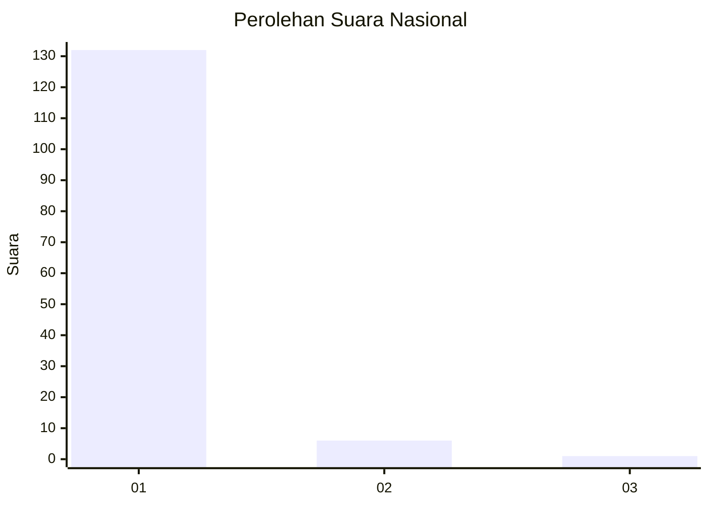
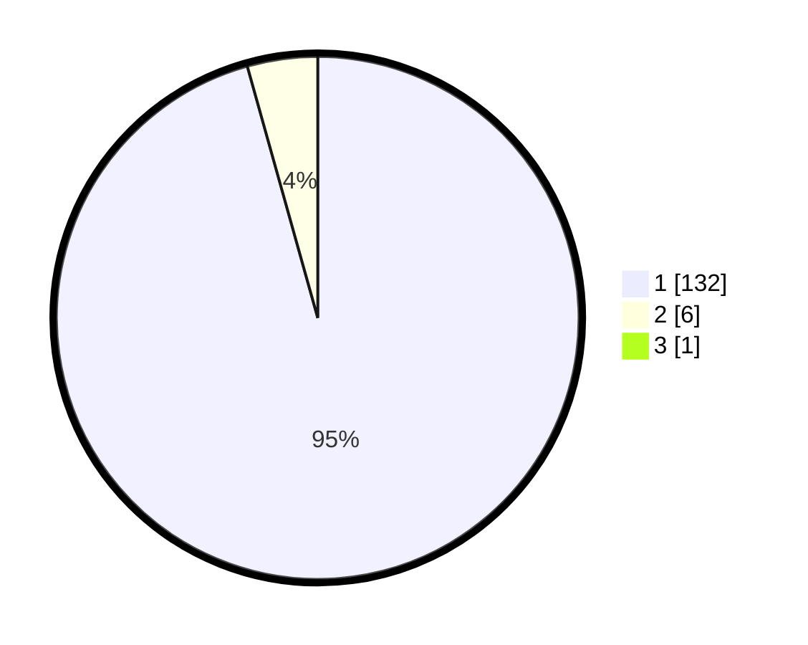

# Hasil

## Grafik

## Tabel

| No. | Nama Paslon    | Suara | Suara (raw) | Persentase |
|:--- |:-------------- | -----:| -----------:| ----------:|
| 1   | ANIES MUHAIMIN | 132   | [132][p-1]  | 94,96      |
| 2   | PRABOWO GIBRAN | 6     | [6][p-2]    | 4,32       |
| 3   | GANJAR MAHFUD  | 1     | [1][p-3]    | 0,72       |

[p-1]: https://github.com/gigit-pemilu/pemilu-2024/blob/main/pilpres/hitung-suara/sub/11-aceh/sub/07-pidie/sub/06-glumpang-tiga/sub/2011-mamplam/sub/002-tps/sub/paslon-1.txt
[p-2]: https://github.com/gigit-pemilu/pemilu-2024/blob/main/pilpres/hitung-suara/sub/11-aceh/sub/07-pidie/sub/06-glumpang-tiga/sub/2011-mamplam/sub/002-tps/sub/paslon-2.txt
[p-3]: https://github.com/gigit-pemilu/pemilu-2024/blob/main/pilpres/hitung-suara/sub/11-aceh/sub/07-pidie/sub/06-glumpang-tiga/sub/2011-mamplam/sub/002-tps/sub/paslon-3.txt

## Foto C Plano

https://sirekap-obj-formc.kpu.go.id/ec3f/pemilu/ppwp/11/07/06/20/11/1107062011002-20240214-200712--4c696806-a941-4d7a-9cc8-063346079312.jpg

https://sirekap-obj-formc.kpu.go.id/ec3f/pemilu/ppwp/11/07/06/20/11/1107062011002-20240214-201042--4de922e4-d404-4116-ba54-d5edff5acdcc.jpg

https://sirekap-obj-formc.kpu.go.id/ec3f/pemilu/ppwp/11/07/06/20/11/1107062011002-20240214-213631--8aef149b-9ac3-4093-b796-54fbda5c89e4.jpg

## Metadata

| Key        | Value               |
| ---------- | ------------------- |
| Time Stamp | 2024-02-15 02:10:27 |

