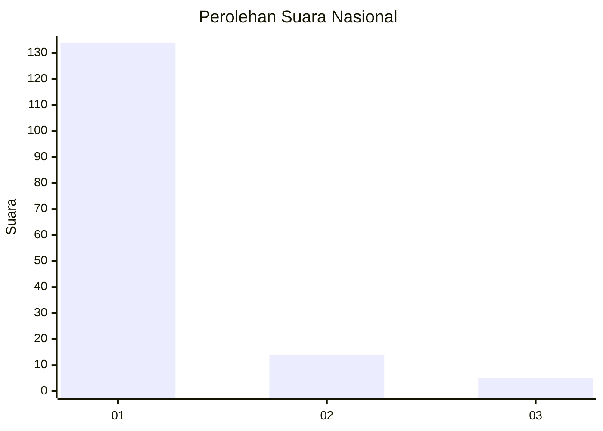
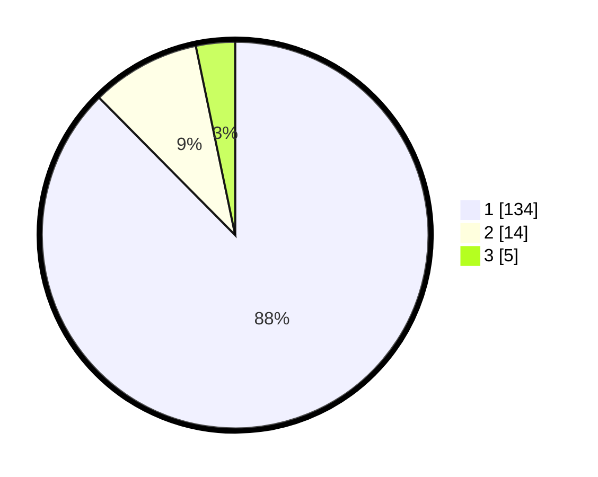

# Hasil

## Grafik

## Tabel

| No. | Nama Paslon    | Suara | Suara (raw) | Persentase |
|:--- |:-------------- | -----:| -----------:| ----------:|
| 1   | ANIES MUHAIMIN | 134   | [134][p-1]  | 87,58      |
| 2   | PRABOWO GIBRAN | 14    | [14][p-2]   | 9,15       |
| 3   | GANJAR MAHFUD  | 5     | [5][p-3]    | 3,27       |

[p-1]: https://github.com/gigit-pemilu/pemilu-2024/blob/main/pilpres/hitung-suara/sub/11-aceh/sub/07-pidie/sub/06-glumpang-tiga/sub/2013-kupula/sub/001-tps/sub/paslon-1.txt
[p-2]: https://github.com/gigit-pemilu/pemilu-2024/blob/main/pilpres/hitung-suara/sub/11-aceh/sub/07-pidie/sub/06-glumpang-tiga/sub/2013-kupula/sub/001-tps/sub/paslon-2.txt
[p-3]: https://github.com/gigit-pemilu/pemilu-2024/blob/main/pilpres/hitung-suara/sub/11-aceh/sub/07-pidie/sub/06-glumpang-tiga/sub/2013-kupula/sub/001-tps/sub/paslon-3.txt

## Foto C Plano

https://sirekap-obj-formc.kpu.go.id/2d81/pemilu/ppwp/11/07/06/20/13/1107062013001-20240214-220655--c0a275f0-4b31-4d36-9361-98505cd2175a.jpg

https://sirekap-obj-formc.kpu.go.id/2d81/pemilu/ppwp/11/07/06/20/13/1107062013001-20240214-215538--2ec82a1a-a7a7-4cae-9310-994e89e675f5.jpg

https://sirekap-obj-formc.kpu.go.id/2d81/pemilu/ppwp/11/07/06/20/13/1107062013001-20240214-220822--8ed1460a-f912-4d48-8cd5-39b5516f7881.jpg

## Metadata

| Key        | Value               |
| ---------- | ------------------- |
| Time Stamp | 2024-02-17 03:30:02 |

