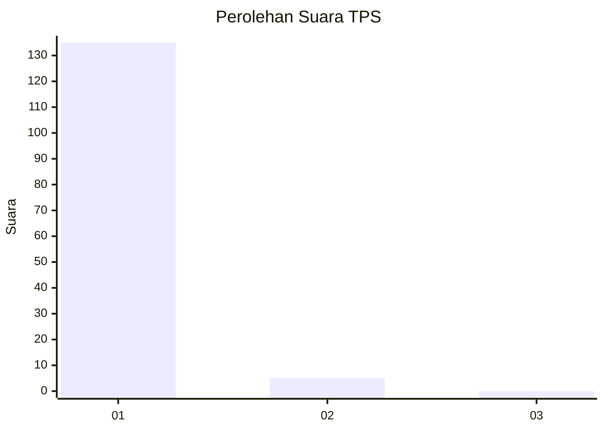
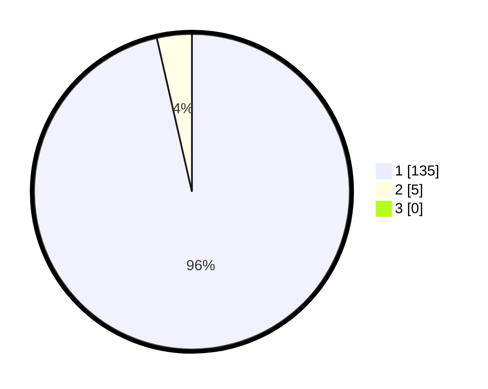

# Hasil

## Grafik

## Tabel

| No. | Nama Paslon    | Suara | Suara (raw) | Persentase |
|:--- |:-------------- | -----:| -----------:| ----------:|
| 1   | ANIES MUHAIMIN | 135   | [135][p-1]  | 96,43      |
| 2   | PRABOWO GIBRAN | 5     | [5][p-2]    | 3,57       |
| 3   | GANJAR MAHFUD  | 0     | [0][p-3]    | 0,00       |

[p-1]: https://github.com/gigit-pemilu/pemilu-2024-11-aceh/blob/main/pilpres/hitung-suara/sub/11-aceh/sub/07-pidie/sub/06-glumpang-tiga/sub/2014-pulo-lueng-teuga/sub/002-tps/sub/paslon-1.txt
[p-2]: https://github.com/gigit-pemilu/pemilu-2024-11-aceh/blob/main/pilpres/hitung-suara/sub/11-aceh/sub/07-pidie/sub/06-glumpang-tiga/sub/2014-pulo-lueng-teuga/sub/002-tps/sub/paslon-2.txt
[p-3]: https://github.com/gigit-pemilu/pemilu-2024-11-aceh/blob/main/pilpres/hitung-suara/sub/11-aceh/sub/07-pidie/sub/06-glumpang-tiga/sub/2014-pulo-lueng-teuga/sub/002-tps/sub/paslon-3.txt

## Foto C Plano

https://sirekap-obj-formc.kpu.go.id/1cda/pemilu/ppwp/11/07/06/20/14/1107062014002-20240215-034652--1acd55f5-0788-41d5-afd5-b8678002c703.jpg

https://sirekap-obj-formc.kpu.go.id/1cda/pemilu/ppwp/11/07/06/20/14/1107062014002-20240214-233410--f098b307-2da2-43f7-b588-9b8f326f4f8e.jpg

https://sirekap-obj-formc.kpu.go.id/1cda/pemilu/ppwp/11/07/06/20/14/1107062014002-20240215-035542--56474fbc-24c7-4f16-8b33-ba3ca70319e5.jpg

## Metadata

| Key        | Value               |
| ---------- | ------------------- |
| Time Stamp | 2024-02-17 03:30:02 |

