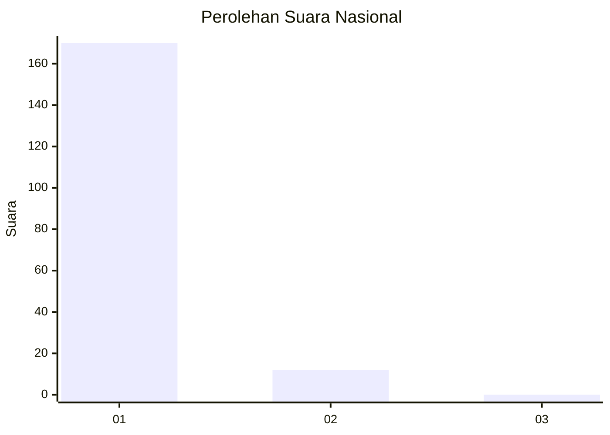
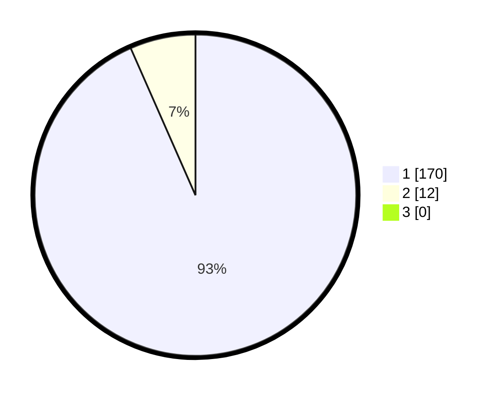

# Hasil

## Grafik

## Tabel

| No. | Nama Paslon    | Suara | Suara (raw) | Persentase |
|:--- |:-------------- | -----:| -----------:| ----------:|
| 1   | ANIES MUHAIMIN | 170   | [170][p-1]  | 93,41      |
| 2   | PRABOWO GIBRAN | 12    | [12][p-2]   | 6,59       |
| 3   | GANJAR MAHFUD  | 0     | [0][p-3]    | 0,00       |

[p-1]: https://github.com/gigit-pemilu/pemilu-2024/blob/main/pilpres/hitung-suara/sub/11-aceh/sub/07-pidie/sub/06-glumpang-tiga/sub/2015-sukon-mesjid/sub/001-tps/sub/paslon-1.txt
[p-2]: https://github.com/gigit-pemilu/pemilu-2024/blob/main/pilpres/hitung-suara/sub/11-aceh/sub/07-pidie/sub/06-glumpang-tiga/sub/2015-sukon-mesjid/sub/001-tps/sub/paslon-2.txt
[p-3]: https://github.com/gigit-pemilu/pemilu-2024/blob/main/pilpres/hitung-suara/sub/11-aceh/sub/07-pidie/sub/06-glumpang-tiga/sub/2015-sukon-mesjid/sub/001-tps/sub/paslon-3.txt

## Foto C Plano

https://sirekap-obj-formc.kpu.go.id/b46b/pemilu/ppwp/11/07/06/20/15/1107062015001-20240215-012926--6cf8fd88-c837-4ac8-acad-3a6f3d4bedd9.jpg

https://sirekap-obj-formc.kpu.go.id/b46b/pemilu/ppwp/11/07/06/20/15/1107062015001-20240215-013028--ba808751-83fe-4115-b8e9-22aa48817d43.jpg

https://sirekap-obj-formc.kpu.go.id/b46b/pemilu/ppwp/11/07/06/20/15/1107062015001-20240215-013153--56826d2e-df23-4277-8fb7-b0719d82f5d0.jpg

## Metadata

| Key        | Value               |
| ---------- | ------------------- |
| Time Stamp | 2024-02-17 03:30:02 |

