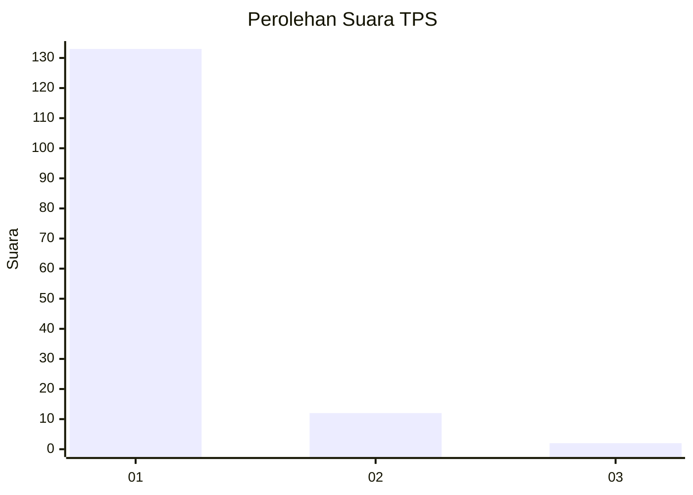
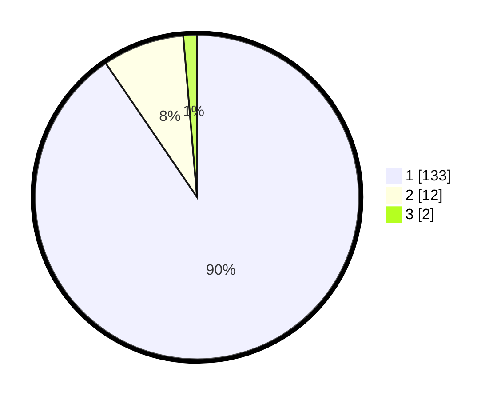

# Hasil

## Grafik

## Tabel

| No. | Nama Paslon    | Suara | Suara (raw) | Persentase |
|:--- |:-------------- | -----:| -----------:| ----------:|
| 1   | ANIES MUHAIMIN | 133   | [133][p-1]  | 90,48      |
| 2   | PRABOWO GIBRAN | 12    | [12][p-2]   | 8,16       |
| 3   | GANJAR MAHFUD  | 2     | [2][p-3]    | 1,36       |

[p-1]: https://github.com/gigit-pemilu/pemilu-2024-11-aceh/blob/main/pilpres/hitung-suara/sub/11-aceh/sub/07-pidie/sub/06-glumpang-tiga/sub/2015-sukon-mesjid/sub/003-tps/sub/paslon-1.txt
[p-2]: https://github.com/gigit-pemilu/pemilu-2024-11-aceh/blob/main/pilpres/hitung-suara/sub/11-aceh/sub/07-pidie/sub/06-glumpang-tiga/sub/2015-sukon-mesjid/sub/003-tps/sub/paslon-2.txt
[p-3]: https://github.com/gigit-pemilu/pemilu-2024-11-aceh/blob/main/pilpres/hitung-suara/sub/11-aceh/sub/07-pidie/sub/06-glumpang-tiga/sub/2015-sukon-mesjid/sub/003-tps/sub/paslon-3.txt

## Foto C Plano

https://sirekap-obj-formc.kpu.go.id/a173/pemilu/ppwp/11/07/06/20/15/1107062015003-20240215-021100--ffc4f354-b8bc-42db-a420-0bdf23788722.jpg

https://sirekap-obj-formc.kpu.go.id/a173/pemilu/ppwp/11/07/06/20/15/1107062015003-20240215-021256--913ff621-da58-4681-a627-cb2af8319d6c.jpg

https://sirekap-obj-formc.kpu.go.id/a173/pemilu/ppwp/11/07/06/20/15/1107062015003-20240215-023614--edd70bc4-fa7e-42c4-a751-e17ad73297b6.jpg

## Metadata

| Key        | Value               |
| ---------- | ------------------- |
| Time Stamp | 2024-02-24 22:31:28 |

