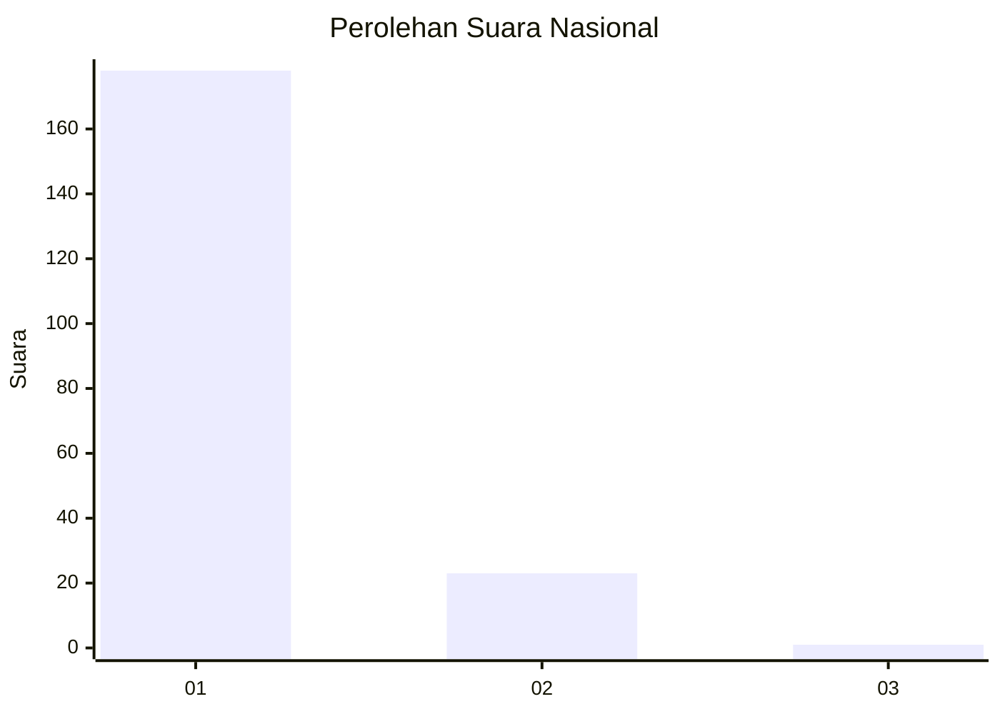
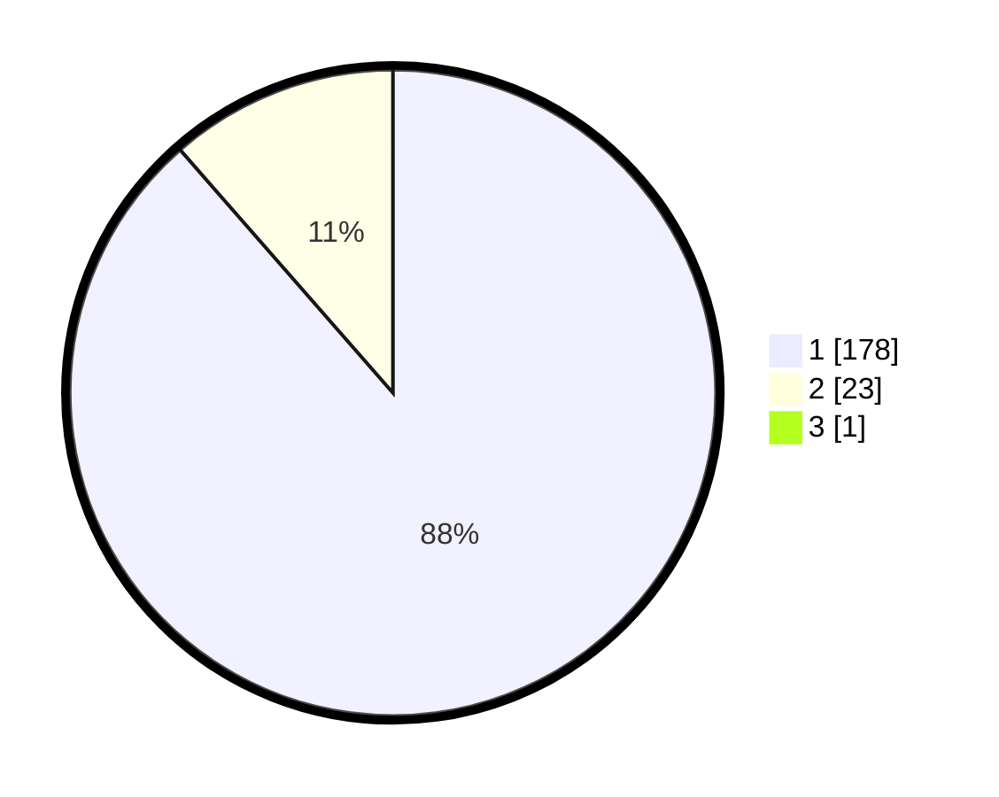

# Hasil

## Grafik

## Tabel

| No. | Nama Paslon    | Suara | Suara (raw) | Persentase |
|:--- |:-------------- | -----:| -----------:| ----------:|
| 1   | ANIES MUHAIMIN | 178   | [178][p-1]  | 88,12      |
| 2   | PRABOWO GIBRAN | 23    | [23][p-2]   | 11,39      |
| 3   | GANJAR MAHFUD  | 1     | [1][p-3]    | 0,50       |

[p-1]: https://github.com/gigit-pemilu/pemilu-2024/blob/main/pilpres/hitung-suara/sub/11-aceh/sub/07-pidie/sub/06-glumpang-tiga/sub/2016-sukon-baroh/sub/001-tps/sub/paslon-1.txt
[p-2]: https://github.com/gigit-pemilu/pemilu-2024/blob/main/pilpres/hitung-suara/sub/11-aceh/sub/07-pidie/sub/06-glumpang-tiga/sub/2016-sukon-baroh/sub/001-tps/sub/paslon-2.txt
[p-3]: https://github.com/gigit-pemilu/pemilu-2024/blob/main/pilpres/hitung-suara/sub/11-aceh/sub/07-pidie/sub/06-glumpang-tiga/sub/2016-sukon-baroh/sub/001-tps/sub/paslon-3.txt

## Foto C Plano

https://sirekap-obj-formc.kpu.go.id/963c/pemilu/ppwp/11/07/06/20/16/1107062016001-20240215-022647--1e405f44-73a6-4e95-8cf0-3a5c5a64f2e1.jpg

https://sirekap-obj-formc.kpu.go.id/963c/pemilu/ppwp/11/07/06/20/16/1107062016001-20240215-022703--217c8359-2200-4c8a-b05e-69cfa3559dc1.jpg

https://sirekap-obj-formc.kpu.go.id/963c/pemilu/ppwp/11/07/06/20/16/1107062016001-20240215-022728--25f2a365-1297-411f-aebb-072672ee2170.jpg

## Metadata

| Key        | Value               |
| ---------- | ------------------- |
| Time Stamp | 2024-02-17 03:30:02 |

