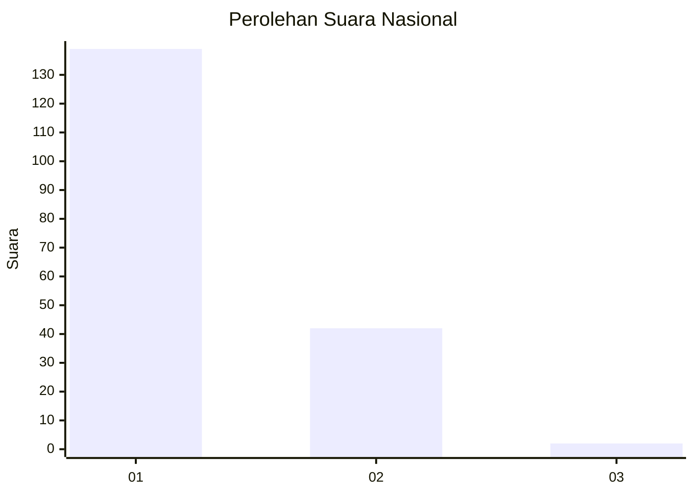
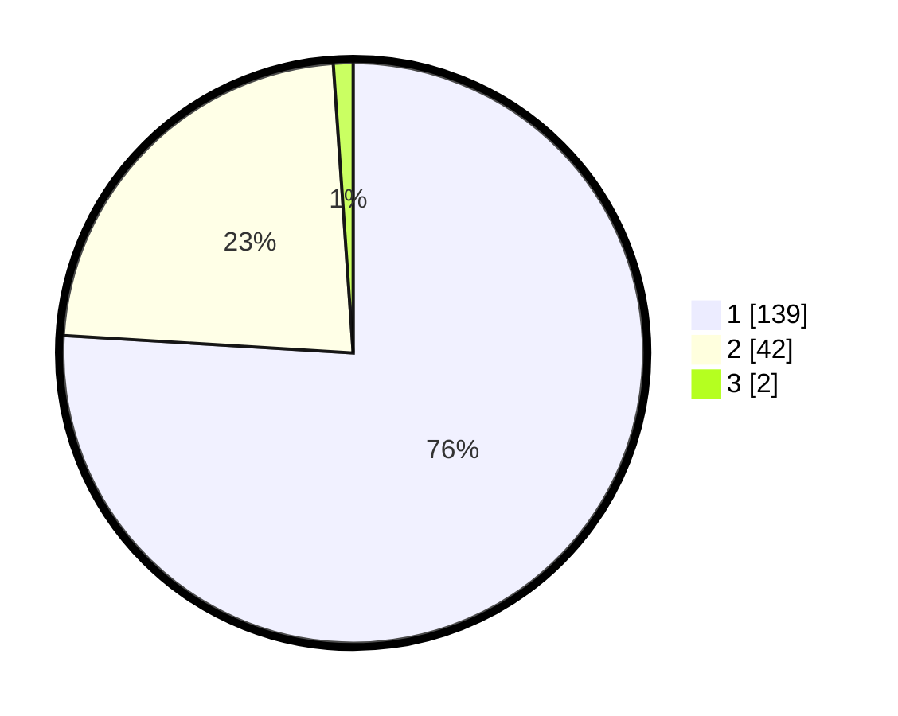

# Hasil

## Grafik

## Tabel

| No. | Nama Paslon    | Suara | Suara (raw) | Persentase |
|:--- |:-------------- | -----:| -----------:| ----------:|
| 1   | ANIES MUHAIMIN | 139   | [139][p-1]  | 75,96      |
| 2   | PRABOWO GIBRAN | 42    | [42][p-2]   | 22,95      |
| 3   | GANJAR MAHFUD  | 2     | [2][p-3]    | 1,09       |

[p-1]: https://github.com/gigit-pemilu/pemilu-2024/blob/main/pilpres/hitung-suara/sub/11-aceh/sub/07-pidie/sub/06-glumpang-tiga/sub/2019-ude-gampong/sub/001-tps/sub/paslon-1.txt
[p-2]: https://github.com/gigit-pemilu/pemilu-2024/blob/main/pilpres/hitung-suara/sub/11-aceh/sub/07-pidie/sub/06-glumpang-tiga/sub/2019-ude-gampong/sub/001-tps/sub/paslon-2.txt
[p-3]: https://github.com/gigit-pemilu/pemilu-2024/blob/main/pilpres/hitung-suara/sub/11-aceh/sub/07-pidie/sub/06-glumpang-tiga/sub/2019-ude-gampong/sub/001-tps/sub/paslon-3.txt

## Foto C Plano

https://sirekap-obj-formc.kpu.go.id/5b6c/pemilu/ppwp/11/07/06/20/19/1107062019001-20240215-033130--bf09161c-a959-469e-a1c7-34ead6061649.jpg

https://sirekap-obj-formc.kpu.go.id/5b6c/pemilu/ppwp/11/07/06/20/19/1107062019001-20240215-033213--a83547d2-43ad-44eb-bc62-174bb75191d3.jpg

https://sirekap-obj-formc.kpu.go.id/5b6c/pemilu/ppwp/11/07/06/20/19/1107062019001-20240215-033315--716b169d-f573-48e6-8ed3-8af588e1083a.jpg

## Metadata

| Key        | Value               |
| ---------- | ------------------- |
| Time Stamp | 2024-02-17 03:30:02 |

