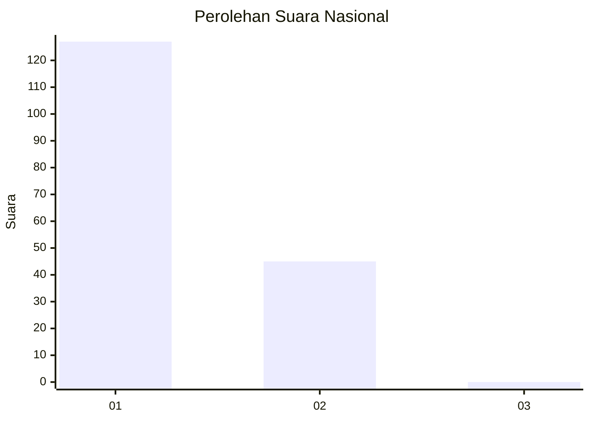
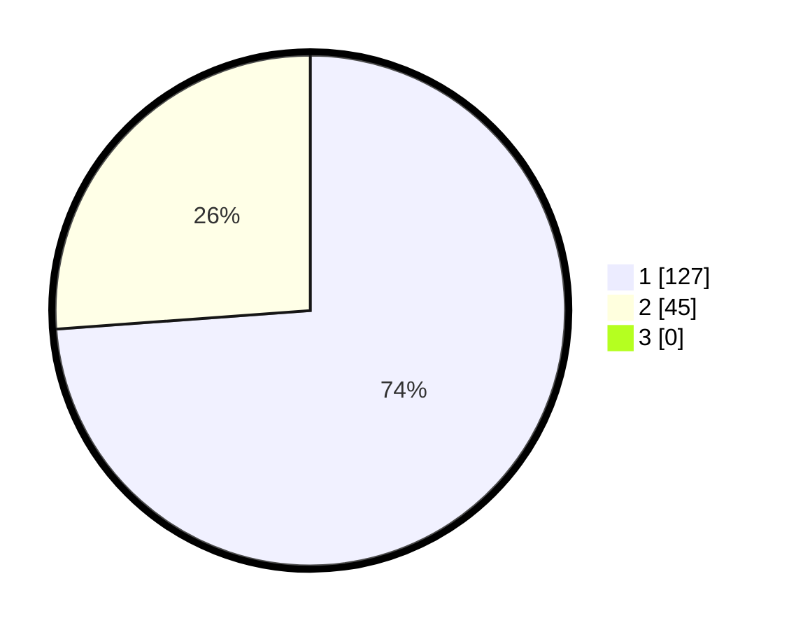

# Hasil

## Grafik

## Tabel

| No. | Nama Paslon    | Suara | Suara (raw) | Persentase |
|:--- |:-------------- | -----:| -----------:| ----------:|
| 1   | ANIES MUHAIMIN | 127   | [127][p-1]  | 73,84      |
| 2   | PRABOWO GIBRAN | 45    | [45][p-2]   | 26,16      |
| 3   | GANJAR MAHFUD  | 0     | [0][p-3]    | 0,00       |

[p-1]: https://github.com/gigit-pemilu/pemilu-2024/blob/main/pilpres/hitung-suara/sub/11-aceh/sub/07-pidie/sub/06-glumpang-tiga/sub/2019-ude-gampong/sub/002-tps/sub/paslon-1.txt
[p-2]: https://github.com/gigit-pemilu/pemilu-2024/blob/main/pilpres/hitung-suara/sub/11-aceh/sub/07-pidie/sub/06-glumpang-tiga/sub/2019-ude-gampong/sub/002-tps/sub/paslon-2.txt
[p-3]: https://github.com/gigit-pemilu/pemilu-2024/blob/main/pilpres/hitung-suara/sub/11-aceh/sub/07-pidie/sub/06-glumpang-tiga/sub/2019-ude-gampong/sub/002-tps/sub/paslon-3.txt

## Foto C Plano

https://sirekap-obj-formc.kpu.go.id/331f/pemilu/ppwp/11/07/06/20/19/1107062019002-20240215-044501--98257ceb-bce7-49d7-8c0e-65de36ebb842.jpg

https://sirekap-obj-formc.kpu.go.id/331f/pemilu/ppwp/11/07/06/20/19/1107062019002-20240215-044630--97f70442-869b-4881-bca6-a41ac46c1c71.jpg

https://sirekap-obj-formc.kpu.go.id/331f/pemilu/ppwp/11/07/06/20/19/1107062019002-20240215-044730--1b78e1d7-1fc4-4a71-b782-64b88271df9d.jpg

## Metadata

| Key        | Value               |
| ---------- | ------------------- |
| Time Stamp | 2024-02-24 22:31:28 |

