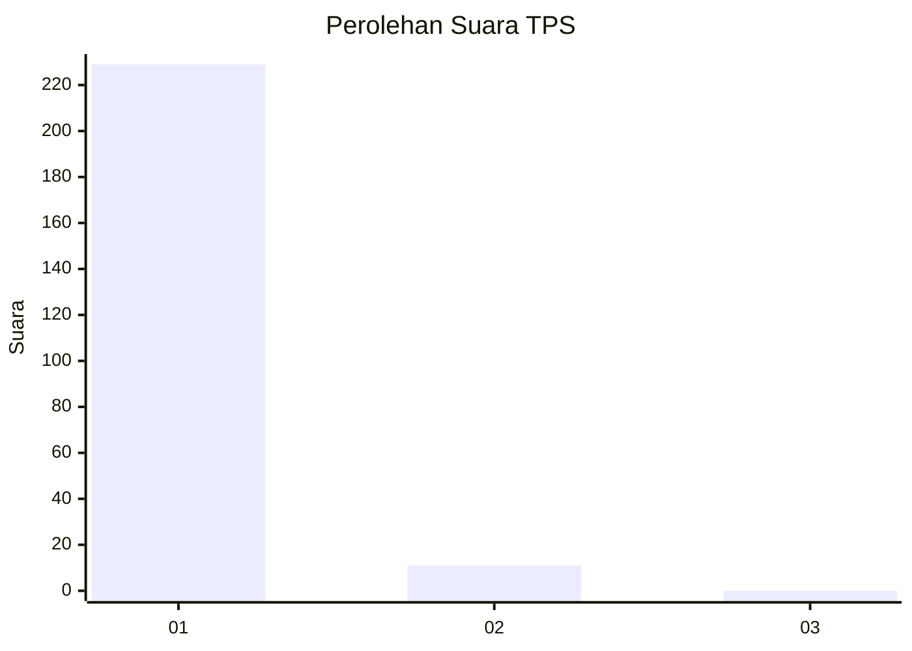
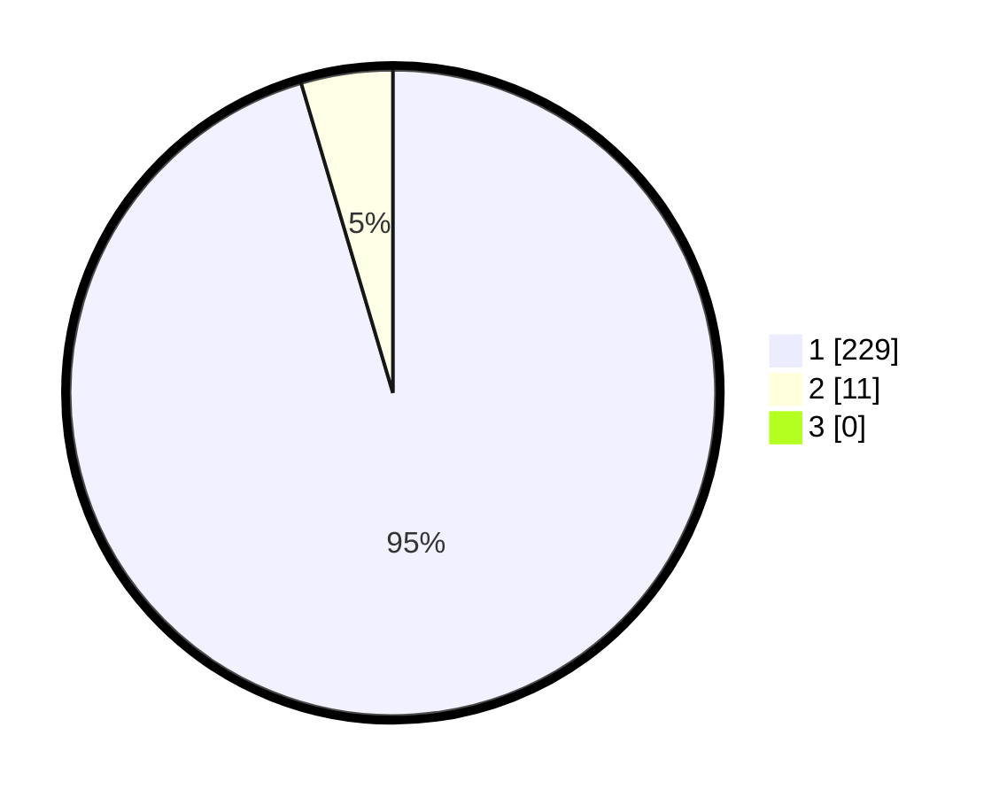

# Hasil

## Grafik

## Tabel

| No. | Nama Paslon    | Suara | Suara (raw) | Persentase |
|:--- |:-------------- | -----:| -----------:| ----------:|
| 1   | ANIES MUHAIMIN | 229   | [229][p-1]  | 95,42      |
| 2   | PRABOWO GIBRAN | 11    | [11][p-2]   | 4,58       |
| 3   | GANJAR MAHFUD  | 0     | [0][p-3]    | 0,00       |

[p-1]: https://github.com/gigit-pemilu/pemilu-2024-11-aceh/blob/main/pilpres/hitung-suara/sub/11-aceh/sub/07-pidie/sub/06-glumpang-tiga/sub/2027-pulo-batee/sub/001-tps/sub/paslon-1.txt
[p-2]: https://github.com/gigit-pemilu/pemilu-2024-11-aceh/blob/main/pilpres/hitung-suara/sub/11-aceh/sub/07-pidie/sub/06-glumpang-tiga/sub/2027-pulo-batee/sub/001-tps/sub/paslon-2.txt
[p-3]: https://github.com/gigit-pemilu/pemilu-2024-11-aceh/blob/main/pilpres/hitung-suara/sub/11-aceh/sub/07-pidie/sub/06-glumpang-tiga/sub/2027-pulo-batee/sub/001-tps/sub/paslon-3.txt

## Foto C Plano

https://sirekap-obj-formc.kpu.go.id/3bad/pemilu/ppwp/11/07/06/20/27/1107062027001-20240215-021537--87b68a1e-6086-47c6-ba97-22eb1e51b44c.jpg

https://sirekap-obj-formc.kpu.go.id/3bad/pemilu/ppwp/11/07/06/20/27/1107062027001-20240215-021747--c54370a6-7bb6-4b17-9aff-9f7a5fe110db.jpg

https://sirekap-obj-formc.kpu.go.id/3bad/pemilu/ppwp/11/07/06/20/27/1107062027001-20240215-021835--1625f272-2ead-44b6-865a-7e0572aee4bb.jpg

## Metadata

| Key        | Value               |
| ---------- | ------------------- |
| Time Stamp | 2024-02-17 03:30:02 |

