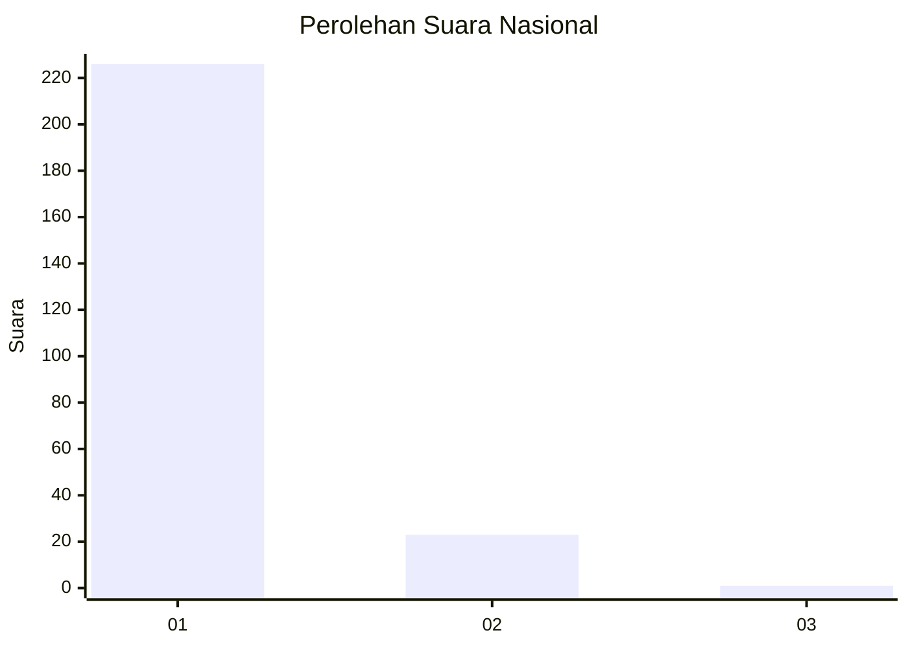
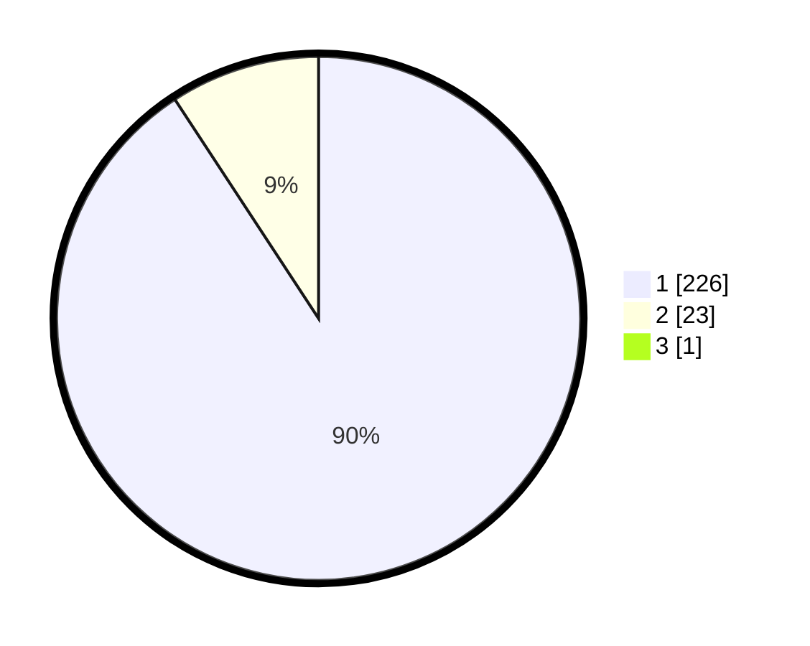

# Hasil

## Grafik

## Tabel

| No. | Nama Paslon    | Suara | Suara (raw) | Persentase |
|:--- |:-------------- | -----:| -----------:| ----------:|
| 1   | ANIES MUHAIMIN | 226   | [226][p-1]  | 90,40      |
| 2   | PRABOWO GIBRAN | 23    | [23][p-2]   | 9,20       |
| 3   | GANJAR MAHFUD  | 1     | [1][p-3]    | 0,40       |

[p-1]: https://github.com/gigit-pemilu/pemilu-2024/blob/main/pilpres/hitung-suara/sub/11-aceh/sub/07-pidie/sub/06-glumpang-tiga/sub/2027-pulo-batee/sub/002-tps/sub/paslon-1.txt
[p-2]: https://github.com/gigit-pemilu/pemilu-2024/blob/main/pilpres/hitung-suara/sub/11-aceh/sub/07-pidie/sub/06-glumpang-tiga/sub/2027-pulo-batee/sub/002-tps/sub/paslon-2.txt
[p-3]: https://github.com/gigit-pemilu/pemilu-2024/blob/main/pilpres/hitung-suara/sub/11-aceh/sub/07-pidie/sub/06-glumpang-tiga/sub/2027-pulo-batee/sub/002-tps/sub/paslon-3.txt

## Foto C Plano

https://sirekap-obj-formc.kpu.go.id/5941/pemilu/ppwp/11/07/06/20/27/1107062027002-20240215-061901--e8eb4966-8bc3-4f21-88a5-213a0286e312.jpg

https://sirekap-obj-formc.kpu.go.id/5941/pemilu/ppwp/11/07/06/20/27/1107062027002-20240215-021351--b12f26b3-fde8-4f0b-933d-9e2c64832c5b.jpg

https://sirekap-obj-formc.kpu.go.id/5941/pemilu/ppwp/11/07/06/20/27/1107062027002-20240215-021626--1e33d9f3-c50f-4779-a058-06eeafb3b5db.jpg

## Metadata

| Key        | Value               |
| ---------- | ------------------- |
| Time Stamp | 2024-02-17 03:30:02 |

