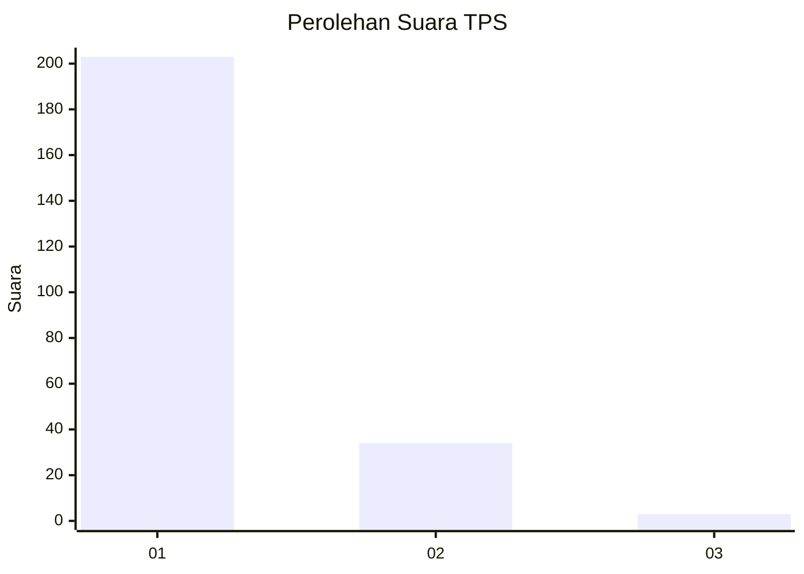
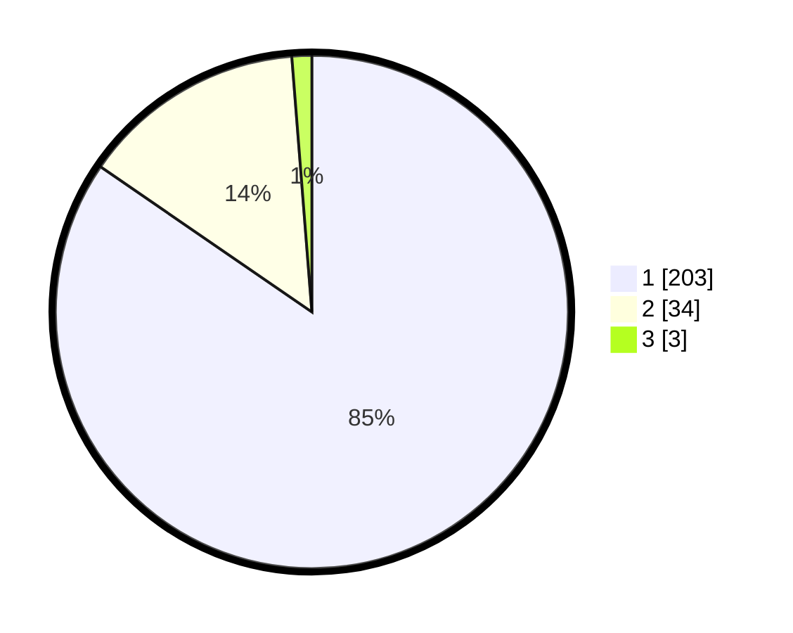

# Hasil

## Grafik

## Tabel

| No. | Nama Paslon    | Suara | Suara (raw) | Persentase |
|:--- |:-------------- | -----:| -----------:| ----------:|
| 1   | ANIES MUHAIMIN | 203   | [203][p-1]  | 84,58      |
| 2   | PRABOWO GIBRAN | 34    | [34][p-2]   | 14,17      |
| 3   | GANJAR MAHFUD  | 3     | [3][p-3]    | 1,25       |

[p-1]: https://github.com/gigit-pemilu/pemilu-2024-11-aceh/blob/main/pilpres/hitung-suara/sub/11-aceh/sub/07-pidie/sub/07-indrajaya/sub/2001-tampieng-tunong/sub/001-tps/sub/paslon-1.txt
[p-2]: https://github.com/gigit-pemilu/pemilu-2024-11-aceh/blob/main/pilpres/hitung-suara/sub/11-aceh/sub/07-pidie/sub/07-indrajaya/sub/2001-tampieng-tunong/sub/001-tps/sub/paslon-2.txt
[p-3]: https://github.com/gigit-pemilu/pemilu-2024-11-aceh/blob/main/pilpres/hitung-suara/sub/11-aceh/sub/07-pidie/sub/07-indrajaya/sub/2001-tampieng-tunong/sub/001-tps/sub/paslon-3.txt

## Foto C Plano

https://sirekap-obj-formc.kpu.go.id/d346/pemilu/ppwp/11/07/07/20/01/1107072001001-20240215-071140--ef4eaa9d-c84d-4bf5-94b7-f0ab2aa630e2.jpg

https://sirekap-obj-formc.kpu.go.id/d346/pemilu/ppwp/11/07/07/20/01/1107072001001-20240215-071235--804713bc-87b3-47ec-b015-bff9a4278d34.jpg

https://sirekap-obj-formc.kpu.go.id/d346/pemilu/ppwp/11/07/07/20/01/1107072001001-20240215-071314--dbfe8a28-4203-4073-a876-77c2030582e6.jpg

## Metadata

| Key        | Value               |
| ---------- | ------------------- |
| Time Stamp | 2024-02-19 06:16:00 |

