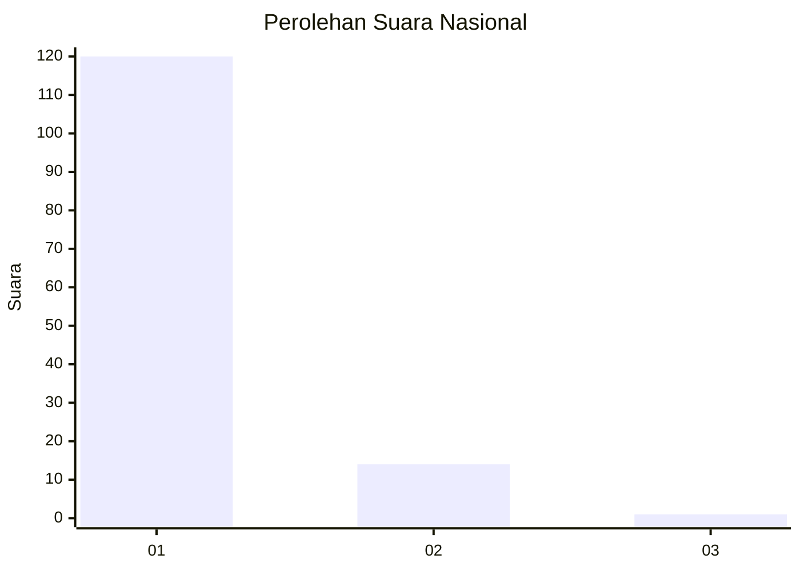
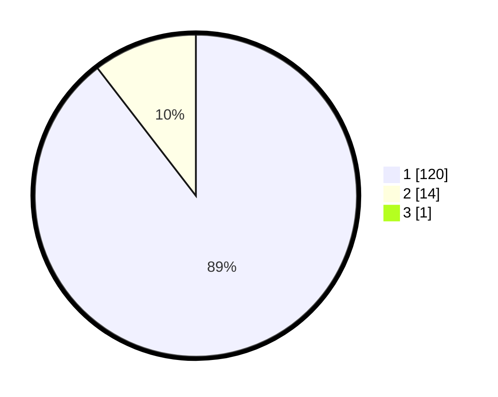

# Hasil

## Grafik

## Tabel

| No. | Nama Paslon    | Suara | Suara (raw) | Persentase |
|:--- |:-------------- | -----:| -----------:| ----------:|
| 1   | ANIES MUHAIMIN | 120   | [120][p-1]  | 88,89      |
| 2   | PRABOWO GIBRAN | 14    | [14][p-2]   | 10,37      |
| 3   | GANJAR MAHFUD  | 1     | [1][p-3]    | 0,74       |

[p-1]: https://github.com/gigit-pemilu/pemilu-2024/blob/main/pilpres/hitung-suara/sub/11-aceh/sub/07-pidie/sub/07-indrajaya/sub/2002-tampieng-baroh/sub/001-tps/sub/paslon-1.txt
[p-2]: https://github.com/gigit-pemilu/pemilu-2024/blob/main/pilpres/hitung-suara/sub/11-aceh/sub/07-pidie/sub/07-indrajaya/sub/2002-tampieng-baroh/sub/001-tps/sub/paslon-2.txt
[p-3]: https://github.com/gigit-pemilu/pemilu-2024/blob/main/pilpres/hitung-suara/sub/11-aceh/sub/07-pidie/sub/07-indrajaya/sub/2002-tampieng-baroh/sub/001-tps/sub/paslon-3.txt

## Foto C Plano

https://sirekap-obj-formc.kpu.go.id/4090/pemilu/ppwp/11/07/07/20/02/1107072002001-20240215-031827--94b5dac0-ab25-4969-8b80-ad45f0ec5b0e.jpg

https://sirekap-obj-formc.kpu.go.id/4090/pemilu/ppwp/11/07/07/20/02/1107072002001-20240215-032115--e70fe6a8-cd07-41db-a120-d266ba3b3881.jpg

https://sirekap-obj-formc.kpu.go.id/4090/pemilu/ppwp/11/07/07/20/02/1107072002001-20240215-032210--788da041-49a3-4507-8915-0cb1a2016fe2.jpg

## Metadata

| Key        | Value               |
| ---------- | ------------------- |
| Time Stamp | 2024-02-17 18:00:00 |

