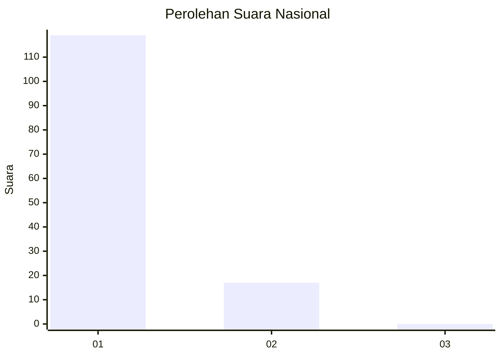
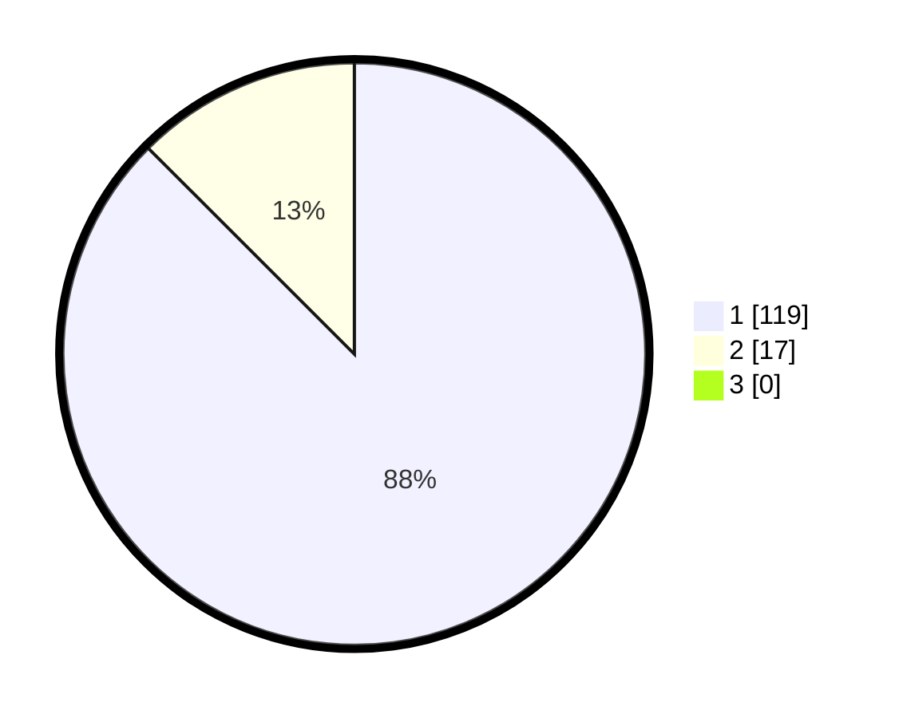

# Hasil

## Grafik

## Tabel

| No. | Nama Paslon    | Suara | Suara (raw) | Persentase |
|:--- |:-------------- | -----:| -----------:| ----------:|
| 1   | ANIES MUHAIMIN | 119   | [119][p-1]  | 87,50      |
| 2   | PRABOWO GIBRAN | 17    | [17][p-2]   | 12,50      |
| 3   | GANJAR MAHFUD  | 0     | [0][p-3]    | 0,00       |

[p-1]: https://github.com/gigit-pemilu/pemilu-2024/blob/main/pilpres/hitung-suara/sub/11-aceh/sub/07-pidie/sub/07-indrajaya/sub/2002-tampieng-baroh/sub/002-tps/sub/paslon-1.txt
[p-2]: https://github.com/gigit-pemilu/pemilu-2024/blob/main/pilpres/hitung-suara/sub/11-aceh/sub/07-pidie/sub/07-indrajaya/sub/2002-tampieng-baroh/sub/002-tps/sub/paslon-2.txt
[p-3]: https://github.com/gigit-pemilu/pemilu-2024/blob/main/pilpres/hitung-suara/sub/11-aceh/sub/07-pidie/sub/07-indrajaya/sub/2002-tampieng-baroh/sub/002-tps/sub/paslon-3.txt

## Foto C Plano

https://sirekap-obj-formc.kpu.go.id/b0d8/pemilu/ppwp/11/07/07/20/02/1107072002002-20240215-031518--5f2919b7-2094-461d-adb1-e606ea94487e.jpg

https://sirekap-obj-formc.kpu.go.id/b0d8/pemilu/ppwp/11/07/07/20/02/1107072002002-20240215-032115--45a29551-c599-4995-a830-e4b8ad785a88.jpg

https://sirekap-obj-formc.kpu.go.id/b0d8/pemilu/ppwp/11/07/07/20/02/1107072002002-20240215-031650--aab5d49d-f9ce-46e8-a96a-b3705c054c4b.jpg

## Metadata

| Key        | Value               |
| ---------- | ------------------- |
| Time Stamp | 2024-02-17 18:00:00 |

