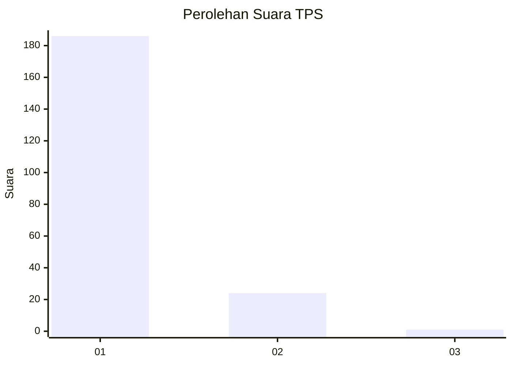
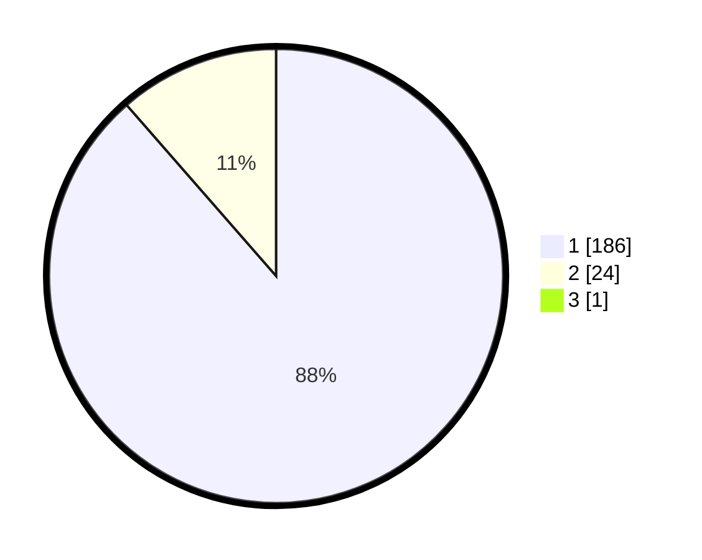

# Hasil

## Grafik

## Tabel

| No. | Nama Paslon    | Suara | Suara (raw) | Persentase |
|:--- |:-------------- | -----:| -----------:| ----------:|
| 1   | ANIES MUHAIMIN | 186   | [186][p-1]  | 88,15      |
| 2   | PRABOWO GIBRAN | 24    | [24][p-2]   | 11,37      |
| 3   | GANJAR MAHFUD  | 1     | [1][p-3]    | 0,47       |

[p-1]: https://github.com/gigit-pemilu/pemilu-2024-11-aceh/blob/main/pilpres/hitung-suara/sub/11-aceh/sub/07-pidie/sub/07-indrajaya/sub/2003-dayah-caleue/sub/001-tps/sub/paslon-1.txt
[p-2]: https://github.com/gigit-pemilu/pemilu-2024-11-aceh/blob/main/pilpres/hitung-suara/sub/11-aceh/sub/07-pidie/sub/07-indrajaya/sub/2003-dayah-caleue/sub/001-tps/sub/paslon-2.txt
[p-3]: https://github.com/gigit-pemilu/pemilu-2024-11-aceh/blob/main/pilpres/hitung-suara/sub/11-aceh/sub/07-pidie/sub/07-indrajaya/sub/2003-dayah-caleue/sub/001-tps/sub/paslon-3.txt

## Foto C Plano

https://sirekap-obj-formc.kpu.go.id/df69/pemilu/ppwp/11/07/07/20/03/1107072003001-20240215-085502--6eb607c9-4a96-4c1f-991f-77113c69d86d.jpg

https://sirekap-obj-formc.kpu.go.id/df69/pemilu/ppwp/11/07/07/20/03/1107072003001-20240215-084341--b65e03ae-700a-4461-8862-9fefcfb5919a.jpg

https://sirekap-obj-formc.kpu.go.id/df69/pemilu/ppwp/11/07/07/20/03/1107072003001-20240215-084754--81091ecd-bc4d-4a74-9998-504a54426879.jpg

## Metadata

| Key        | Value               |
| ---------- | ------------------- |
| Time Stamp | 2024-02-17 18:00:00 |

