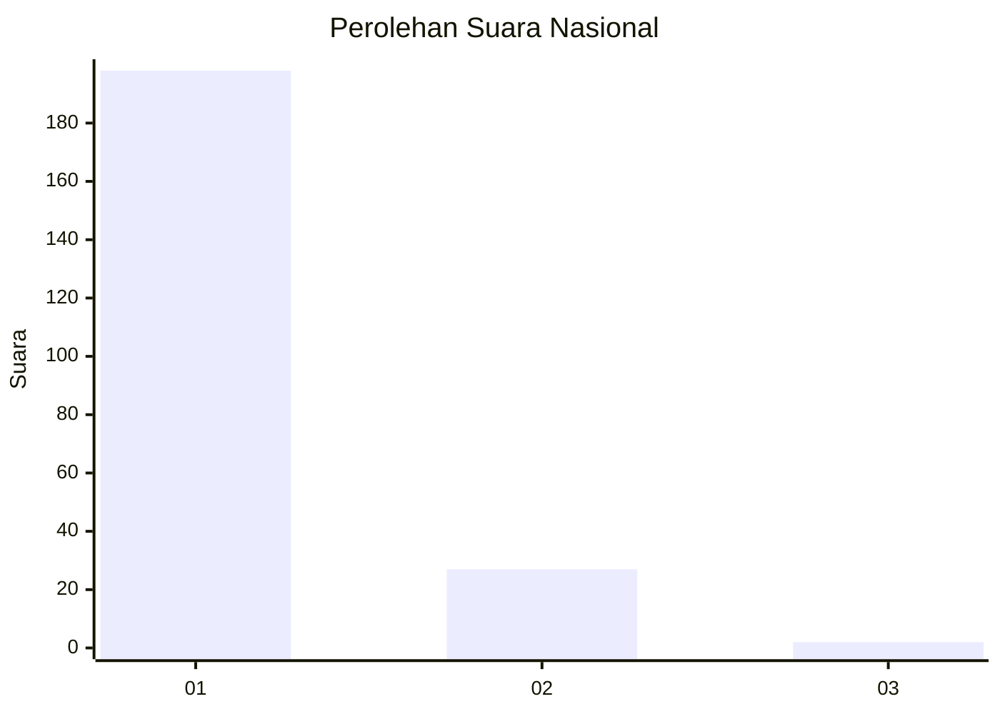
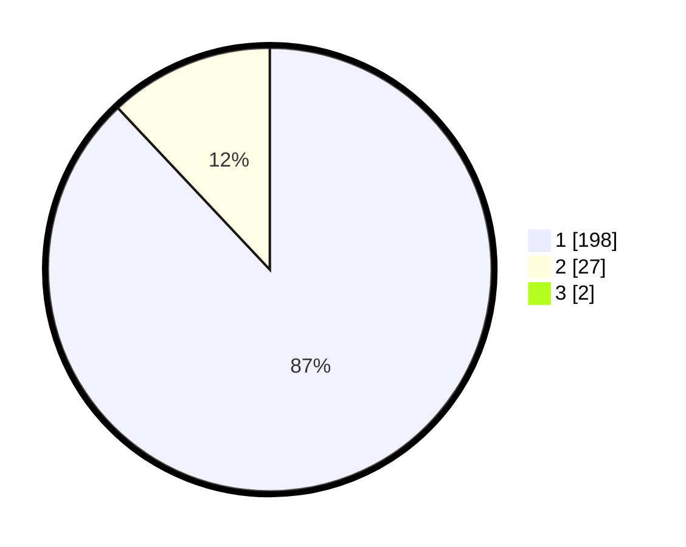

# Hasil

## Grafik

## Tabel

| No. | Nama Paslon    | Suara | Suara (raw) | Persentase |
|:--- |:-------------- | -----:| -----------:| ----------:|
| 1   | ANIES MUHAIMIN | 198   | [198][p-1]  | 87,22      |
| 2   | PRABOWO GIBRAN | 27    | [27][p-2]   | 11,89      |
| 3   | GANJAR MAHFUD  | 2     | [2][p-3]    | 0,88       |

[p-1]: https://github.com/gigit-pemilu/pemilu-2024/blob/main/pilpres/hitung-suara/sub/11-aceh/sub/07-pidie/sub/07-indrajaya/sub/2003-dayah-caleue/sub/002-tps/sub/paslon-1.txt
[p-2]: https://github.com/gigit-pemilu/pemilu-2024/blob/main/pilpres/hitung-suara/sub/11-aceh/sub/07-pidie/sub/07-indrajaya/sub/2003-dayah-caleue/sub/002-tps/sub/paslon-2.txt
[p-3]: https://github.com/gigit-pemilu/pemilu-2024/blob/main/pilpres/hitung-suara/sub/11-aceh/sub/07-pidie/sub/07-indrajaya/sub/2003-dayah-caleue/sub/002-tps/sub/paslon-3.txt

## Foto C Plano

https://sirekap-obj-formc.kpu.go.id/0047/pemilu/ppwp/11/07/07/20/03/1107072003002-20240215-044732--7d646db0-0746-4920-a9f8-ea60f10fb0e0.jpg

https://sirekap-obj-formc.kpu.go.id/0047/pemilu/ppwp/11/07/07/20/03/1107072003002-20240215-045433--bbf87a56-27d2-48f3-8a6b-7052e05da026.jpg

https://sirekap-obj-formc.kpu.go.id/0047/pemilu/ppwp/11/07/07/20/03/1107072003002-20240215-045612--ae8f1a08-a1b6-4dd6-8d05-89e79a1d6592.jpg

## Metadata

| Key        | Value               |
| ---------- | ------------------- |
| Time Stamp | 2024-02-17 18:00:00 |

