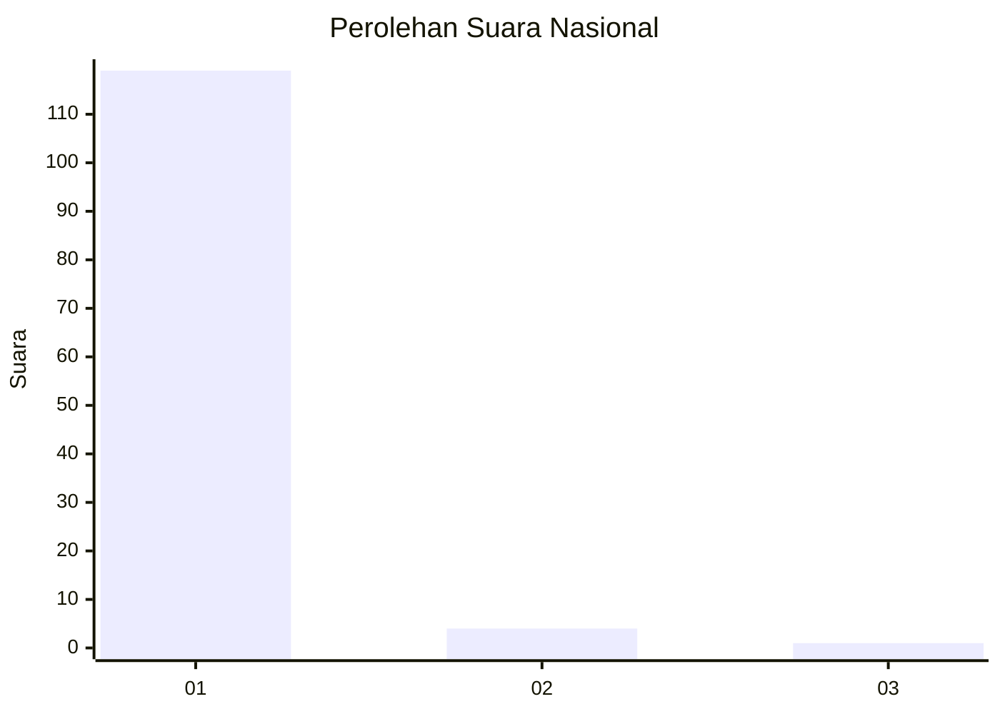
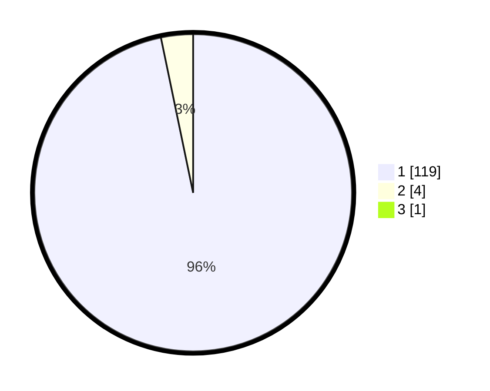

# Hasil

## Grafik

## Tabel

| No. | Nama Paslon    | Suara | Suara (raw) | Persentase |
|:--- |:-------------- | -----:| -----------:| ----------:|
| 1   | ANIES MUHAIMIN | 119   | [119][p-1]  | 95,97      |
| 2   | PRABOWO GIBRAN | 4     | [4][p-2]    | 3,23       |
| 3   | GANJAR MAHFUD  | 1     | [1][p-3]    | 0,81       |

[p-1]: https://github.com/gigit-pemilu/pemilu-2024/blob/main/pilpres/hitung-suara/sub/11-aceh/sub/07-pidie/sub/07-indrajaya/sub/2004-jurong/sub/001-tps/sub/paslon-1.txt
[p-2]: https://github.com/gigit-pemilu/pemilu-2024/blob/main/pilpres/hitung-suara/sub/11-aceh/sub/07-pidie/sub/07-indrajaya/sub/2004-jurong/sub/001-tps/sub/paslon-2.txt
[p-3]: https://github.com/gigit-pemilu/pemilu-2024/blob/main/pilpres/hitung-suara/sub/11-aceh/sub/07-pidie/sub/07-indrajaya/sub/2004-jurong/sub/001-tps/sub/paslon-3.txt

## Foto C Plano

https://sirekap-obj-formc.kpu.go.id/1bd3/pemilu/ppwp/11/07/07/20/04/1107072004001-20240215-113112--3cbdbb7e-1f98-4658-8ce4-b49857f43a4f.jpg

https://sirekap-obj-formc.kpu.go.id/1bd3/pemilu/ppwp/11/07/07/20/04/1107072004001-20240215-113305--6241e987-2275-4c9f-8895-45c40a37a3d6.jpg

https://sirekap-obj-formc.kpu.go.id/1bd3/pemilu/ppwp/11/07/07/20/04/1107072004001-20240215-113459--ac37cfa1-f7e2-4669-be03-1ec593d92c4c.jpg

## Metadata

| Key        | Value               |
| ---------- | ------------------- |
| Time Stamp | 2024-02-24 22:31:28 |

