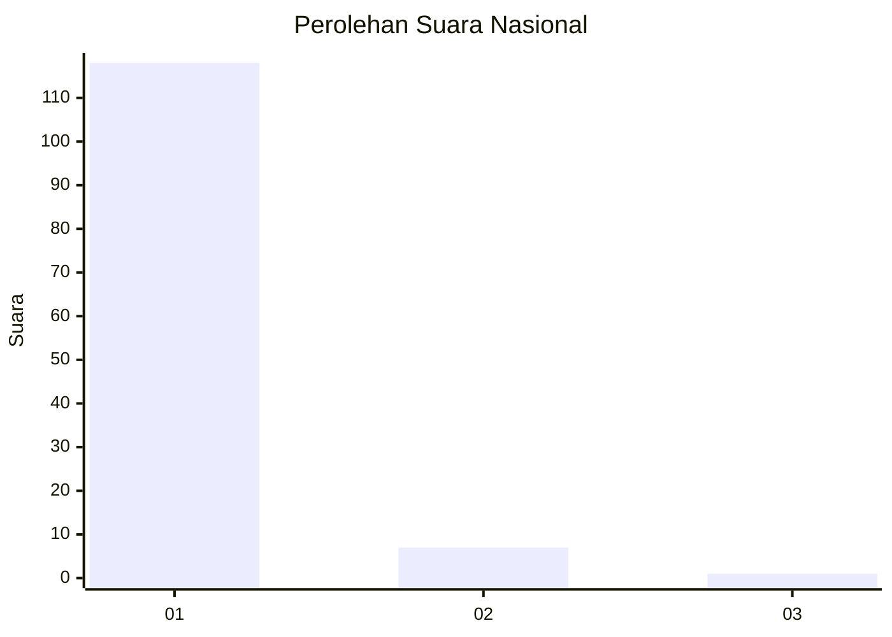
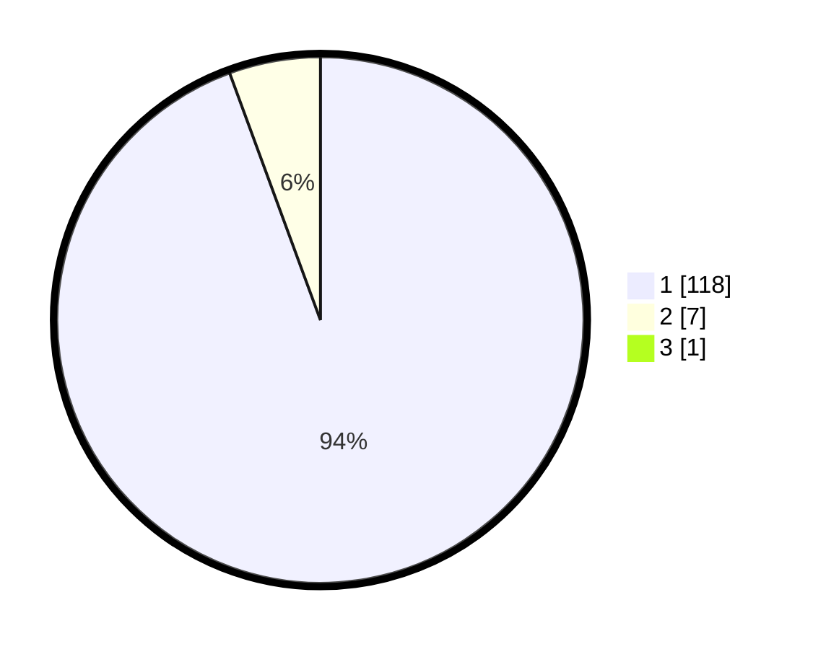

# Hasil

## Grafik

## Tabel

| No. | Nama Paslon    | Suara | Suara (raw) | Persentase |
|:--- |:-------------- | -----:| -----------:| ----------:|
| 1   | ANIES MUHAIMIN | 118   | [118][p-1]  | 93,65      |
| 2   | PRABOWO GIBRAN | 7     | [7][p-2]    | 5,56       |
| 3   | GANJAR MAHFUD  | 1     | [1][p-3]    | 0,79       |

[p-1]: https://github.com/gigit-pemilu/pemilu-2024/blob/main/pilpres/hitung-suara/sub/11-aceh/sub/07-pidie/sub/07-indrajaya/sub/2004-jurong/sub/002-tps/sub/paslon-1.txt
[p-2]: https://github.com/gigit-pemilu/pemilu-2024/blob/main/pilpres/hitung-suara/sub/11-aceh/sub/07-pidie/sub/07-indrajaya/sub/2004-jurong/sub/002-tps/sub/paslon-2.txt
[p-3]: https://github.com/gigit-pemilu/pemilu-2024/blob/main/pilpres/hitung-suara/sub/11-aceh/sub/07-pidie/sub/07-indrajaya/sub/2004-jurong/sub/002-tps/sub/paslon-3.txt

## Foto C Plano

https://sirekap-obj-formc.kpu.go.id/5e7a/pemilu/ppwp/11/07/07/20/04/1107072004002-20240215-112542--a51af06f-2e58-4ce3-8555-34ee46e442dd.jpg

https://sirekap-obj-formc.kpu.go.id/5e7a/pemilu/ppwp/11/07/07/20/04/1107072004002-20240215-113249--8023f352-6bd1-4849-bacf-e56fcad2bb92.jpg

https://sirekap-obj-formc.kpu.go.id/5e7a/pemilu/ppwp/11/07/07/20/04/1107072004002-20240215-111841--e9f94142-3cbe-4a39-9dd6-593ba7759bad.jpg

## Metadata

| Key        | Value               |
| ---------- | ------------------- |
| Time Stamp | 2024-02-17 18:00:00 |

