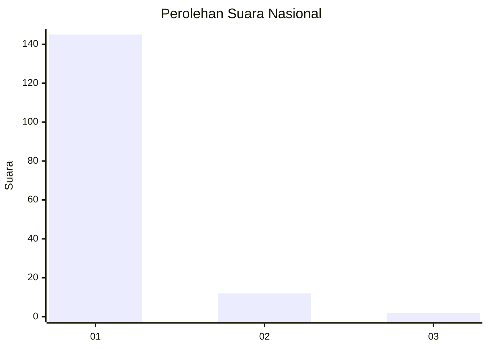
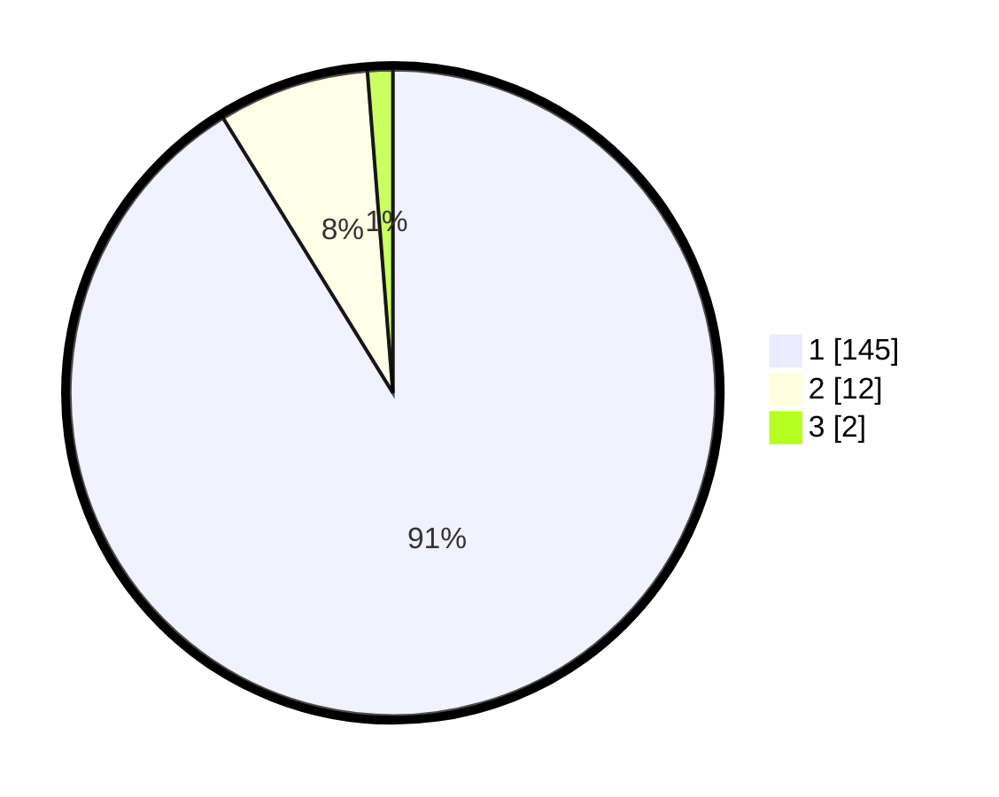

# Hasil

## Grafik

## Tabel

| No. | Nama Paslon    | Suara | Suara (raw) | Persentase |
|:--- |:-------------- | -----:| -----------:| ----------:|
| 1   | ANIES MUHAIMIN | 145   | [145][p-1]  | 91,19      |
| 2   | PRABOWO GIBRAN | 12    | [12][p-2]   | 7,55       |
| 3   | GANJAR MAHFUD  | 2     | [2][p-3]    | 1,26       |

[p-1]: https://github.com/gigit-pemilu/pemilu-2024/blob/main/pilpres/hitung-suara/sub/11-aceh/sub/07-pidie/sub/07-indrajaya/sub/2005-keutapang/sub/002-tps/sub/paslon-1.txt
[p-2]: https://github.com/gigit-pemilu/pemilu-2024/blob/main/pilpres/hitung-suara/sub/11-aceh/sub/07-pidie/sub/07-indrajaya/sub/2005-keutapang/sub/002-tps/sub/paslon-2.txt
[p-3]: https://github.com/gigit-pemilu/pemilu-2024/blob/main/pilpres/hitung-suara/sub/11-aceh/sub/07-pidie/sub/07-indrajaya/sub/2005-keutapang/sub/002-tps/sub/paslon-3.txt

## Foto C Plano

https://sirekap-obj-formc.kpu.go.id/81c2/pemilu/ppwp/11/07/07/20/05/1107072005002-20240215-055218--214aad69-3e18-4e89-9674-555d818519c7.jpg

https://sirekap-obj-formc.kpu.go.id/81c2/pemilu/ppwp/11/07/07/20/05/1107072005002-20240215-060038--7af95c7f-a096-4c67-9721-96b7482656a8.jpg

https://sirekap-obj-formc.kpu.go.id/81c2/pemilu/ppwp/11/07/07/20/05/1107072005002-20240215-060135--3bf940f8-4c9f-4d09-a7b8-58d017d18053.jpg

## Metadata

| Key        | Value               |
| ---------- | ------------------- |
| Time Stamp | 2024-02-25 11:00:00 |

