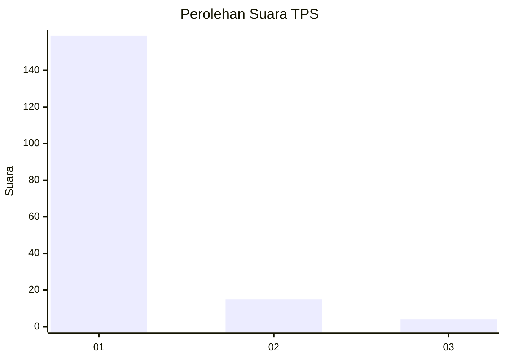
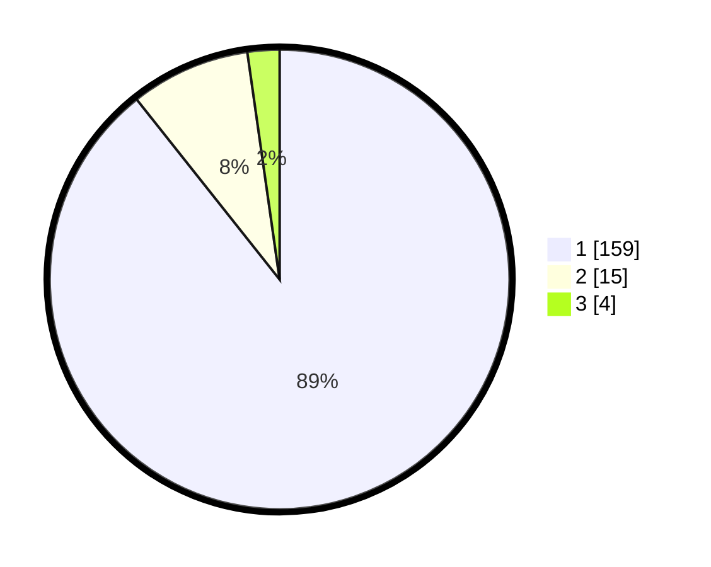

# Hasil

## Grafik

## Tabel

| No. | Nama Paslon    | Suara | Suara (raw) | Persentase |
|:--- |:-------------- | -----:| -----------:| ----------:|
| 1   | ANIES MUHAIMIN | 159   | [159][p-1]  | 89,33      |
| 2   | PRABOWO GIBRAN | 15    | [15][p-2]   | 8,43       |
| 3   | GANJAR MAHFUD  | 4     | [4][p-3]    | 2,25       |

[p-1]: https://github.com/gigit-pemilu/pemilu-2024-11-aceh/blob/main/pilpres/hitung-suara/sub/11-aceh/sub/07-pidie/sub/07-indrajaya/sub/2006-dayah-keurako/sub/001-tps/sub/paslon-1.txt
[p-2]: https://github.com/gigit-pemilu/pemilu-2024-11-aceh/blob/main/pilpres/hitung-suara/sub/11-aceh/sub/07-pidie/sub/07-indrajaya/sub/2006-dayah-keurako/sub/001-tps/sub/paslon-2.txt
[p-3]: https://github.com/gigit-pemilu/pemilu-2024-11-aceh/blob/main/pilpres/hitung-suara/sub/11-aceh/sub/07-pidie/sub/07-indrajaya/sub/2006-dayah-keurako/sub/001-tps/sub/paslon-3.txt

## Foto C Plano

https://sirekap-obj-formc.kpu.go.id/7d38/pemilu/ppwp/11/07/07/20/06/1107072006001-20240215-040720--779a2653-808f-40a1-a393-5511abd6d24d.jpg

https://sirekap-obj-formc.kpu.go.id/7d38/pemilu/ppwp/11/07/07/20/06/1107072006001-20240215-041253--57a0a770-bc11-4a3c-ad8c-904ae805d3be.jpg

https://sirekap-obj-formc.kpu.go.id/7d38/pemilu/ppwp/11/07/07/20/06/1107072006001-20240215-092049--5564db82-d6a0-4573-b66c-7e885ba40067.jpg

## Metadata

| Key        | Value               |
| ---------- | ------------------- |
| Time Stamp | 2024-02-24 22:31:28 |

