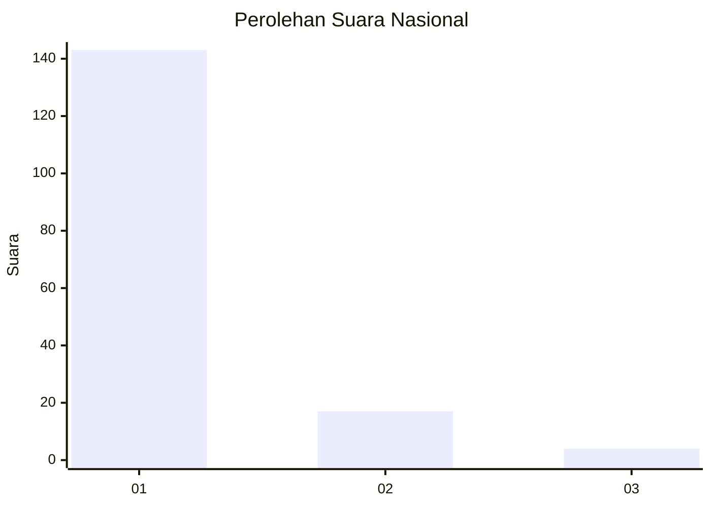
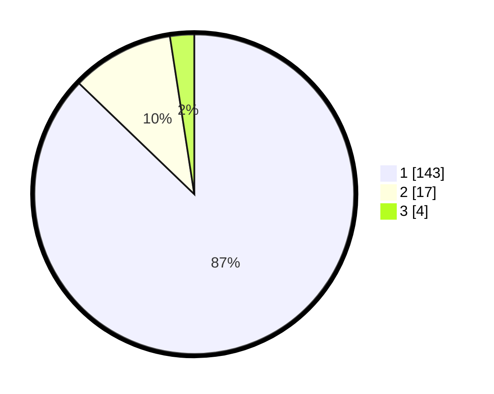

# Hasil

## Grafik

## Tabel

| No. | Nama Paslon    | Suara | Suara (raw) | Persentase |
|:--- |:-------------- | -----:| -----------:| ----------:|
| 1   | ANIES MUHAIMIN | 143   | [143][p-1]  | 87,20      |
| 2   | PRABOWO GIBRAN | 17    | [17][p-2]   | 10,37      |
| 3   | GANJAR MAHFUD  | 4     | [4][p-3]    | 2,44       |

[p-1]: https://github.com/gigit-pemilu/pemilu-2024/blob/main/pilpres/hitung-suara/sub/11-aceh/sub/07-pidie/sub/07-indrajaya/sub/2006-dayah-keurako/sub/002-tps/sub/paslon-1.txt
[p-2]: https://github.com/gigit-pemilu/pemilu-2024/blob/main/pilpres/hitung-suara/sub/11-aceh/sub/07-pidie/sub/07-indrajaya/sub/2006-dayah-keurako/sub/002-tps/sub/paslon-2.txt
[p-3]: https://github.com/gigit-pemilu/pemilu-2024/blob/main/pilpres/hitung-suara/sub/11-aceh/sub/07-pidie/sub/07-indrajaya/sub/2006-dayah-keurako/sub/002-tps/sub/paslon-3.txt

## Foto C Plano

https://sirekap-obj-formc.kpu.go.id/07cd/pemilu/ppwp/11/07/07/20/06/1107072006002-20240215-043237--8583aad5-9ea3-4591-bc41-942488fd2e83.jpg

https://sirekap-obj-formc.kpu.go.id/07cd/pemilu/ppwp/11/07/07/20/06/1107072006002-20240215-025704--3c2f8021-f481-47ca-b150-ac20903f766c.jpg

https://sirekap-obj-formc.kpu.go.id/07cd/pemilu/ppwp/11/07/07/20/06/1107072006002-20240215-025733--865b3e65-68ac-4371-be2c-a2837fc420b4.jpg

## Metadata

| Key        | Value               |
| ---------- | ------------------- |
| Time Stamp | 2024-02-17 18:00:00 |

