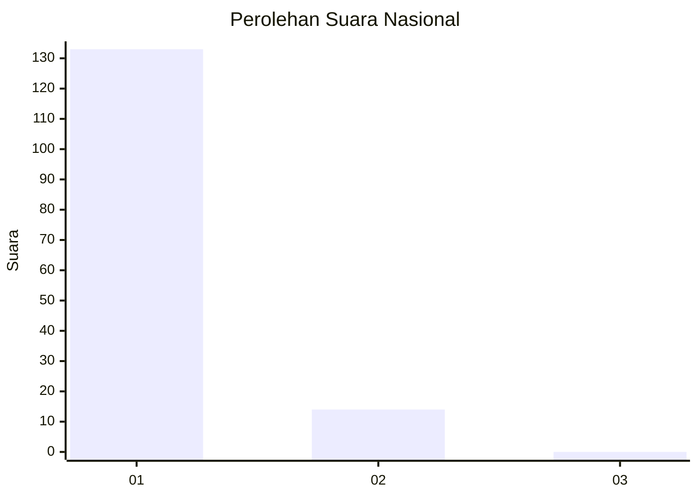
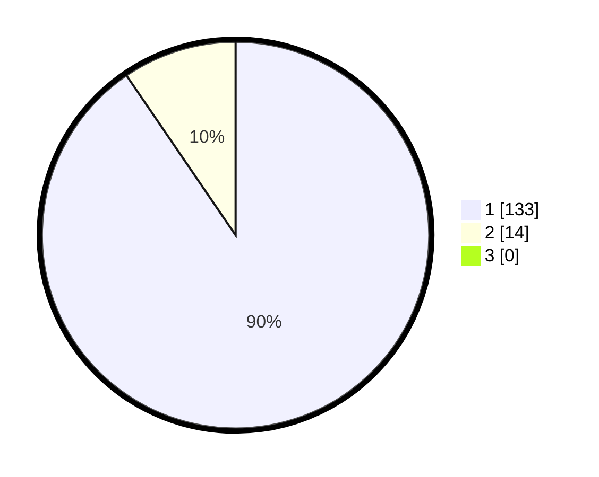

# Hasil

## Grafik

## Tabel

| No. | Nama Paslon    | Suara | Suara (raw) | Persentase |
|:--- |:-------------- | -----:| -----------:| ----------:|
| 1   | ANIES MUHAIMIN | 133   | [133][p-1]  | 90,48      |
| 2   | PRABOWO GIBRAN | 14    | [14][p-2]   | 9,52       |
| 3   | GANJAR MAHFUD  | 0     | [0][p-3]    | 0,00       |

[p-1]: https://github.com/gigit-pemilu/pemilu-2024/blob/main/pilpres/hitung-suara/sub/11-aceh/sub/07-pidie/sub/07-indrajaya/sub/2007-mesjid-lam-ujong/sub/001-tps/sub/paslon-1.txt
[p-2]: https://github.com/gigit-pemilu/pemilu-2024/blob/main/pilpres/hitung-suara/sub/11-aceh/sub/07-pidie/sub/07-indrajaya/sub/2007-mesjid-lam-ujong/sub/001-tps/sub/paslon-2.txt
[p-3]: https://github.com/gigit-pemilu/pemilu-2024/blob/main/pilpres/hitung-suara/sub/11-aceh/sub/07-pidie/sub/07-indrajaya/sub/2007-mesjid-lam-ujong/sub/001-tps/sub/paslon-3.txt

## Foto C Plano

https://sirekap-obj-formc.kpu.go.id/31d6/pemilu/ppwp/11/07/07/20/07/1107072007001-20240215-074111--771c79b2-d7c8-4bc4-937c-b10874357418.jpg

https://sirekap-obj-formc.kpu.go.id/31d6/pemilu/ppwp/11/07/07/20/07/1107072007001-20240215-074231--6fc6a6e7-f8c4-4fad-99d0-fedf7c3eb8fd.jpg

https://sirekap-obj-formc.kpu.go.id/31d6/pemilu/ppwp/11/07/07/20/07/1107072007001-20240215-074337--fa04e066-61a0-402d-9239-39f5573fe6e2.jpg

## Metadata

| Key        | Value               |
| ---------- | ------------------- |
| Time Stamp | 2024-02-17 18:00:00 |

