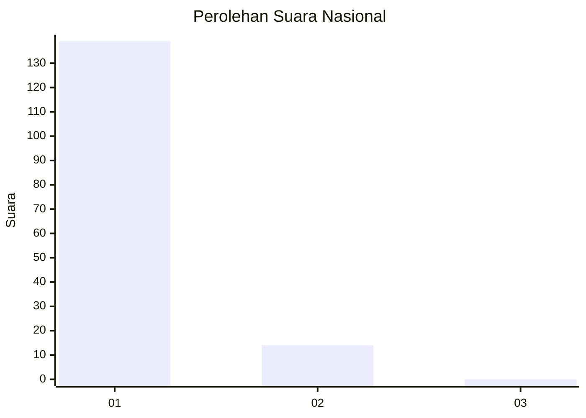
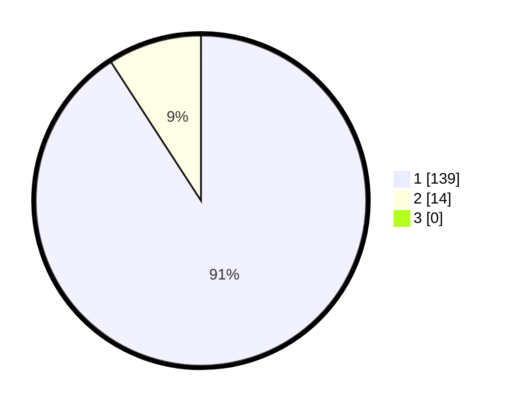

# Hasil

## Grafik

## Tabel

| No. | Nama Paslon    | Suara | Suara (raw) | Persentase |
|:--- |:-------------- | -----:| -----------:| ----------:|
| 1   | ANIES MUHAIMIN | 139   | [139][p-1]  | 90,85      |
| 2   | PRABOWO GIBRAN | 14    | [14][p-2]   | 9,15       |
| 3   | GANJAR MAHFUD  | 0     | [0][p-3]    | 0,00       |

[p-1]: https://github.com/gigit-pemilu/pemilu-2024/blob/main/pilpres/hitung-suara/sub/11-aceh/sub/07-pidie/sub/07-indrajaya/sub/2008-baro-jruek/sub/002-tps/sub/paslon-1.txt
[p-2]: https://github.com/gigit-pemilu/pemilu-2024/blob/main/pilpres/hitung-suara/sub/11-aceh/sub/07-pidie/sub/07-indrajaya/sub/2008-baro-jruek/sub/002-tps/sub/paslon-2.txt
[p-3]: https://github.com/gigit-pemilu/pemilu-2024/blob/main/pilpres/hitung-suara/sub/11-aceh/sub/07-pidie/sub/07-indrajaya/sub/2008-baro-jruek/sub/002-tps/sub/paslon-3.txt

## Foto C Plano

https://sirekap-obj-formc.kpu.go.id/0d72/pemilu/ppwp/11/07/07/20/08/1107072008002-20240215-113001--3533dd59-8394-4198-a070-f13841905648.jpg

https://sirekap-obj-formc.kpu.go.id/0d72/pemilu/ppwp/11/07/07/20/08/1107072008002-20240215-112843--01538c5a-d85c-43fb-becc-2440e71fa8ec.jpg

https://sirekap-obj-formc.kpu.go.id/0d72/pemilu/ppwp/11/07/07/20/08/1107072008002-20240215-005915--46f81f7b-a556-4748-93f1-89668eb30fb6.jpg

## Metadata

| Key        | Value               |
| ---------- | ------------------- |
| Time Stamp | 2024-02-19 06:16:00 |

