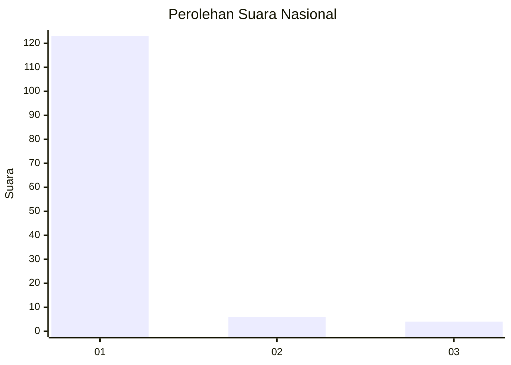
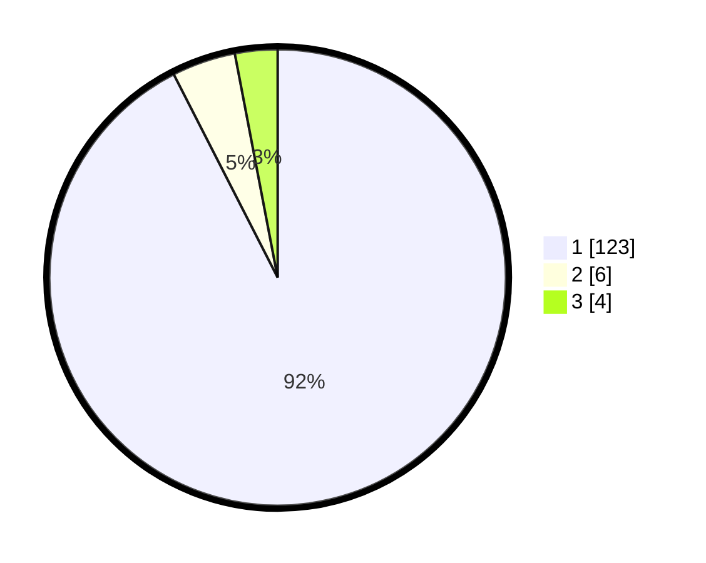

# Hasil

## Grafik

## Tabel

| No. | Nama Paslon    | Suara | Suara (raw) | Persentase |
|:--- |:-------------- | -----:| -----------:| ----------:|
| 1   | ANIES MUHAIMIN | 123   | [123][p-1]  | 92,48      |
| 2   | PRABOWO GIBRAN | 6     | [6][p-2]    | 4,51       |
| 3   | GANJAR MAHFUD  | 4     | [4][p-3]    | 3,01       |

[p-1]: https://github.com/gigit-pemilu/pemilu-2024/blob/main/pilpres/hitung-suara/sub/11-aceh/sub/07-pidie/sub/07-indrajaya/sub/2010-raya-lhok-kaju/sub/001-tps/sub/paslon-1.txt
[p-2]: https://github.com/gigit-pemilu/pemilu-2024/blob/main/pilpres/hitung-suara/sub/11-aceh/sub/07-pidie/sub/07-indrajaya/sub/2010-raya-lhok-kaju/sub/001-tps/sub/paslon-2.txt
[p-3]: https://github.com/gigit-pemilu/pemilu-2024/blob/main/pilpres/hitung-suara/sub/11-aceh/sub/07-pidie/sub/07-indrajaya/sub/2010-raya-lhok-kaju/sub/001-tps/sub/paslon-3.txt

## Foto C Plano

https://sirekap-obj-formc.kpu.go.id/e788/pemilu/ppwp/11/07/07/20/10/1107072010001-20240215-083912--e9755ec4-bc03-46b3-a7dd-ac6de2fcf808.jpg

https://sirekap-obj-formc.kpu.go.id/e788/pemilu/ppwp/11/07/07/20/10/1107072010001-20240215-045651--16bc852f-29a7-4fd4-923e-d87f78536c7a.jpg

https://sirekap-obj-formc.kpu.go.id/e788/pemilu/ppwp/11/07/07/20/10/1107072010001-20240215-045905--264ccfe5-6fce-45ba-8242-d5977587d869.jpg

## Metadata

| Key        | Value               |
| ---------- | ------------------- |
| Time Stamp | 2024-02-19 06:16:00 |

