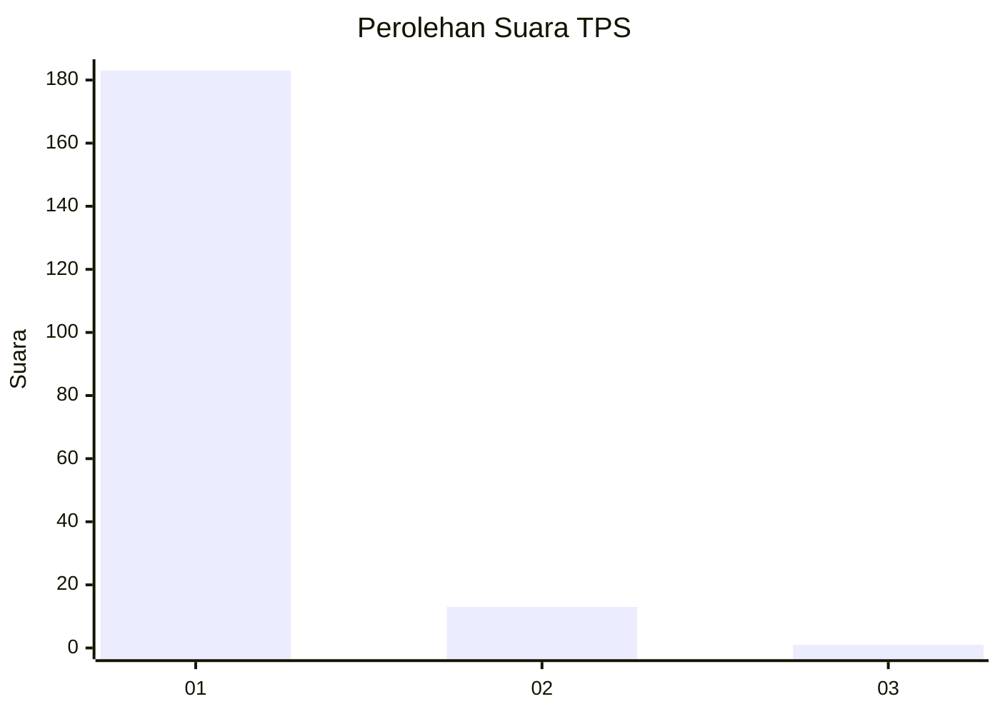
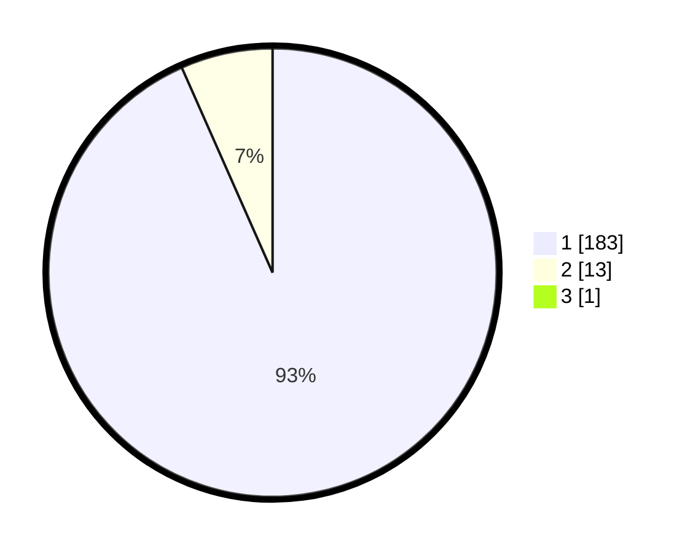

# Hasil

## Grafik

## Tabel

| No. | Nama Paslon    | Suara | Suara (raw) | Persentase |
|:--- |:-------------- | -----:| -----------:| ----------:|
| 1   | ANIES MUHAIMIN | 183   | [183][p-1]  | 92,89      |
| 2   | PRABOWO GIBRAN | 13    | [13][p-2]   | 6,60       |
| 3   | GANJAR MAHFUD  | 1     | [1][p-3]    | 0,51       |

[p-1]: https://github.com/gigit-pemilu/pemilu-2024-11-aceh/blob/main/pilpres/hitung-suara/sub/11-aceh/sub/07-pidie/sub/07-indrajaya/sub/2012-pante-lhok-kaju/sub/001-tps/sub/paslon-1.txt
[p-2]: https://github.com/gigit-pemilu/pemilu-2024-11-aceh/blob/main/pilpres/hitung-suara/sub/11-aceh/sub/07-pidie/sub/07-indrajaya/sub/2012-pante-lhok-kaju/sub/001-tps/sub/paslon-2.txt
[p-3]: https://github.com/gigit-pemilu/pemilu-2024-11-aceh/blob/main/pilpres/hitung-suara/sub/11-aceh/sub/07-pidie/sub/07-indrajaya/sub/2012-pante-lhok-kaju/sub/001-tps/sub/paslon-3.txt

## Foto C Plano

https://sirekap-obj-formc.kpu.go.id/5b23/pemilu/ppwp/11/07/07/20/12/1107072012001-20240214-194432--ad33ebf7-a0e0-4c1e-806a-c582f9047535.jpg

https://sirekap-obj-formc.kpu.go.id/5b23/pemilu/ppwp/11/07/07/20/12/1107072012001-20240214-194446--00ba7cab-78bf-458a-8908-d8ec63daf699.jpg

https://sirekap-obj-formc.kpu.go.id/5b23/pemilu/ppwp/11/07/07/20/12/1107072012001-20240214-194500--d37d909e-ce7e-4eb6-819f-962e4133b152.jpg

## Metadata

| Key        | Value               |
| ---------- | ------------------- |
| Time Stamp | 2024-02-14 21:46:01 |

