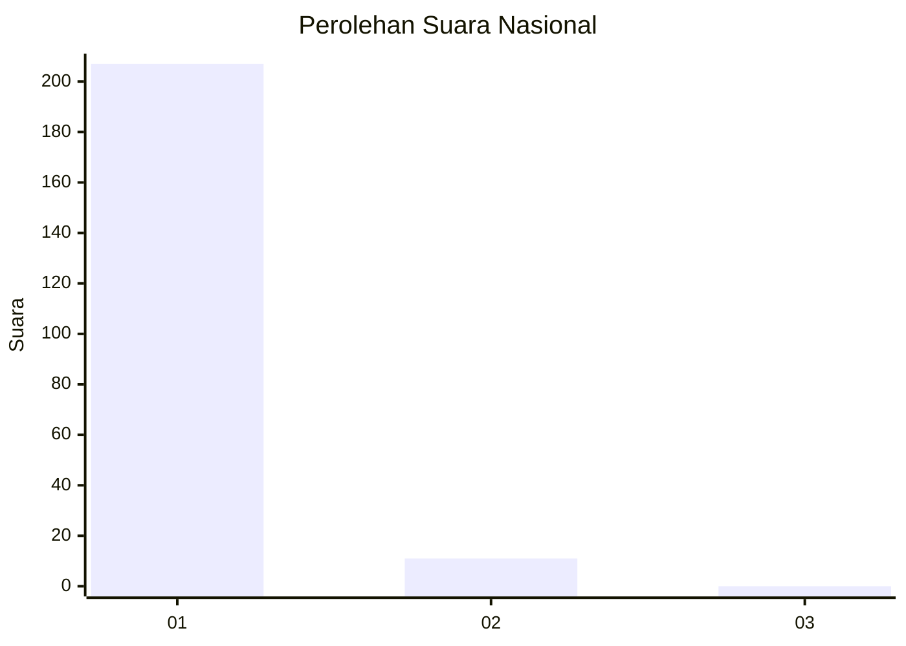
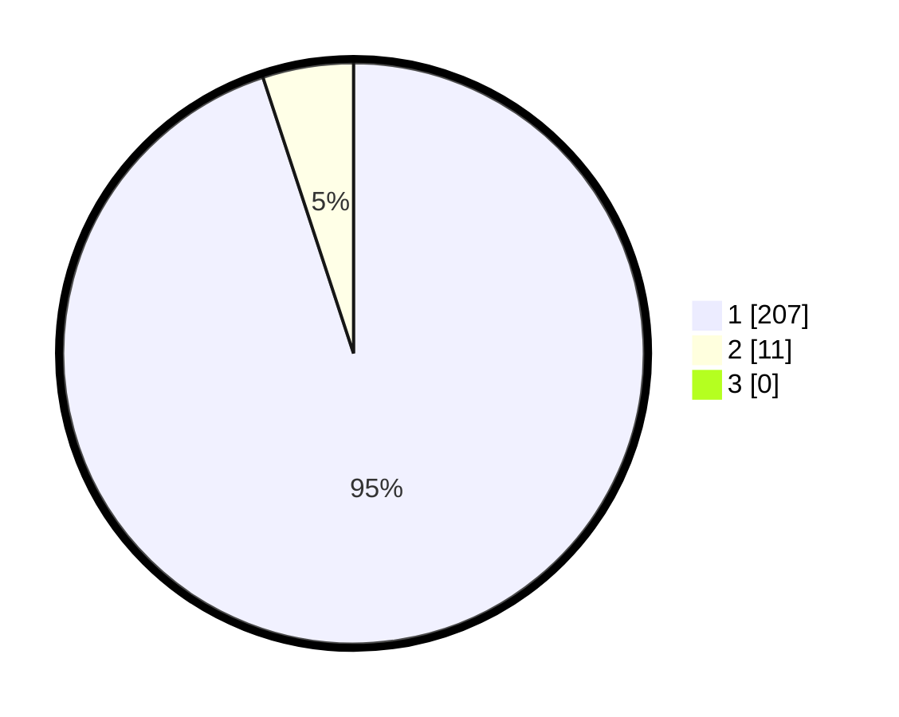

# Hasil

## Grafik

## Tabel

| No. | Nama Paslon    | Suara | Suara (raw) | Persentase |
|:--- |:-------------- | -----:| -----------:| ----------:|
| 1   | ANIES MUHAIMIN | 207   | [207][p-1]  | 94,95      |
| 2   | PRABOWO GIBRAN | 11    | [11][p-2]   | 5,05       |
| 3   | GANJAR MAHFUD  | 0     | [0][p-3]    | 0,00       |

[p-1]: https://github.com/gigit-pemilu/pemilu-2024/blob/main/pilpres/hitung-suara/sub/11-aceh/sub/07-pidie/sub/07-indrajaya/sub/2016-mesjid-tungkop/sub/001-tps/sub/paslon-1.txt
[p-2]: https://github.com/gigit-pemilu/pemilu-2024/blob/main/pilpres/hitung-suara/sub/11-aceh/sub/07-pidie/sub/07-indrajaya/sub/2016-mesjid-tungkop/sub/001-tps/sub/paslon-2.txt
[p-3]: https://github.com/gigit-pemilu/pemilu-2024/blob/main/pilpres/hitung-suara/sub/11-aceh/sub/07-pidie/sub/07-indrajaya/sub/2016-mesjid-tungkop/sub/001-tps/sub/paslon-3.txt

## Foto C Plano

https://sirekap-obj-formc.kpu.go.id/ebab/pemilu/ppwp/11/07/07/20/16/1107072016001-20240214-213033--2f589918-2173-429d-85de-a5c49a50a606.jpg

https://sirekap-obj-formc.kpu.go.id/ebab/pemilu/ppwp/11/07/07/20/16/1107072016001-20240214-213341--422f710b-ad3c-4b61-a722-c6ccfdc9b60b.jpg

https://sirekap-obj-formc.kpu.go.id/ebab/pemilu/ppwp/11/07/07/20/16/1107072016001-20240214-213547--c6f77ba1-a6fd-4db2-920f-6ba75bf1aa14.jpg

## Metadata

| Key        | Value               |
| ---------- | ------------------- |
| Time Stamp | 2024-02-19 06:16:00 |

