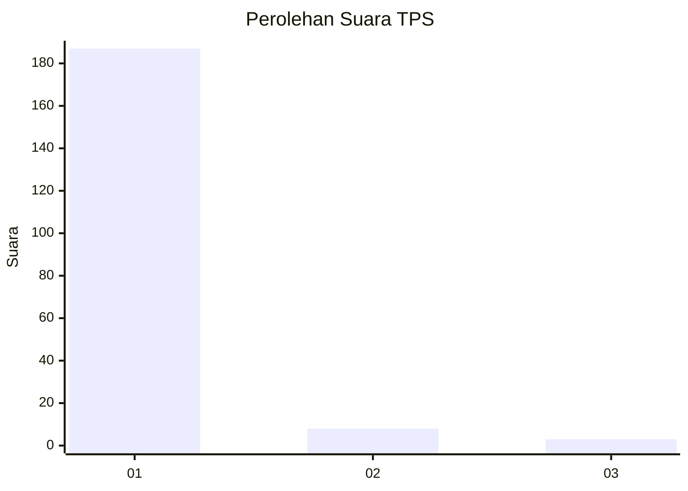
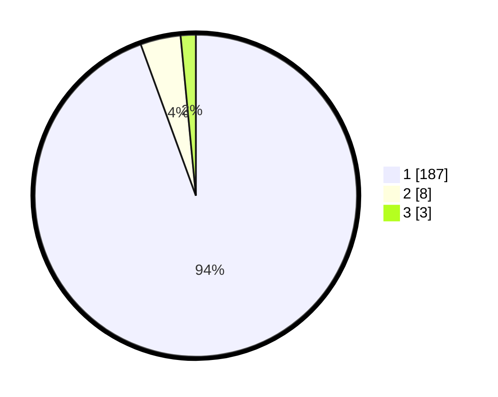

# Hasil

## Grafik

## Tabel

| No. | Nama Paslon    | Suara | Suara (raw) | Persentase |
|:--- |:-------------- | -----:| -----------:| ----------:|
| 1   | ANIES MUHAIMIN | 187   | [187][p-1]  | 94,44      |
| 2   | PRABOWO GIBRAN | 8     | [8][p-2]    | 4,04       |
| 3   | GANJAR MAHFUD  | 3     | [3][p-3]    | 1,52       |

[p-1]: https://github.com/gigit-pemilu/pemilu-2024-11-aceh/blob/main/pilpres/hitung-suara/sub/11-aceh/sub/07-pidie/sub/07-indrajaya/sub/2017-dayah-muara-garot/sub/001-tps/sub/paslon-1.txt
[p-2]: https://github.com/gigit-pemilu/pemilu-2024-11-aceh/blob/main/pilpres/hitung-suara/sub/11-aceh/sub/07-pidie/sub/07-indrajaya/sub/2017-dayah-muara-garot/sub/001-tps/sub/paslon-2.txt
[p-3]: https://github.com/gigit-pemilu/pemilu-2024-11-aceh/blob/main/pilpres/hitung-suara/sub/11-aceh/sub/07-pidie/sub/07-indrajaya/sub/2017-dayah-muara-garot/sub/001-tps/sub/paslon-3.txt

## Foto C Plano

https://sirekap-obj-formc.kpu.go.id/8455/pemilu/ppwp/11/07/07/20/17/1107072017001-20240215-062613--9dc1394d-46cd-42b6-8f22-cc44d8f889ec.jpg

https://sirekap-obj-formc.kpu.go.id/8455/pemilu/ppwp/11/07/07/20/17/1107072017001-20240215-062906--3669f10f-17f5-430b-8710-a2f3bb49b2b8.jpg

https://sirekap-obj-formc.kpu.go.id/8455/pemilu/ppwp/11/07/07/20/17/1107072017001-20240215-063135--418bef98-a3de-4c2e-9a14-67cec3fd7ecd.jpg

## Metadata

| Key        | Value               |
| ---------- | ------------------- |
| Time Stamp | 2024-02-19 06:16:00 |

