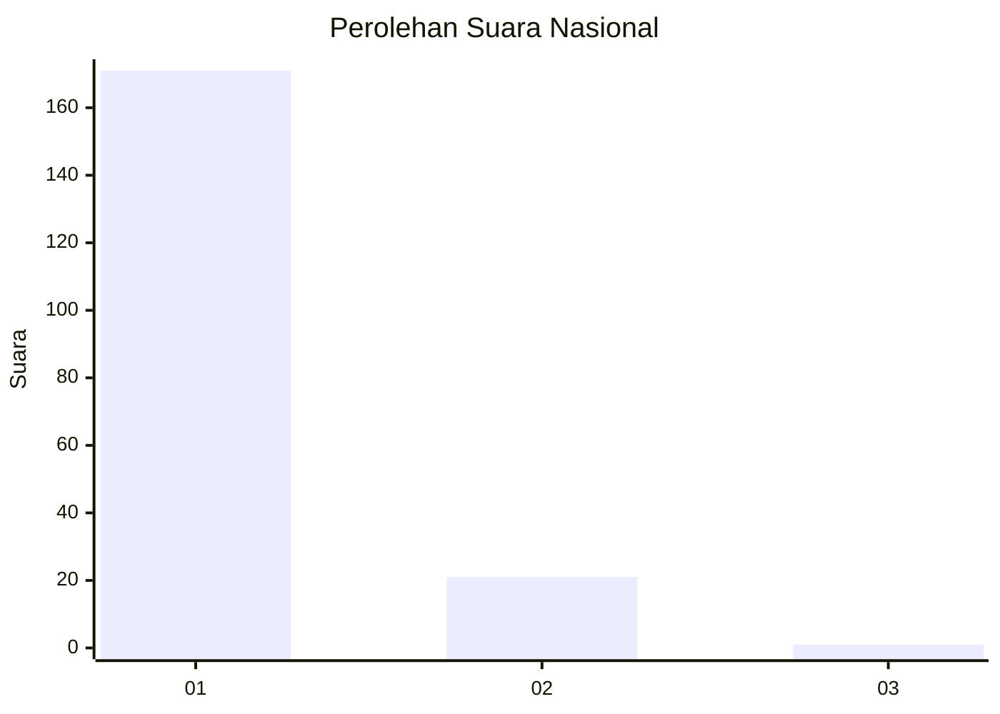
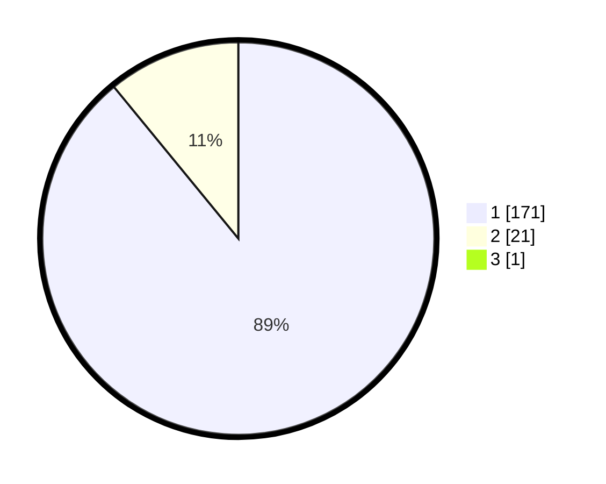

# Hasil

## Grafik

## Tabel

| No. | Nama Paslon    | Suara | Suara (raw) | Persentase |
|:--- |:-------------- | -----:| -----------:| ----------:|
| 1   | ANIES MUHAIMIN | 171   | [171][p-1]  | 88,60      |
| 2   | PRABOWO GIBRAN | 21    | [21][p-2]   | 10,88      |
| 3   | GANJAR MAHFUD  | 1     | [1][p-3]    | 0,52       |

[p-1]: https://github.com/gigit-pemilu/pemilu-2024/blob/main/pilpres/hitung-suara/sub/11-aceh/sub/07-pidie/sub/07-indrajaya/sub/2017-dayah-muara-garot/sub/002-tps/sub/paslon-1.txt
[p-2]: https://github.com/gigit-pemilu/pemilu-2024/blob/main/pilpres/hitung-suara/sub/11-aceh/sub/07-pidie/sub/07-indrajaya/sub/2017-dayah-muara-garot/sub/002-tps/sub/paslon-2.txt
[p-3]: https://github.com/gigit-pemilu/pemilu-2024/blob/main/pilpres/hitung-suara/sub/11-aceh/sub/07-pidie/sub/07-indrajaya/sub/2017-dayah-muara-garot/sub/002-tps/sub/paslon-3.txt

## Foto C Plano

https://sirekap-obj-formc.kpu.go.id/ad1d/pemilu/ppwp/11/07/07/20/17/1107072017002-20240215-072235--bf7f30bf-2242-4e64-9f9d-e7d3a7f4066d.jpg

https://sirekap-obj-formc.kpu.go.id/ad1d/pemilu/ppwp/11/07/07/20/17/1107072017002-20240215-072420--cc74e4da-6c03-4757-b640-51b9b8bfdd5f.jpg

https://sirekap-obj-formc.kpu.go.id/ad1d/pemilu/ppwp/11/07/07/20/17/1107072017002-20240215-072616--6018da8c-2c43-4d73-a1f2-3a50426c5a89.jpg

## Metadata

| Key        | Value               |
| ---------- | ------------------- |
| Time Stamp | 2024-02-19 06:16:00 |

