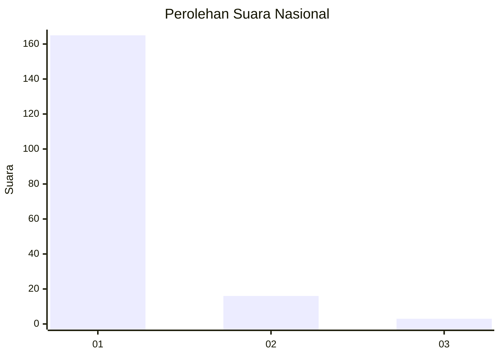
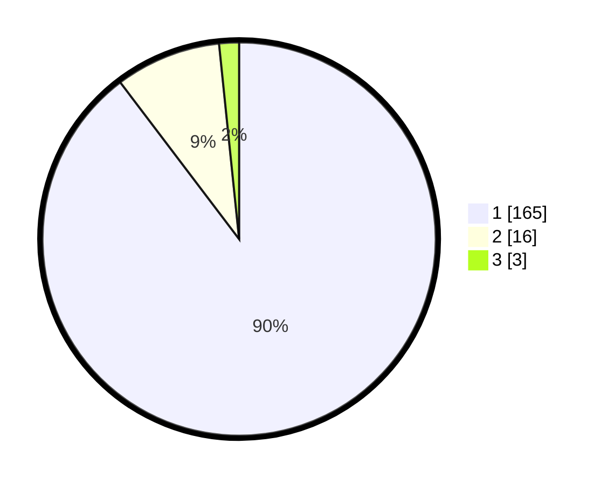

# Hasil

## Grafik

## Tabel

| No. | Nama Paslon    | Suara | Suara (raw) | Persentase |
|:--- |:-------------- | -----:| -----------:| ----------:|
| 1   | ANIES MUHAIMIN | 165   | [165][p-1]  | 89,67      |
| 2   | PRABOWO GIBRAN | 16    | [16][p-2]   | 8,70       |
| 3   | GANJAR MAHFUD  | 3     | [3][p-3]    | 1,63       |

[p-1]: https://github.com/gigit-pemilu/pemilu-2024/blob/main/pilpres/hitung-suara/sub/11-aceh/sub/07-pidie/sub/07-indrajaya/sub/2017-dayah-muara-garot/sub/003-tps/sub/paslon-1.txt
[p-2]: https://github.com/gigit-pemilu/pemilu-2024/blob/main/pilpres/hitung-suara/sub/11-aceh/sub/07-pidie/sub/07-indrajaya/sub/2017-dayah-muara-garot/sub/003-tps/sub/paslon-2.txt
[p-3]: https://github.com/gigit-pemilu/pemilu-2024/blob/main/pilpres/hitung-suara/sub/11-aceh/sub/07-pidie/sub/07-indrajaya/sub/2017-dayah-muara-garot/sub/003-tps/sub/paslon-3.txt

## Foto C Plano

https://sirekap-obj-formc.kpu.go.id/20d8/pemilu/ppwp/11/07/07/20/17/1107072017003-20240215-064050--aeef614e-4181-487a-930a-eb5950af0e54.jpg

https://sirekap-obj-formc.kpu.go.id/20d8/pemilu/ppwp/11/07/07/20/17/1107072017003-20240215-064234--0324b124-382d-4118-8442-6e6848f72ff9.jpg

https://sirekap-obj-formc.kpu.go.id/20d8/pemilu/ppwp/11/07/07/20/17/1107072017003-20240215-064339--dee0d783-509c-434f-bf9a-365c5fbe00b7.jpg

## Metadata

| Key        | Value               |
| ---------- | ------------------- |
| Time Stamp | 2024-02-24 22:31:28 |

