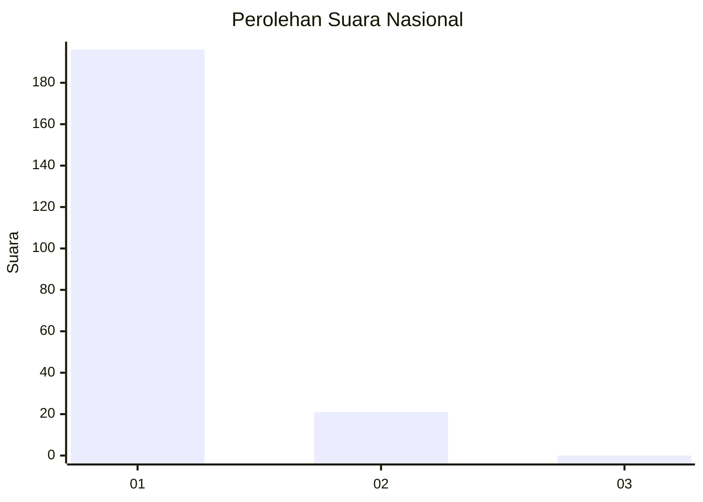
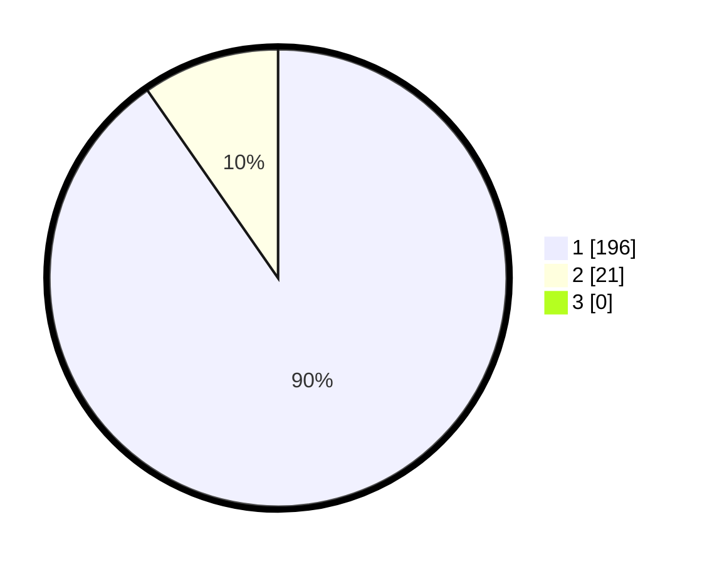

# Hasil

## Grafik

## Tabel

| No. | Nama Paslon    | Suara | Suara (raw) | Persentase |
|:--- |:-------------- | -----:| -----------:| ----------:|
| 1   | ANIES MUHAIMIN | 196   | [196][p-1]  | 90,32      |
| 2   | PRABOWO GIBRAN | 21    | [21][p-2]   | 9,68       |
| 3   | GANJAR MAHFUD  | 0     | [0][p-3]    | 0,00       |

[p-1]: https://github.com/gigit-pemilu/pemilu-2024/blob/main/pilpres/hitung-suara/sub/11-aceh/sub/07-pidie/sub/07-indrajaya/sub/2017-dayah-muara-garot/sub/004-tps/sub/paslon-1.txt
[p-2]: https://github.com/gigit-pemilu/pemilu-2024/blob/main/pilpres/hitung-suara/sub/11-aceh/sub/07-pidie/sub/07-indrajaya/sub/2017-dayah-muara-garot/sub/004-tps/sub/paslon-2.txt
[p-3]: https://github.com/gigit-pemilu/pemilu-2024/blob/main/pilpres/hitung-suara/sub/11-aceh/sub/07-pidie/sub/07-indrajaya/sub/2017-dayah-muara-garot/sub/004-tps/sub/paslon-3.txt

## Foto C Plano

https://sirekap-obj-formc.kpu.go.id/db41/pemilu/ppwp/11/07/07/20/17/1107072017004-20240215-063909--165c20b5-e3eb-457f-a47d-0c46cc8c2374.jpg

https://sirekap-obj-formc.kpu.go.id/db41/pemilu/ppwp/11/07/07/20/17/1107072017004-20240215-064050--62318bc8-3985-455d-a418-a656a6819da7.jpg

https://sirekap-obj-formc.kpu.go.id/db41/pemilu/ppwp/11/07/07/20/17/1107072017004-20240215-064305--e372d869-477a-4f1f-9753-99235e3aeb3f.jpg

## Metadata

| Key        | Value               |
| ---------- | ------------------- |
| Time Stamp | 2024-02-19 06:16:00 |

