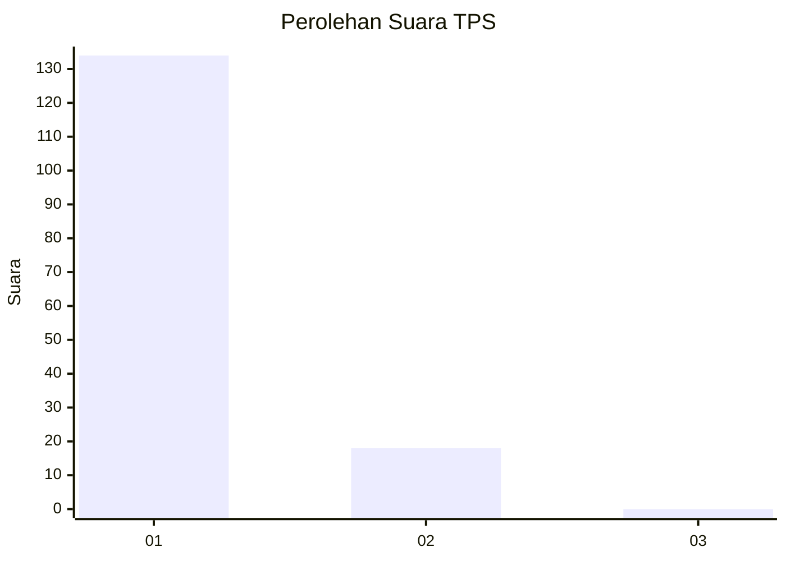
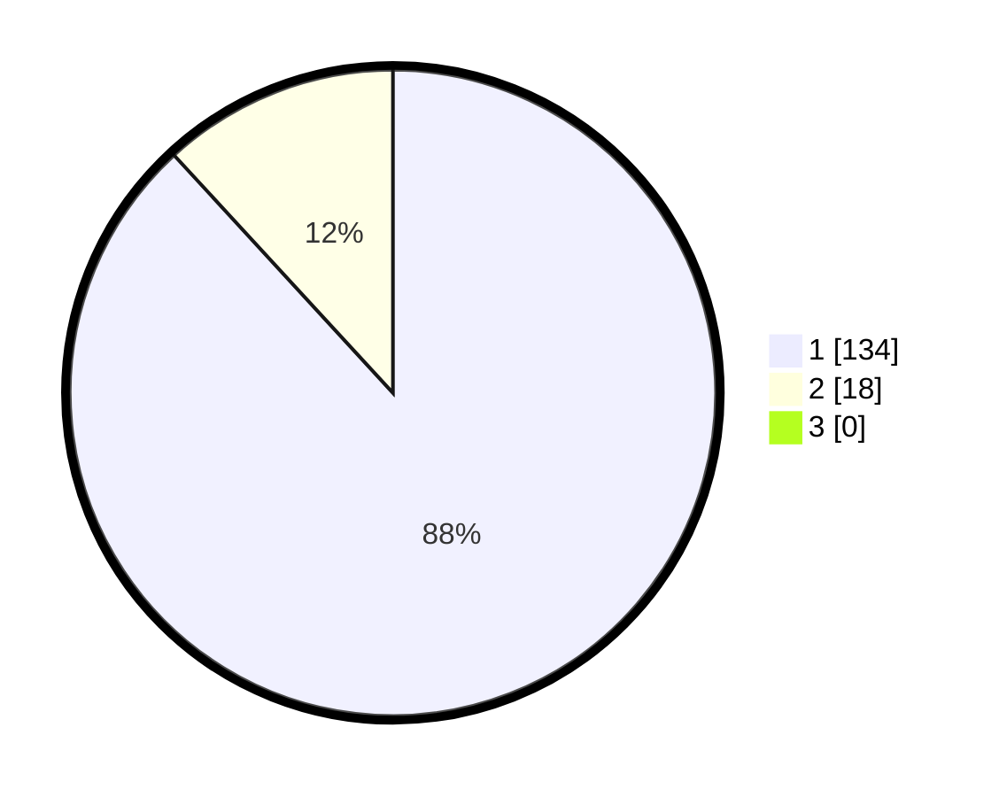

# Hasil

## Grafik

## Tabel

| No. | Nama Paslon    | Suara | Suara (raw) | Persentase |
|:--- |:-------------- | -----:| -----------:| ----------:|
| 1   | ANIES MUHAIMIN | 134   | [134][p-1]  | 88,16      |
| 2   | PRABOWO GIBRAN | 18    | [18][p-2]   | 11,84      |
| 3   | GANJAR MAHFUD  | 0     | [0][p-3]    | 0,00       |

[p-1]: https://github.com/gigit-pemilu/pemilu-2024-11-aceh/blob/main/pilpres/hitung-suara/sub/11-aceh/sub/07-pidie/sub/07-indrajaya/sub/2021-blang-garot/sub/001-tps/sub/paslon-1.txt
[p-2]: https://github.com/gigit-pemilu/pemilu-2024-11-aceh/blob/main/pilpres/hitung-suara/sub/11-aceh/sub/07-pidie/sub/07-indrajaya/sub/2021-blang-garot/sub/001-tps/sub/paslon-2.txt
[p-3]: https://github.com/gigit-pemilu/pemilu-2024-11-aceh/blob/main/pilpres/hitung-suara/sub/11-aceh/sub/07-pidie/sub/07-indrajaya/sub/2021-blang-garot/sub/001-tps/sub/paslon-3.txt

## Foto C Plano

https://sirekap-obj-formc.kpu.go.id/445f/pemilu/ppwp/11/07/07/20/21/1107072021001-20240215-045009--5f1f387e-192a-4164-9e6e-4f1399185c4c.jpg

https://sirekap-obj-formc.kpu.go.id/445f/pemilu/ppwp/11/07/07/20/21/1107072021001-20240215-045025--1c1b2d19-2f56-4f3d-a115-30489ab1b11a.jpg

https://sirekap-obj-formc.kpu.go.id/445f/pemilu/ppwp/11/07/07/20/21/1107072021001-20240215-045041--c51d905f-b98f-4a62-9f55-e23b4f82351b.jpg

## Metadata

| Key        | Value               |
| ---------- | ------------------- |
| Time Stamp | 2024-02-19 06:16:00 |

