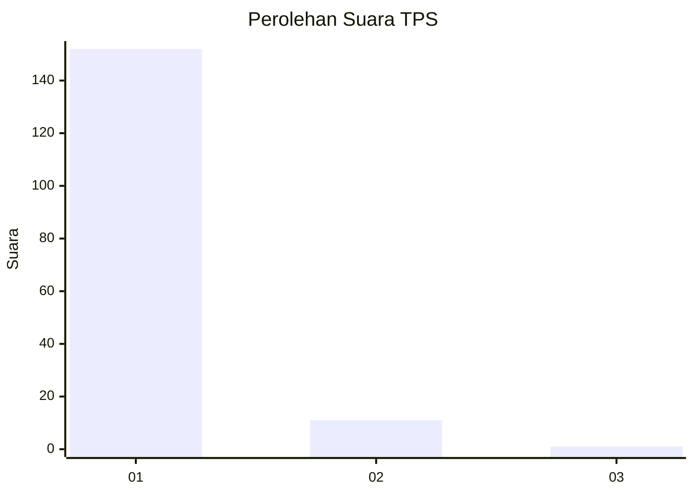
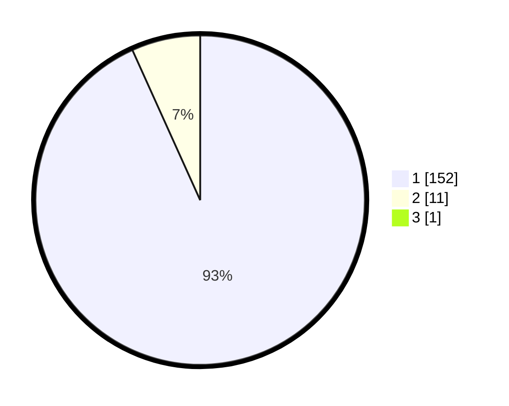

# Hasil

## Grafik

## Tabel

| No. | Nama Paslon    | Suara | Suara (raw) | Persentase |
|:--- |:-------------- | -----:| -----------:| ----------:|
| 1   | ANIES MUHAIMIN | 152   | [152][p-1]  | 92,68      |
| 2   | PRABOWO GIBRAN | 11    | [11][p-2]   | 6,71       |
| 3   | GANJAR MAHFUD  | 1     | [1][p-3]    | 0,61       |

[p-1]: https://github.com/gigit-pemilu/pemilu-2024-11-aceh/blob/main/pilpres/hitung-suara/sub/11-aceh/sub/07-pidie/sub/07-indrajaya/sub/2021-blang-garot/sub/002-tps/sub/paslon-1.txt
[p-2]: https://github.com/gigit-pemilu/pemilu-2024-11-aceh/blob/main/pilpres/hitung-suara/sub/11-aceh/sub/07-pidie/sub/07-indrajaya/sub/2021-blang-garot/sub/002-tps/sub/paslon-2.txt
[p-3]: https://github.com/gigit-pemilu/pemilu-2024-11-aceh/blob/main/pilpres/hitung-suara/sub/11-aceh/sub/07-pidie/sub/07-indrajaya/sub/2021-blang-garot/sub/002-tps/sub/paslon-3.txt

## Foto C Plano

https://sirekap-obj-formc.kpu.go.id/fe06/pemilu/ppwp/11/07/07/20/21/1107072021002-20240214-214934--0d30bd23-32dc-4dd2-90eb-042170ac5710.jpg

https://sirekap-obj-formc.kpu.go.id/fe06/pemilu/ppwp/11/07/07/20/21/1107072021002-20240214-215041--fd4f5a9b-0c6e-44a1-a365-ba654fde5c10.jpg

https://sirekap-obj-formc.kpu.go.id/fe06/pemilu/ppwp/11/07/07/20/21/1107072021002-20240214-215119--a99efd31-ef6e-4857-b722-4a4d7a2cda50.jpg

## Metadata

| Key        | Value               |
| ---------- | ------------------- |
| Time Stamp | 2024-02-19 06:16:00 |

