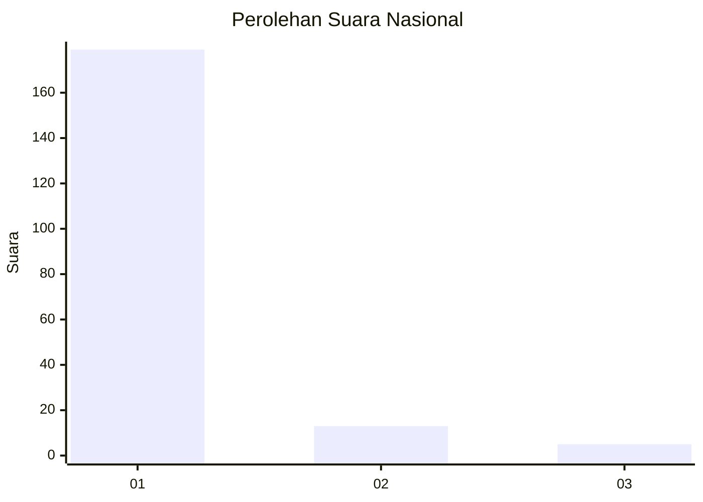
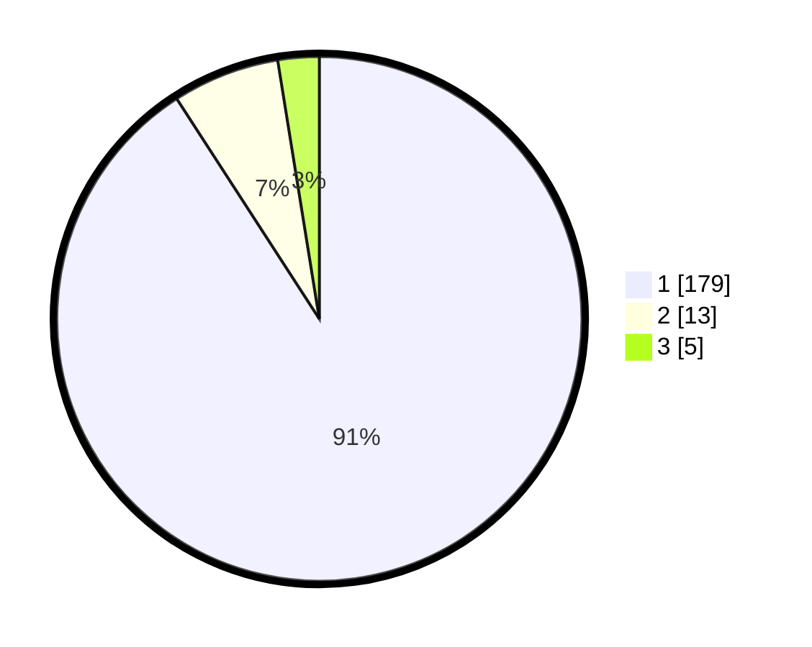

# Hasil

## Grafik

## Tabel

| No. | Nama Paslon    | Suara | Suara (raw) | Persentase |
|:--- |:-------------- | -----:| -----------:| ----------:|
| 1   | ANIES MUHAIMIN | 179   | [179][p-1]  | 90,86      |
| 2   | PRABOWO GIBRAN | 13    | [13][p-2]   | 6,60       |
| 3   | GANJAR MAHFUD  | 5     | [5][p-3]    | 2,54       |

[p-1]: https://github.com/gigit-pemilu/pemilu-2024/blob/main/pilpres/hitung-suara/sub/11-aceh/sub/07-pidie/sub/07-indrajaya/sub/2022-meulayu/sub/002-tps/sub/paslon-1.txt
[p-2]: https://github.com/gigit-pemilu/pemilu-2024/blob/main/pilpres/hitung-suara/sub/11-aceh/sub/07-pidie/sub/07-indrajaya/sub/2022-meulayu/sub/002-tps/sub/paslon-2.txt
[p-3]: https://github.com/gigit-pemilu/pemilu-2024/blob/main/pilpres/hitung-suara/sub/11-aceh/sub/07-pidie/sub/07-indrajaya/sub/2022-meulayu/sub/002-tps/sub/paslon-3.txt

## Foto C Plano

https://sirekap-obj-formc.kpu.go.id/d018/pemilu/ppwp/11/07/07/20/22/1107072022002-20240214-222520--f13fa20c-6d2b-43ce-bf2c-741cde9d2a9a.jpg

https://sirekap-obj-formc.kpu.go.id/d018/pemilu/ppwp/11/07/07/20/22/1107072022002-20240215-023736--ea82b3c4-1077-4830-ab52-0746e03ba73f.jpg

https://sirekap-obj-formc.kpu.go.id/d018/pemilu/ppwp/11/07/07/20/22/1107072022002-20240215-101842--79f5bc3e-2d8c-41d5-a193-b26d65d44bcc.jpg

## Metadata

| Key        | Value               |
| ---------- | ------------------- |
| Time Stamp | 2024-02-15 19:30:26 |

