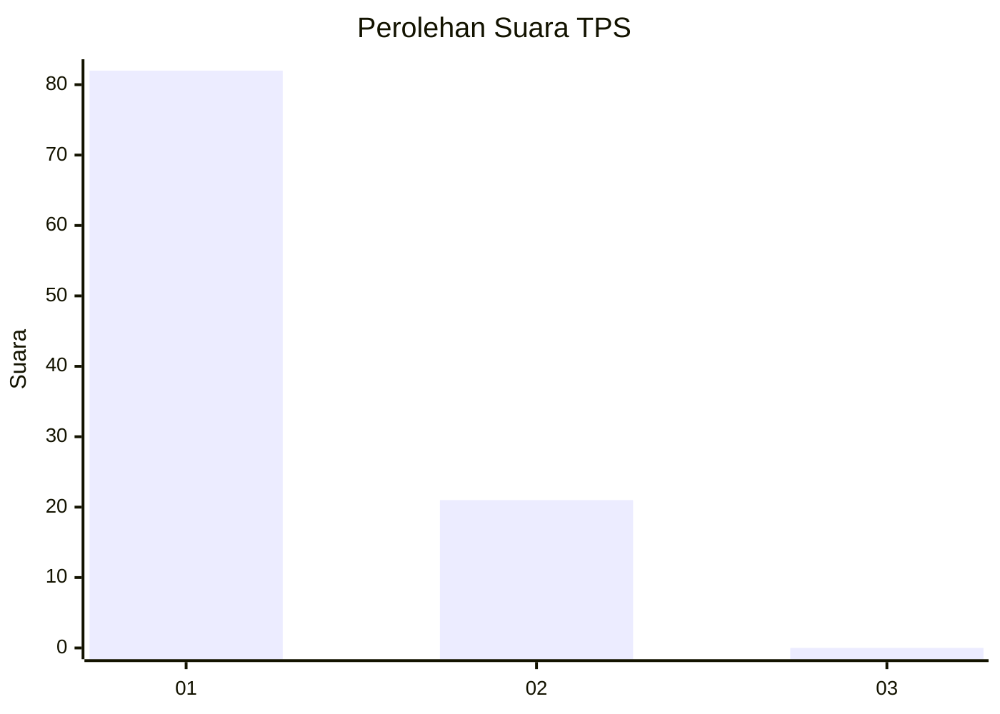
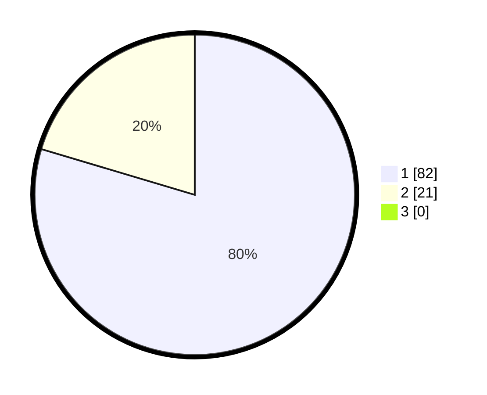

# Hasil

## Grafik

## Tabel

| No. | Nama Paslon    | Suara | Suara (raw) | Persentase |
|:--- |:-------------- | -----:| -----------:| ----------:|
| 1   | ANIES MUHAIMIN | 82    | [82][p-1]   | 79,61      |
| 2   | PRABOWO GIBRAN | 21    | [21][p-2]   | 20,39      |
| 3   | GANJAR MAHFUD  | 0     | [0][p-3]    | 0,00       |

[p-1]: https://github.com/gigit-pemilu/pemilu-2024-11-aceh/blob/main/pilpres/hitung-suara/sub/11-aceh/sub/07-pidie/sub/07-indrajaya/sub/2023-tungkop-cut/sub/001-tps/sub/paslon-1.txt
[p-2]: https://github.com/gigit-pemilu/pemilu-2024-11-aceh/blob/main/pilpres/hitung-suara/sub/11-aceh/sub/07-pidie/sub/07-indrajaya/sub/2023-tungkop-cut/sub/001-tps/sub/paslon-2.txt
[p-3]: https://github.com/gigit-pemilu/pemilu-2024-11-aceh/blob/main/pilpres/hitung-suara/sub/11-aceh/sub/07-pidie/sub/07-indrajaya/sub/2023-tungkop-cut/sub/001-tps/sub/paslon-3.txt

## Foto C Plano

https://sirekap-obj-formc.kpu.go.id/6c55/pemilu/ppwp/11/07/07/20/23/1107072023001-20240214-201418--4ee52c0d-89f3-4dc3-80bc-d69d882909b1.jpg

https://sirekap-obj-formc.kpu.go.id/6c55/pemilu/ppwp/11/07/07/20/23/1107072023001-20240214-201808--87526540-04f1-47ec-b91e-26040eea9d6e.jpg

https://sirekap-obj-formc.kpu.go.id/6c55/pemilu/ppwp/11/07/07/20/23/1107072023001-20240214-202206--9997c17c-9a33-4421-843e-1fe0c6af7ff0.jpg

## Metadata

| Key        | Value               |
| ---------- | ------------------- |
| Time Stamp | 2024-02-19 06:16:00 |

