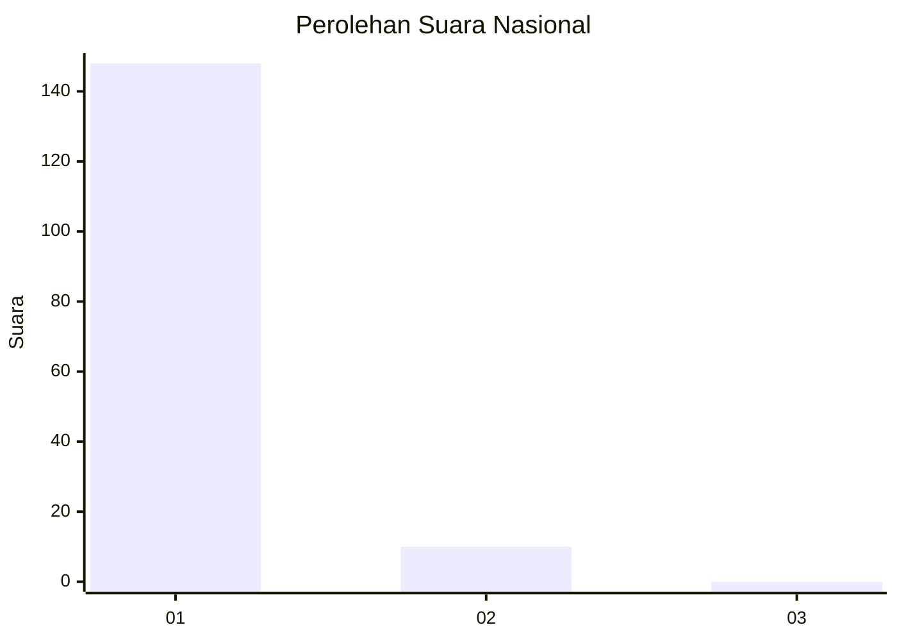
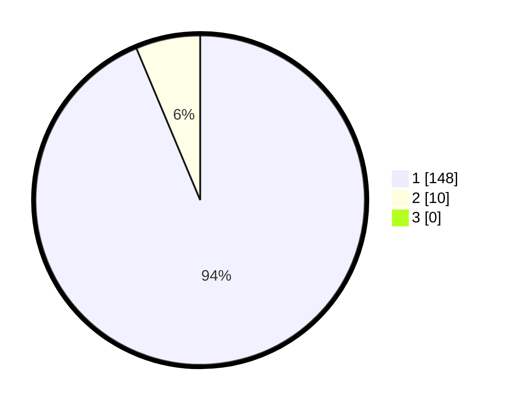

# Hasil

## Grafik

## Tabel

| No. | Nama Paslon    | Suara | Suara (raw) | Persentase |
|:--- |:-------------- | -----:| -----------:| ----------:|
| 1   | ANIES MUHAIMIN | 148   | [148][p-1]  | 93,67      |
| 2   | PRABOWO GIBRAN | 10    | [10][p-2]   | 6,33       |
| 3   | GANJAR MAHFUD  | 0     | [0][p-3]    | 0,00       |

[p-1]: https://github.com/gigit-pemilu/pemilu-2024/blob/main/pilpres/hitung-suara/sub/11-aceh/sub/07-pidie/sub/07-indrajaya/sub/2024-guci/sub/001-tps/sub/paslon-1.txt
[p-2]: https://github.com/gigit-pemilu/pemilu-2024/blob/main/pilpres/hitung-suara/sub/11-aceh/sub/07-pidie/sub/07-indrajaya/sub/2024-guci/sub/001-tps/sub/paslon-2.txt
[p-3]: https://github.com/gigit-pemilu/pemilu-2024/blob/main/pilpres/hitung-suara/sub/11-aceh/sub/07-pidie/sub/07-indrajaya/sub/2024-guci/sub/001-tps/sub/paslon-3.txt

## Foto C Plano

https://sirekap-obj-formc.kpu.go.id/6eb8/pemilu/ppwp/11/07/07/20/24/1107072024001-20240215-050015--5e5a2139-4404-4a1d-b985-4fbb002f4eba.jpg

https://sirekap-obj-formc.kpu.go.id/6eb8/pemilu/ppwp/11/07/07/20/24/1107072024001-20240215-103649--02fc79d1-14dd-42e9-a161-ea80030f44a2.jpg

https://sirekap-obj-formc.kpu.go.id/6eb8/pemilu/ppwp/11/07/07/20/24/1107072024001-20240215-102752--10630760-4e35-4a9e-ad68-6679d89ca416.jpg

## Metadata

| Key        | Value               |
| ---------- | ------------------- |
| Time Stamp | 2024-02-17 18:30:00 |

