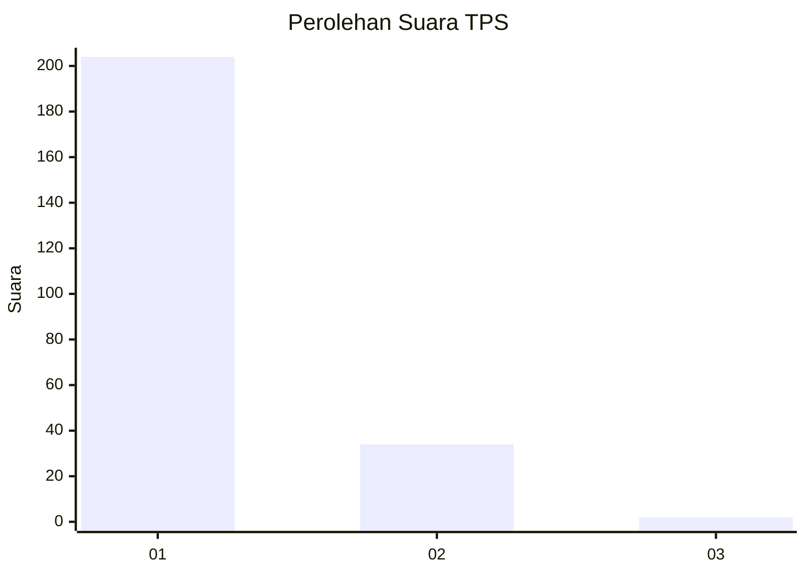
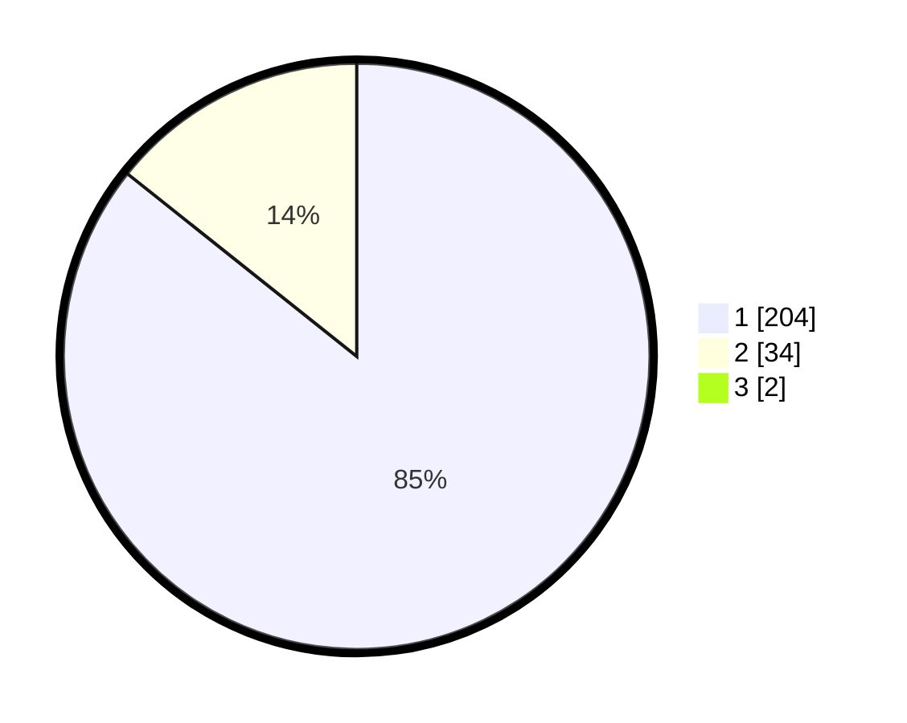

# Hasil

## Grafik

## Tabel

| No. | Nama Paslon    | Suara | Suara (raw) | Persentase |
|:--- |:-------------- | -----:| -----------:| ----------:|
| 1   | ANIES MUHAIMIN | 204   | [204][p-1]  | 85,00      |
| 2   | PRABOWO GIBRAN | 34    | [34][p-2]   | 14,17      |
| 3   | GANJAR MAHFUD  | 2     | [2][p-3]    | 0,83       |

[p-1]: https://github.com/gigit-pemilu/pemilu-2024-11-aceh/blob/main/pilpres/hitung-suara/sub/11-aceh/sub/07-pidie/sub/07-indrajaya/sub/2025-teungoh-blang/sub/001-tps/sub/paslon-1.txt
[p-2]: https://github.com/gigit-pemilu/pemilu-2024-11-aceh/blob/main/pilpres/hitung-suara/sub/11-aceh/sub/07-pidie/sub/07-indrajaya/sub/2025-teungoh-blang/sub/001-tps/sub/paslon-2.txt
[p-3]: https://github.com/gigit-pemilu/pemilu-2024-11-aceh/blob/main/pilpres/hitung-suara/sub/11-aceh/sub/07-pidie/sub/07-indrajaya/sub/2025-teungoh-blang/sub/001-tps/sub/paslon-3.txt

## Foto C Plano

https://sirekap-obj-formc.kpu.go.id/35d8/pemilu/ppwp/11/07/07/20/25/1107072025001-20240214-230140--104ecfcc-77f8-41c7-9e08-1400506a3f6f.jpg

https://sirekap-obj-formc.kpu.go.id/35d8/pemilu/ppwp/11/07/07/20/25/1107072025001-20240214-230356--7ae9a4d3-a6e9-4423-8485-b4508481f610.jpg

https://sirekap-obj-formc.kpu.go.id/35d8/pemilu/ppwp/11/07/07/20/25/1107072025001-20240215-030238--6dcc5a25-75b7-43a8-8124-d782ebdfaeea.jpg

## Metadata

| Key        | Value               |
| ---------- | ------------------- |
| Time Stamp | 2024-02-24 22:31:28 |

