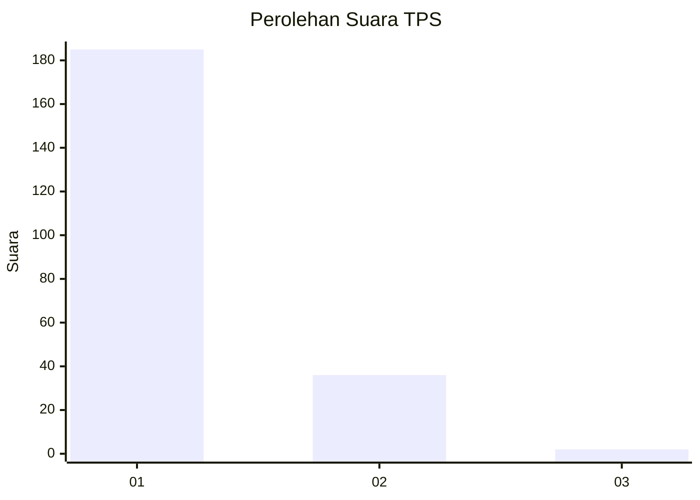
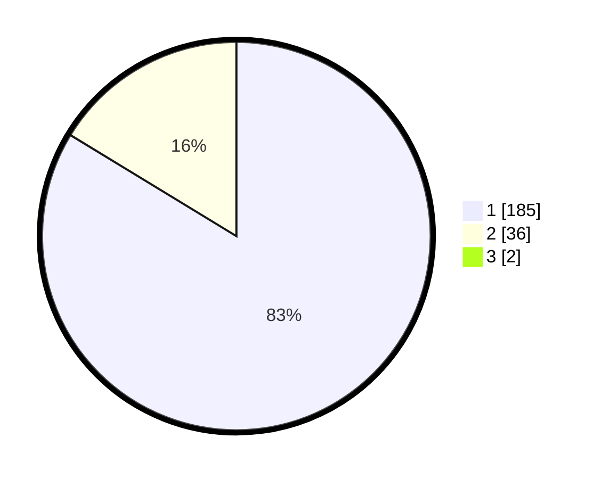

# Hasil

## Grafik

## Tabel

| No. | Nama Paslon    | Suara | Suara (raw) | Persentase |
|:--- |:-------------- | -----:| -----------:| ----------:|
| 1   | ANIES MUHAIMIN | 185   | [185][p-1]  | 82,96      |
| 2   | PRABOWO GIBRAN | 36    | [36][p-2]   | 16,14      |
| 3   | GANJAR MAHFUD  | 2     | [2][p-3]    | 0,90       |

[p-1]: https://github.com/gigit-pemilu/pemilu-2024-11-aceh/blob/main/pilpres/hitung-suara/sub/11-aceh/sub/07-pidie/sub/07-indrajaya/sub/2026-mesjid-dijiem/sub/001-tps/sub/paslon-1.txt
[p-2]: https://github.com/gigit-pemilu/pemilu-2024-11-aceh/blob/main/pilpres/hitung-suara/sub/11-aceh/sub/07-pidie/sub/07-indrajaya/sub/2026-mesjid-dijiem/sub/001-tps/sub/paslon-2.txt
[p-3]: https://github.com/gigit-pemilu/pemilu-2024-11-aceh/blob/main/pilpres/hitung-suara/sub/11-aceh/sub/07-pidie/sub/07-indrajaya/sub/2026-mesjid-dijiem/sub/001-tps/sub/paslon-3.txt

## Foto C Plano

https://sirekap-obj-formc.kpu.go.id/c9b9/pemilu/ppwp/11/07/07/20/26/1107072026001-20240215-060337--3f165626-b20b-478d-afcd-b22f458363be.jpg

https://sirekap-obj-formc.kpu.go.id/c9b9/pemilu/ppwp/11/07/07/20/26/1107072026001-20240215-145241--33af8d59-bde5-4d4a-bdfb-f15261e050d6.jpg

https://sirekap-obj-formc.kpu.go.id/c9b9/pemilu/ppwp/11/07/07/20/26/1107072026001-20240215-060637--cbb28aa8-d826-4a68-b621-6e249de169ef.jpg

## Metadata

| Key        | Value               |
| ---------- | ------------------- |
| Time Stamp | 2024-02-19 06:16:00 |

