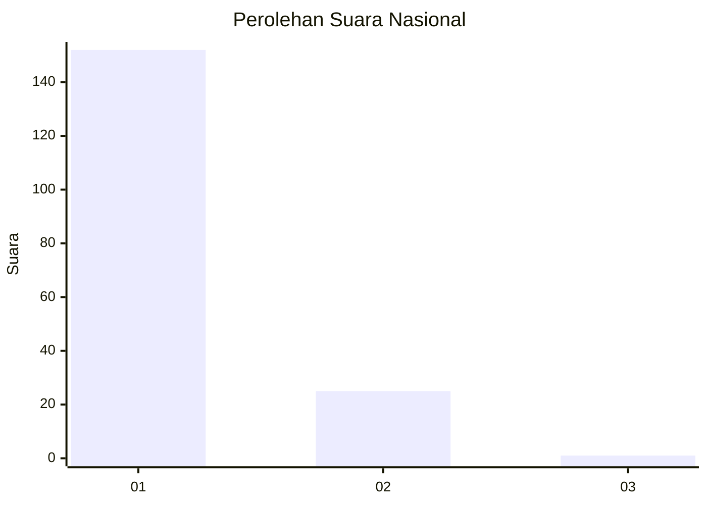
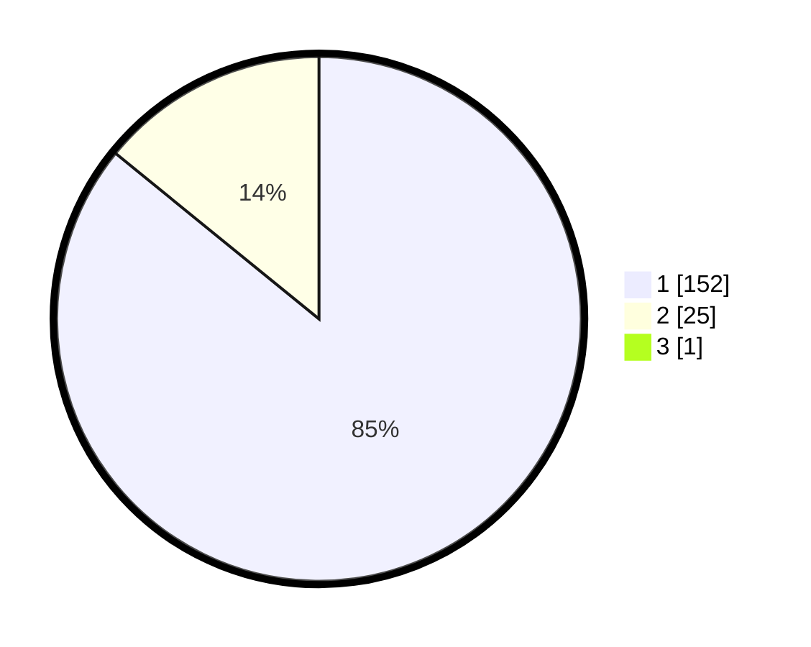

# Hasil

## Grafik

## Tabel

| No. | Nama Paslon    | Suara | Suara (raw) | Persentase |
|:--- |:-------------- | -----:| -----------:| ----------:|
| 1   | ANIES MUHAIMIN | 152   | [152][p-1]  | 85,39      |
| 2   | PRABOWO GIBRAN | 25    | [25][p-2]   | 14,04      |
| 3   | GANJAR MAHFUD  | 1     | [1][p-3]    | 0,56       |

[p-1]: https://github.com/gigit-pemilu/pemilu-2024/blob/main/pilpres/hitung-suara/sub/11-aceh/sub/07-pidie/sub/07-indrajaya/sub/2027-sukon-ulee-gampong/sub/001-tps/sub/paslon-1.txt
[p-2]: https://github.com/gigit-pemilu/pemilu-2024/blob/main/pilpres/hitung-suara/sub/11-aceh/sub/07-pidie/sub/07-indrajaya/sub/2027-sukon-ulee-gampong/sub/001-tps/sub/paslon-2.txt
[p-3]: https://github.com/gigit-pemilu/pemilu-2024/blob/main/pilpres/hitung-suara/sub/11-aceh/sub/07-pidie/sub/07-indrajaya/sub/2027-sukon-ulee-gampong/sub/001-tps/sub/paslon-3.txt

## Foto C Plano

https://sirekap-obj-formc.kpu.go.id/7aff/pemilu/ppwp/11/07/07/20/27/1107072027001-20240215-002937--77e30944-70f3-4dfc-8c3d-e63aeb0aaf9f.jpg

https://sirekap-obj-formc.kpu.go.id/7aff/pemilu/ppwp/11/07/07/20/27/1107072027001-20240215-002955--c0fda235-1390-40a6-bcac-2c7c3b558c22.jpg

https://sirekap-obj-formc.kpu.go.id/7aff/pemilu/ppwp/11/07/07/20/27/1107072027001-20240215-003022--2e600dd5-67af-4d6b-8f83-bcee8fd87b1b.jpg

## Metadata

| Key        | Value               |
| ---------- | ------------------- |
| Time Stamp | 2024-02-19 06:16:00 |

