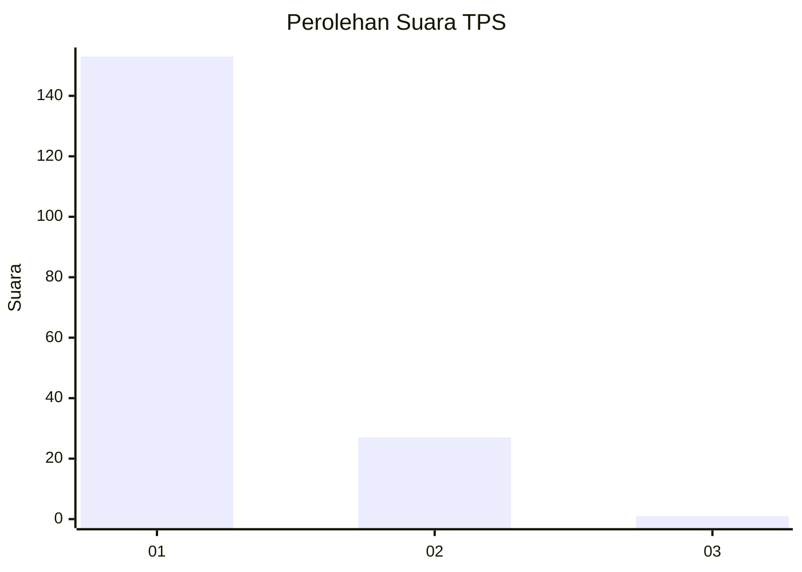
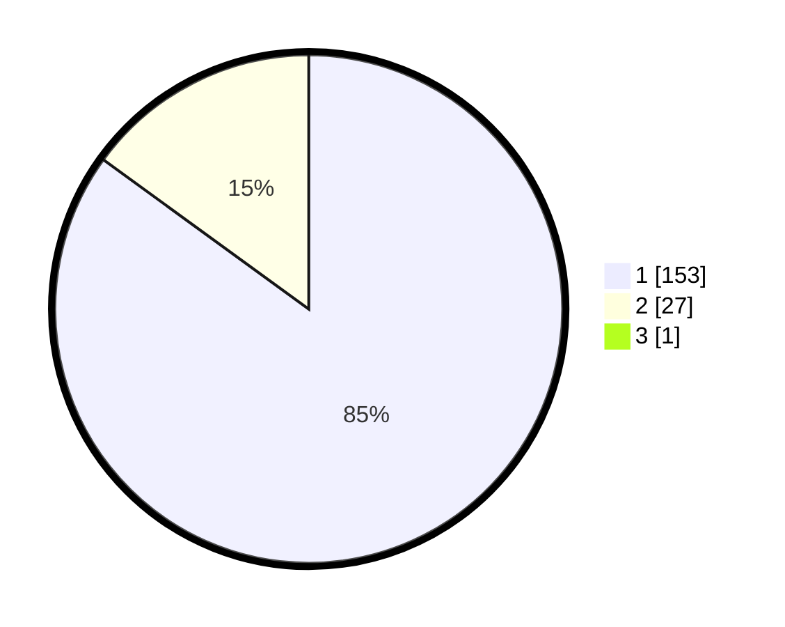

# Hasil

## Grafik

## Tabel

| No. | Nama Paslon    | Suara | Suara (raw) | Persentase |
|:--- |:-------------- | -----:| -----------:| ----------:|
| 1   | ANIES MUHAIMIN | 153   | [153][p-1]  | 84,53      |
| 2   | PRABOWO GIBRAN | 27    | [27][p-2]   | 14,92      |
| 3   | GANJAR MAHFUD  | 1     | [1][p-3]    | 0,55       |

[p-1]: https://github.com/gigit-pemilu/pemilu-2024-11-aceh/blob/main/pilpres/hitung-suara/sub/11-aceh/sub/07-pidie/sub/07-indrajaya/sub/2028-lamkabu/sub/001-tps/sub/paslon-1.txt
[p-2]: https://github.com/gigit-pemilu/pemilu-2024-11-aceh/blob/main/pilpres/hitung-suara/sub/11-aceh/sub/07-pidie/sub/07-indrajaya/sub/2028-lamkabu/sub/001-tps/sub/paslon-2.txt
[p-3]: https://github.com/gigit-pemilu/pemilu-2024-11-aceh/blob/main/pilpres/hitung-suara/sub/11-aceh/sub/07-pidie/sub/07-indrajaya/sub/2028-lamkabu/sub/001-tps/sub/paslon-3.txt

## Foto C Plano

https://sirekap-obj-formc.kpu.go.id/d4d5/pemilu/ppwp/11/07/07/20/28/1107072028001-20240217-141603--4578ce26-7d6a-4c44-90b3-7945b5c8579c.jpg

https://sirekap-obj-formc.kpu.go.id/d4d5/pemilu/ppwp/11/07/07/20/28/1107072028001-20240217-141622--8385d414-02d9-4c78-9241-fa43350d83da.jpg

https://sirekap-obj-formc.kpu.go.id/d4d5/pemilu/ppwp/11/07/07/20/28/1107072028001-20240217-141642--23f05d6a-2928-49a7-9287-17b580bf9e76.jpg

## Metadata

| Key        | Value               |
| ---------- | ------------------- |
| Time Stamp | 2024-02-25 12:00:00 |

