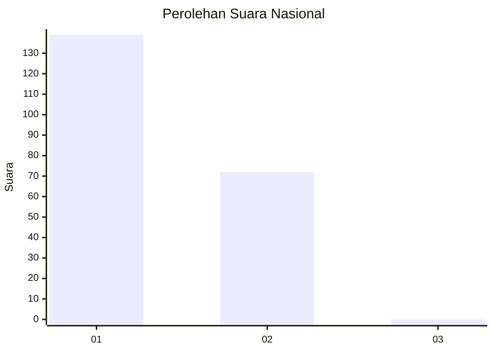
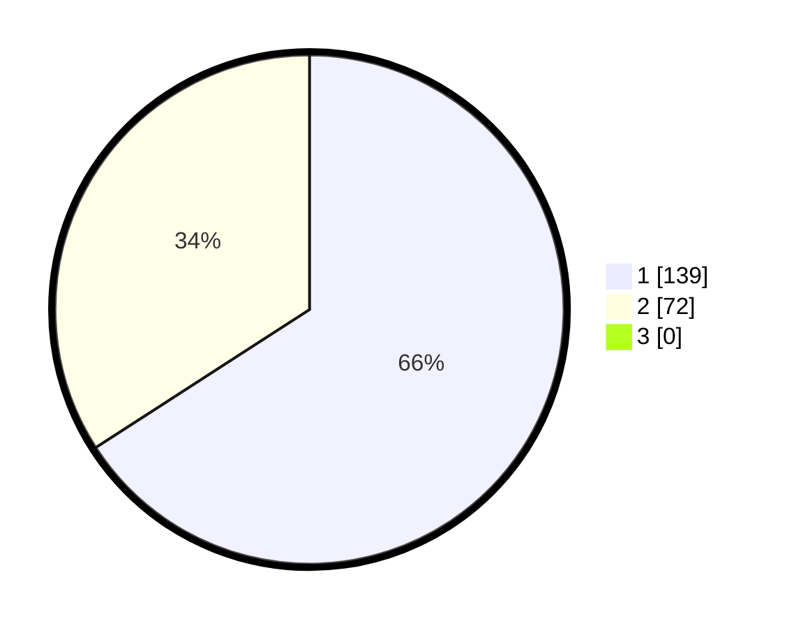

# Hasil

## Grafik

## Tabel

| No. | Nama Paslon    | Suara | Suara (raw) | Persentase |
|:--- |:-------------- | -----:| -----------:| ----------:|
| 1   | ANIES MUHAIMIN | 139   | [139][p-1]  | 65,88      |
| 2   | PRABOWO GIBRAN | 72    | [72][p-2]   | 34,12      |
| 3   | GANJAR MAHFUD  | 0     | [0][p-3]    | 0,00       |

[p-1]: https://github.com/gigit-pemilu/pemilu-2024/blob/main/pilpres/hitung-suara/sub/11-aceh/sub/07-pidie/sub/07-indrajaya/sub/2029-ulee-birah/sub/001-tps/sub/paslon-1.txt
[p-2]: https://github.com/gigit-pemilu/pemilu-2024/blob/main/pilpres/hitung-suara/sub/11-aceh/sub/07-pidie/sub/07-indrajaya/sub/2029-ulee-birah/sub/001-tps/sub/paslon-2.txt
[p-3]: https://github.com/gigit-pemilu/pemilu-2024/blob/main/pilpres/hitung-suara/sub/11-aceh/sub/07-pidie/sub/07-indrajaya/sub/2029-ulee-birah/sub/001-tps/sub/paslon-3.txt

## Foto C Plano

https://sirekap-obj-formc.kpu.go.id/8ed0/pemilu/ppwp/11/07/07/20/29/1107072029001-20240215-000224--13ff6549-81ba-4a80-9f4a-756a9caf475f.jpg

https://sirekap-obj-formc.kpu.go.id/8ed0/pemilu/ppwp/11/07/07/20/29/1107072029001-20240215-000719--84bd8f9d-ca5d-453b-93c5-30fb8c93367a.jpg

https://sirekap-obj-formc.kpu.go.id/8ed0/pemilu/ppwp/11/07/07/20/29/1107072029001-20240215-002403--021746fa-338a-4bbe-80fb-a70482902e5b.jpg

## Metadata

| Key        | Value               |
| ---------- | ------------------- |
| Time Stamp | 2024-02-19 06:16:00 |

